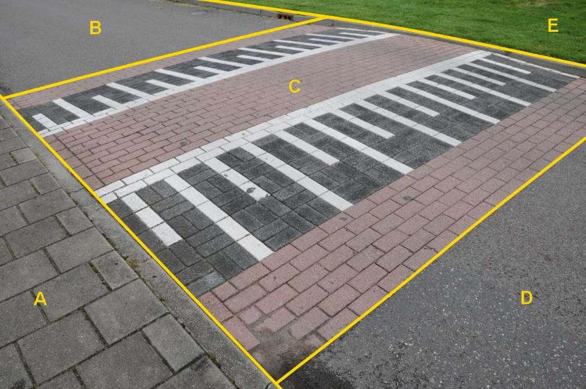

### Wegdeel, fysiekVoorkomen: gesloten verharding

B en D (afzonderlijke objecten):

  ***Wegdeel***            ***Attribuutwaarde***   ***Opmerkingen***
  ------------------------ ----------------------- -------------------
  functieWeg               Rijbaan: lokale weg     
  fysiek voorkomen         Gesloten verharding     
  relatieveHoogteligging   0                       

A: Wegdeel, Voetpad, Open verharding.

C: op volgende bladzijde.

E: Begroeid terreindeel, Groenvoorziening.

