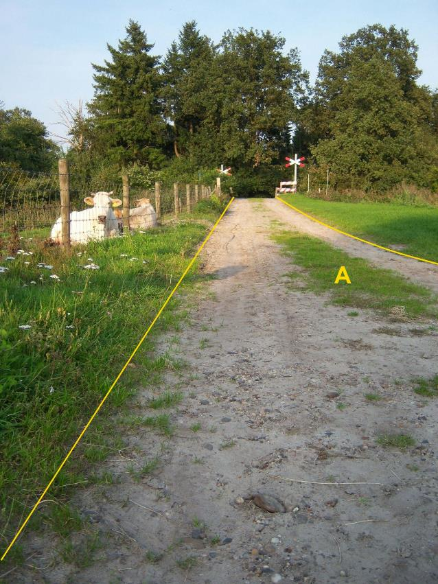

### Wegdeel, fysiekVoorkomen: onverhard

A:

  ------------------------ ---------------------- -----------------
  **Wegdeel**              **Attribuutwaarde**    **Opmerkingen**
  functie                   Rijbaan: lokale weg    
  fysiekVoorkomen          onverhard               
  relatieveHoogteligging    0                      
  ------------------------ ---------------------- -----------------

Objecttype: OndersteunendWegdeel
--------------------------------

