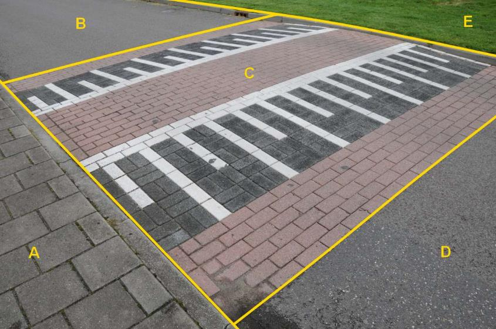

### Wegdeel, fysiekVoorkomen: open verharding

C:

  ------------------------ ---------------------- -----------------
  **Wegdeel**              **Attribuutwaarde**    **Opmerkingen**
  functie                   Rijbaan: lokale weg    
  fysiekVoorkomen          open verharding         
  relatieveHoogteligging    0                      
  ------------------------ ---------------------- -----------------

Overige letters op vorige bladzijde.

Goten vormen geen BGT inhoud en worden gerekend tot het wegdeel waar ze
in liggen.

Zebrapad heeft hetzelfde fysiek voorkomen als rest wegdeel en hoort
daarom voor de BGT bij A.

A:

  ***Wegdeel***            ***Attribuutwaarde***   ***Opmerkingen***
  ------------------------ ----------------------- -------------------
  functieWeg               Rijbaan: lokale weg     
  fysiek voorkomen         open verharding         
  relatieveHoogteligging   0                       

