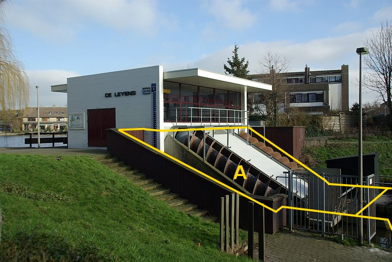

### Kunstwerkdeel, type: gemaal

Het gebouw bij het gemaal is een BAG-pand en vormt met de
maaiveldgeometrie BGT-inhoud.

A:

  ------------------------ --------------------- -----------------
  **Kunstwerkdeel**        **Attribuutwaarde**   **Opmerkingen**
  type                     gemaal                 
  relatieveHoogteligging    0                     
  ------------------------ --------------------- -----------------

