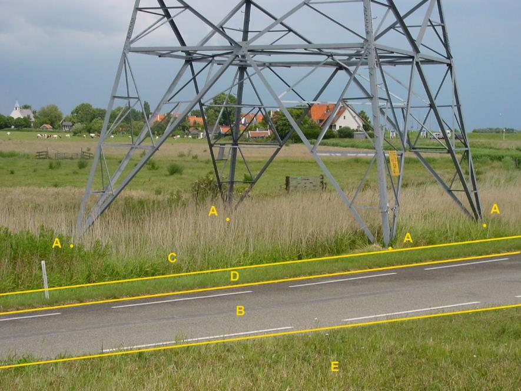
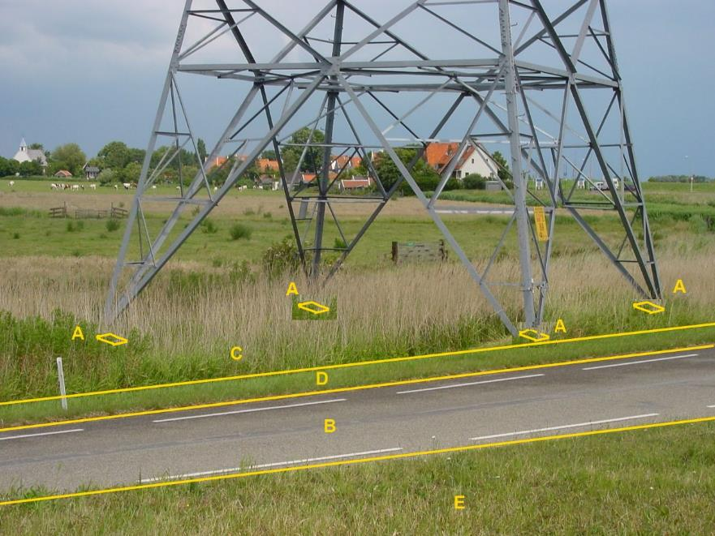

### Kunstwerkdeel, type: hoogspanningsmast

Wanneer er geen afzonderlijke afmeting van de mastvoeten beschikbaar is,
wordt elk hoekpunt van de omtrek om de mastvoeten als multipunt van de
hoogspanningsmast geclassificeerd.

A:

  ------------------------ --------------------- -----------------
  **Kunstwerkdeel**        **Attribuutwaarde**   **Opmerkingen**
  Type                     hoogspanningsmast      multipunt
  relatieveHoogteligging    0                    
  ------------------------ --------------------- -----------------

B: wegdeel. Rijbaan: lokale weg, gesloten verharding

C: begroeid terreindeel, grasland overig

D en E: ondersteunend wegdeel: berm, fysiek voorkomen: groenvoorziening.

Wanneer een hoogspanningsmast op meerdere plaatsen op het maaiveld
steunt en er zijn afzonderlijke afmetingen van elke mastvoet bekend dan
wordt de geometrie van elke mastvoet afzonderlijk geclassificeerd als
multivlak-geometrie van de mast.

A:

  ------------------------ --------------------- -----------------
  **Kunstwerkdeel**        **Attribuutwaarde**   **Opmerkingen**
  Type                     hoogspanningsmast     multivlak 
  relatieveHoogteligging    0                    
  ------------------------ --------------------- -----------------

B: wegdeel. Rijbaan: lokale weg, gesloten verharding

C en E: begroeid terreindeel, grasland overig

D: ondersteunend wegdeel: berm, fysiek voorkomen: groenvoorziening.

