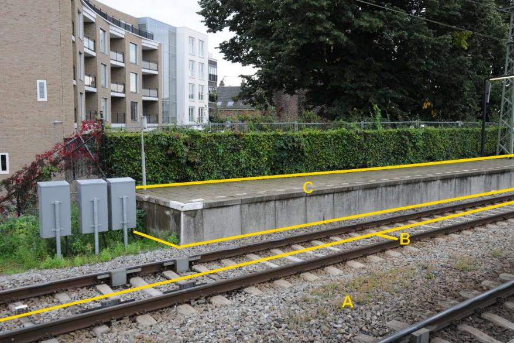
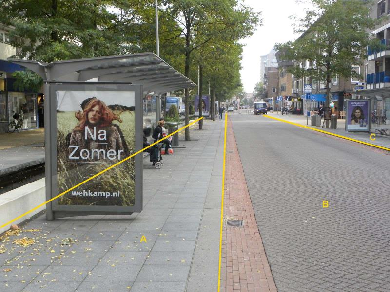

### Kunstwerkdeel, type: perron

C:

  ------------------------- --------------------- -----------------
  **overigKunstwerkdeel**   **Attribuutwaarde**   **Opmerkingen**
  type                      perron                 
  relatieveHoogteligging     0                     
  ------------------------- --------------------- -----------------

A: wegdeel, spoorbaan.

B: spoor, trein.

Dit is geen perron.

Perrons worden alleen opgenomen als ze langs een spoor van trein of
sneltram liggen.

A is voor de BGT een wegdeel, in IMGeo kan het tevens worden
geclassificeerd als: Functioneel gebied, niet BGT, bushalte.

A:

  ***Wegdeel***            ***Attribuutwaarde***   ***Opmerkingen***
  ------------------------ ----------------------- -------------------
  functieWeg               Voetpad                 
  fysiek voorkomen         Open verharding         
  relatieveHoogteligging   0                       

