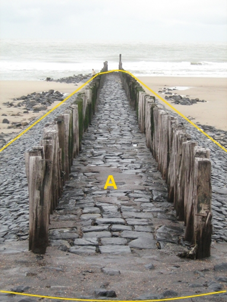

### Kunstwerkdeel, type: strekdam

A:

  ------------------------- --------------------- -----------------
  **overigKunstwerkdeel**   **Attribuutwaarde**   **Opmerkingen**
  type                      strekdam               
  relatieveHoogteligging     0                     
  ------------------------- --------------------- -----------------

