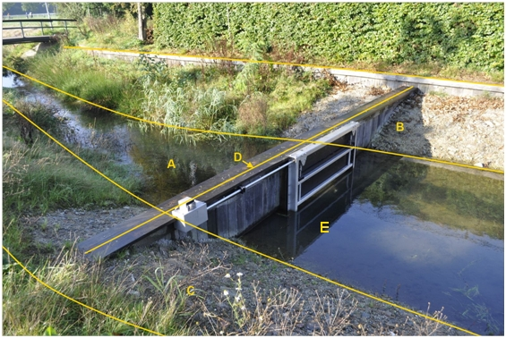

### Kunstwerkdeel, type: stuw

De waterloop wordt door de stuw D opgeknipt in twee waterdelen A en E.

D:

  ------------------------ --------------------- --------------------------------------
  **Kunstwerkdeel**        **Attribuutwaarde**   **Opmerkingen**
  Type                     Stuw                   Breedte \< 0.30 m dus lijngeometrie
  relatieveHoogteligging    0                     
  ------------------------ --------------------- --------------------------------------

B en C: ondersteunend waterdeel, oever/slootkant.

