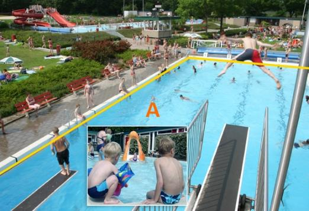

### OverigBouwwerk, type: bassin

2xA:

  ------------------------ --------------------- -----------------
  **OverigBouwwerk**       **Attribuutwaarde**   **Opmerkingen**
  type                     bassin                 
  relatieveHoogteligging    0                     
  ------------------------ --------------------- -----------------

Objecttype: Overbruggingsdeel
-----------------------------

