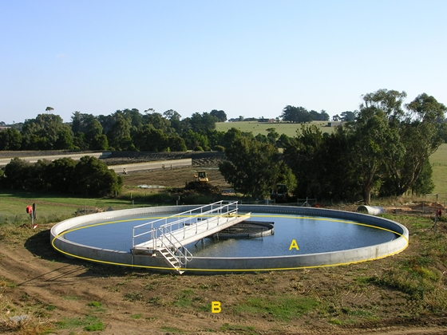

### OverigBouwwerk, type: bezinkbak

A:

  ------------------------ --------------------- -----------------
  **OverigBouwwerk**       **Attribuutwaarde**   **Opmerkingen**
  type                     bezinkbak              
  relatieveHoogteligging    0                     
  ------------------------ --------------------- -----------------

B: onbegroeidterreindeel, onverhard.

