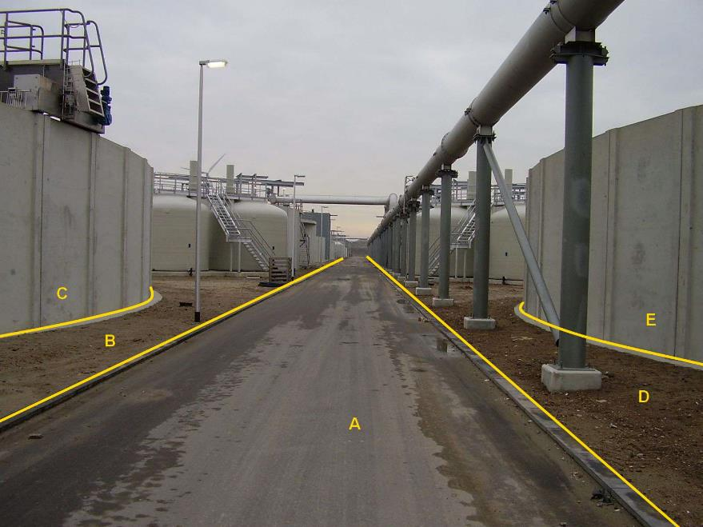

### OverigBouwwerk, type: opslagtank

C en E:

  ------------------------ --------------------- -----------------
  **OverigBouwwerk**       **Attribuutwaarde**   **Opmerkingen**
  type                     Opslagtank             
  relatieveHoogteligging    0                     
  ------------------------ --------------------- -----------------

A: wegdeel, rijbaan: lokale weg.

B en D: onbegroeidterreindeel, erf.

