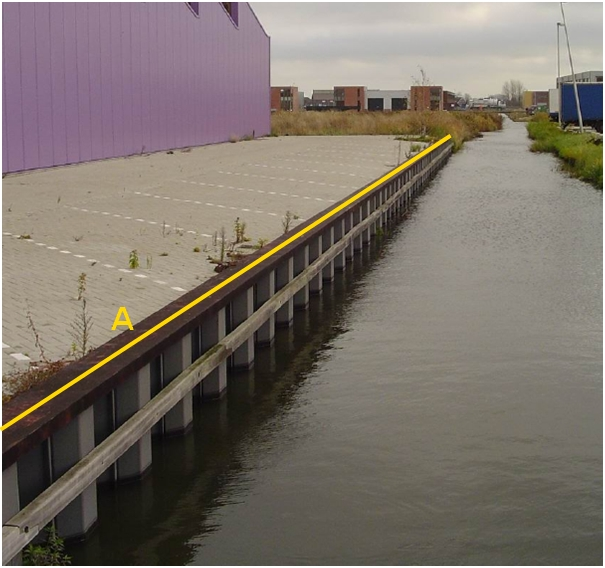

### Scheiding, type: damwand

A:

  ------------------------ --------------------- -----------------
  **Scheiding**            **Attribuutwaarde**   **Opmerkingen**
  type                     damwand                
  relatieveHoogteligging    0                     
  ------------------------ --------------------- -----------------

