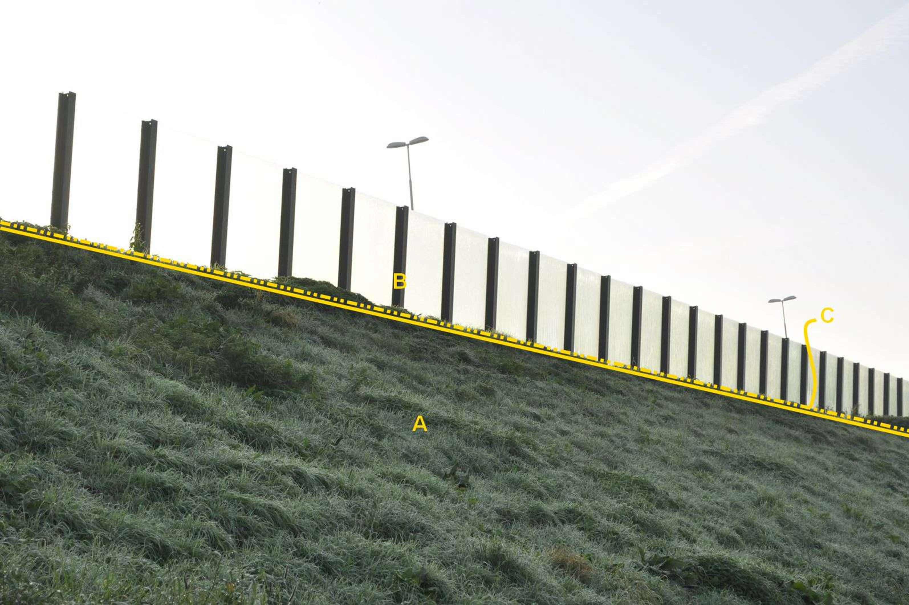

### Scheiding, type: geluidsscherm

B:

  ------------------------ --------------------- -----------------
  **Scheiding**            **Attribuutwaarde**   **Opmerkingen**
  type                     geluidsscherm          
  relatieveHoogteligging    0                     
  ------------------------ --------------------- -----------------

A: begroeid terreindeel, grasland overig, talud, kruinlijn, niveau 0.

