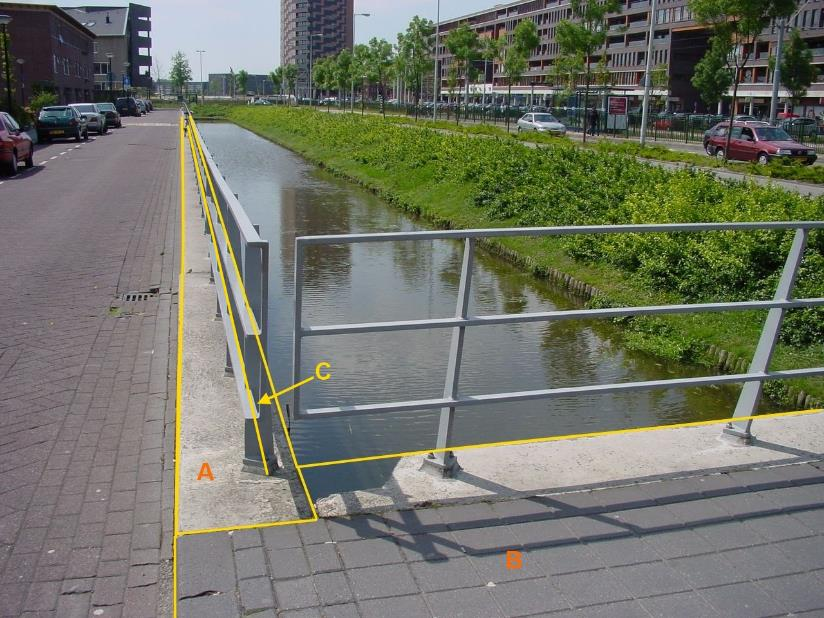

### Scheiding, type: kademuur

C:

  ------------------------ --------------------- -----------------
  **Scheiding**            **Attribuutwaarde**   **Opmerkingen**
  type                     kademuur               
  relatieveHoogteligging    0                     
  ------------------------ --------------------- -----------------

Hek C wordt **niet** opgenomen in de BGT omdat het op scheiding kademuur
staat, deze gaat voor in de hiërarchie bij scheidingen.

A:

  ***Scheiding***          ***Attribuutwaarde***   ***Opmerkingen***
  ------------------------ ----------------------- -------------------
  typeScheiding            Kademuur                
  relatieveHoogteligging    0                      

B: overbruggingsdeel en wegdeel, beide op niveau 1.

