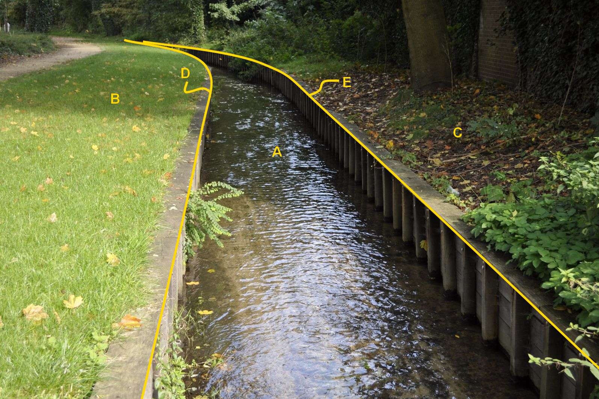

### Scheiding, type: walbescherming

D en E:

  ------------------------ --------------------- -----------------
  **Scheiding**            **Attribuutwaarde**   **Opmerkingen**
  type                     walbescherming         
  relatieveHoogteligging    0                     
  ------------------------ --------------------- -----------------

A: waterdeel, waterloop.

B en C: begroeid terreindeel, groenvoorziening.

