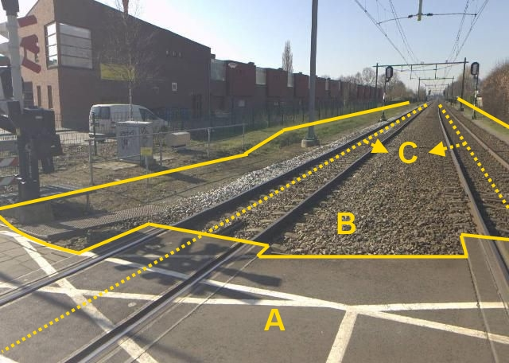

### Spoor, type: trein

C (verschillende objecten):

  ------------------------ --------------------- -----------------
  **Spoor**                **Attribuutwaarde**   **Opmerkingen**
  functie                  trein                  
  relatieveHoogteligging    0                     
  ------------------------ --------------------- -----------------

A: Wegdeel, Overweg.

B: Wegdeel, functie: Spoorbaan.

