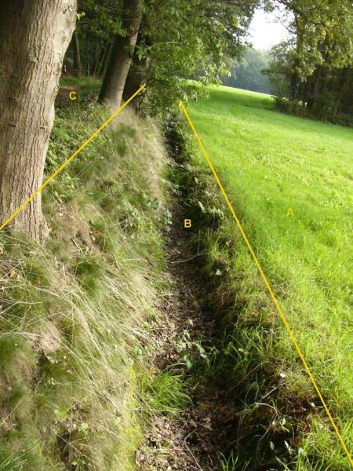

### Waterdeel, type: greppel/droge sloot

B:

  ***Waterdeel***          ***Attribuutwaarde***   ***Opmerkingen***
  ------------------------ ----------------------- -------------------
  type water               Greppel/droge sloot     
  relatieveHoogteligging    0                       

A: begroeidterreindeel, grasland agrarisch

C: begroeidterreindeel, loofbos.

Objecttype: OndersteunendWaterdeel
----------------------------------

