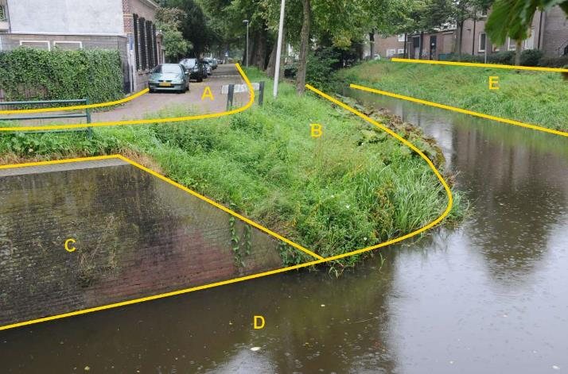
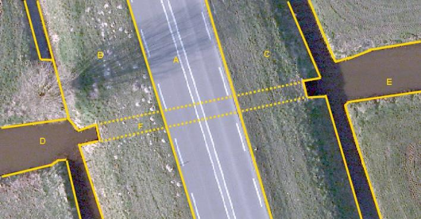

### Waterdeel, type: waterloop

D:

  ------------------------ --------------------- -----------------
  **Waterdeel**            **Attribuutwaarde**   **Opmerkingen**
  type                     waterloop              
  relatieveHoogteligging    0                     
  ------------------------ --------------------- -----------------

A: wegdeel, rijbaan: lokale weg, open verharding

B en E: ondersteunend waterdeel, oever/slootkant.

C: scheiding, kademuur.

Duikers vormen geen inhoud BGT.

F: Het niet zichtbare waterdeel in duiker is géén BGT-inhoud.

