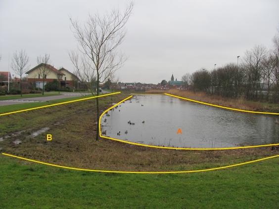

### Waterdeel, type: watervlakte

A:

  ------------------------ --------------------- -----------------
  **Waterdeel**            **Attribuutwaarde**   **Opmerkingen**
  type                     watervlakte            
  relatieveHoogteligging    0                     
  ------------------------ --------------------- -----------------

B: OndersteunendWaterdeel, Oever/slootkant

