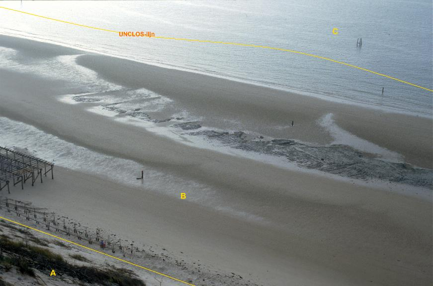

### Waterdeel, type: zee

C:

  ------------------------ --------------------- -----------------
  **Waterdeel**            **Attribuutwaarde**   **Opmerkingen**
  type                     zee                    
  relatieveHoogteligging    0                     
  ------------------------ --------------------- -----------------

A: begroeid terreindeel, duin.

B: onbegroeid terreindeel, zand.

