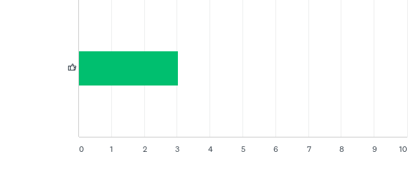
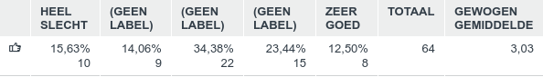
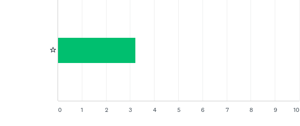
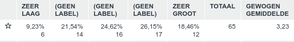
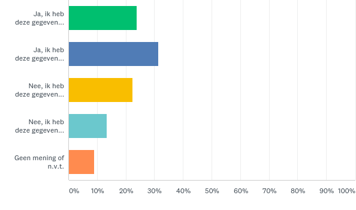
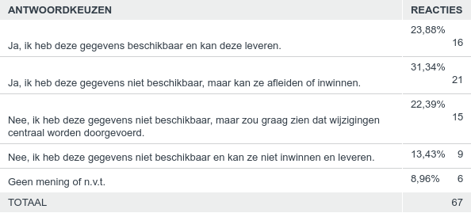
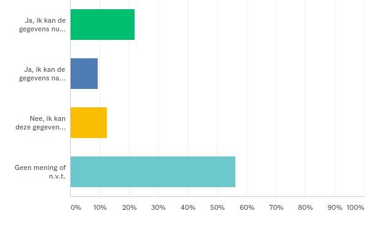
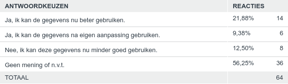

Aanpassen definitie 'oever/slootkant' en nieuwe afbakeningscriteria voor OndersteunendWaterdeel
-----------------------------------------------------------------------------------------------

Op het IMGeo voorstel voor het aanpassen van de definitie ‘oever/slootkant’ en
nieuwe afbakeningscriteria voor OndersteunendWaterdeel zijn in totaal 69
reacties ontvangen. Hieronder staat een samenvatting van de respons.

### Vraag 1. Hoe vindt u deze wijziging?

Beantwoord: 64 Overgeslagen: 3

*Toelichting score:*

Respondenten konden een score van 1 (HEEL SLECHT) tot 5 (ZEER GOED) geven. Ca.
36% van de respondenten beoordeelt dit voorstel met GOED (4) tot ZEER GOED (5).
Ca. 30% van de respondenten beoordeelt dit voorstel met SLECHT (2) tot ZEER
SLECHT (1).

*Samenvatting toelichtingen:*

Het voorstel was niet voor alle respondenten duidelijk genoeg, onder andere het
nut van deze wijziging (kosten-baten) en wat precies met ‘helling’ wordt
bedoeld.

Enerzijds werd opgemerkt door respondenten dat IMGeo hiermee te veel aansluit op
IMWA en waterbeheer, wat voorbij schiet aan het doel van de BGT. Anderzijds werd
opgemerkt dat ook groenbeheer baat heeft bij deze wijze van afbakening. Een
aantal respondenten reageerden dat met de beslisboom de afbakening duidelijker
wordt.

### Vraag 2. Hoe groot schat u de impact van deze wijziging voor uw organisatie?

Beantwoord: 65 Overgeslagen: 2

*Toelichting score:*

Respondenten konden een score van 1 (ZEER LAAG) tot 5 (ZEER GROOT) geven. Ca.
31% van de respondenten beoordeelt de impact van dit voorrstel met LAAG (2) tot
ZEER LAAG (1). Ca. 45% van de respondenten beoordeelt dit voorstel met GROOT (2)
tot ZEER GROOT (1).

*Samenvatting toelichtingen:*

De impact van deze wijziging wordt vooral gezien in het inwinnen en nalopen van
(hellingen van) alle terreindelen en ondersteunende waterdelen. Hellingen dienen
fotogrammetrisch of terrestrisch te worden ingewonnen, maar zijn door landmeters
moeilijk in te schatten.

### Vraag 3. Indien bronhouder, kunt u de gegevens conform deze wijziging leveren?

Beantwoord: 67 Overgeslagen: 0

table2455350340.png

*Samenvatting toelichtingen:*

Respondenten geven aan dat de gegevens in te winnen zijn, maar wel zeer werk en
tegen hoge kosten. De vraag is in hoeverre AHN hierbij een rol kan spelen om
taluds/hellingen te bepalen.

### Vraag 4. Indien gebruiker, kunt u de gegevens met deze wijziging beter gebruiken?

Beantwoord: 64 Overgeslagen: 3

*Samenvatting toelichtingen:*

De verwachting is dat groenbeheer en beheer van milieu vriendelijke oevers beter
wordt. Bovendien kan elke gebruiker de BGT beter gebruiken vanwege de
uniformiteit die dit voorstel nastreeft.
