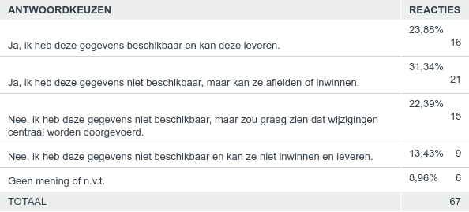
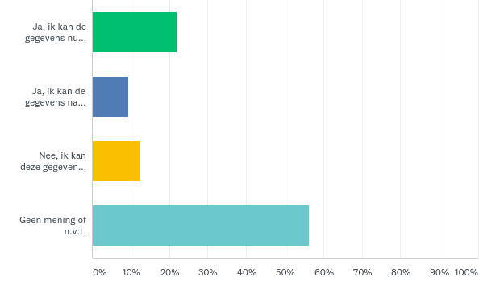
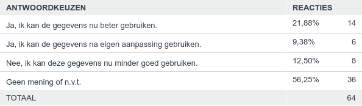

Aanscherpen afbakeningsregels voor gemaal, sluisdeur en stuw
------------------------------------------------------------

Op het IMGeo voorstel voor het aanpassen van de afbakeningsregels voor gemaal,
sluisdeur en stuw zijn in totaal 47 reacties ontvangen. Hieronder staat een
samenvatting van de respons.

### Vraag 1. Hoe vindt u deze wijziging?

Beantwoord: 42 Overgeslagen: 5

*Toelichting score:*

Respondenten konden een score van 1 (HEEL SLECHT) tot 5 (ZEER GOED) geven. Ca.
50% van de respondenten beoordeelt dit voorstel met GOED (4) tot ZEER GOED (5).
Ca. 7% van de respondenten beoordeelt dit voorstel met SLECHT (2) tot ZEER
SLECHT (1).

*Samenvatting toelichtingen:*

### Vraag 2. Hoe groot schat u de impact van deze wijziging voor uw organisatie?

Beantwoord: 44 Overgeslagen: 3

*Toelichting score:*

Respondenten konden een score van 1 (ZEER LAAG) tot 5 (ZEER GROOT) geven. Ca.
52% van de respondenten beoordeelt de impact van dit voorstel met LAAG (2) tot
ZEER LAAG (1). Ca. 18% van de respondenten beoordeelt dit voorstel met GROOT
(2), 0% met ZEER GROOT (1).

*Samenvatting toelichtingen:*

### Vraag 3. Indien bronhouder, kunt u de gegevens conform deze wijziging leveren?

Beantwoord: 67 Overgeslagen: 0

table2455350340.png

*Samenvatting toelichtingen:*

Respondenten geven aan dat de gegevens in te winnen zijn, maar wel zeer werk en
tegen hoge kosten. De vraag is in hoeverre AHN hierbij een rol kan spelen om
taluds/hellingen te bepalen.

### Vraag 4. Indien gebruiker, kunt u de gegevens met deze wijziging beter gebruiken?

Beantwoord: 64 Overgeslagen: 3

*Samenvatting toelichtingen:*

De verwachting is dat groenbeheer en beheer van milieu vriendelijke oevers beter
wordt. Bovendien kan elke gebruiker de BGT beter gebruiken vanwege de
uniformiteit die dit voorstel nastreeft.
