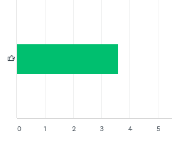
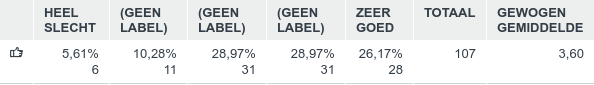
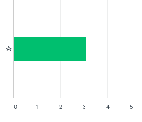
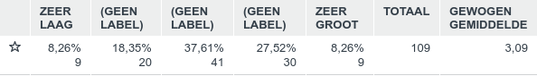
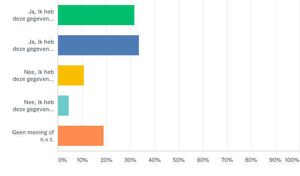
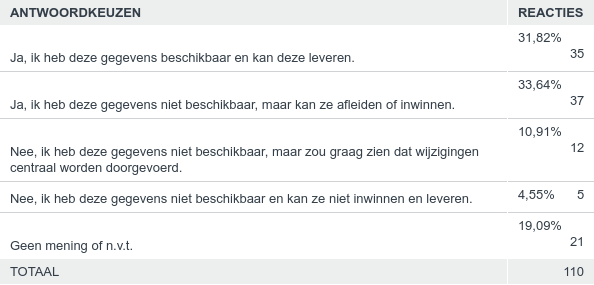
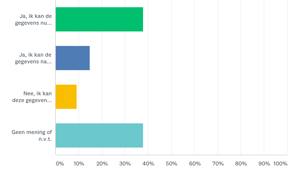
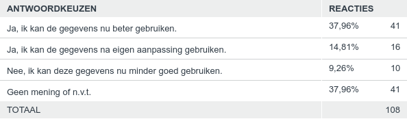

## Inrichtende vlakken op relatieve hoogte 0 worden opdelend

Op het IMGeo voorstel voor het opdelend worden van inrichtende vlakken op
relatieve hoogte 0 zijn in totaal 111 reacties ontvangen. Hieronder staat een
samenvatting van de respons.

### Vraag 1. Hoe vindt u deze wijziging?

Beantwoord: 107 Overgeslagen: 4

*Toelichting score:*

Respondenten konden een score van 1 (HEEL SLECHT) tot 5 (ZEER GOED) geven. Ca.
55% van de respondenten beoordeelt dit voorstel met GOED (4) tot ZEER GOED (5).
Ca. 16% van de respondenten beoordeelt dit voorstel met SLECHT (2) tot ZEER
SLECHT (1).

*Samenvatting toelichtingen:*

Over het algemeen positieve reacties om zo betere berekeningen voor o.a.
groenbeheer te kunnen maken. Dit argument wordt niet door alle respondenten
herkend.

Een meerdere keren genoemd aandachtspunt is dat niet alle inrichtende
vlakobjecten opdelend moeten worden, bijvoorbeeld wegmarkeringen, ponton,
faunavoorzieningen, wildrooster etc. Voor overige bouwwerken, (overige)
scheidingen, boomspiegel en hagen is dit voorstel wel juist. In de specificaties
moet ook duidelijk worden opgenomen hoe bijvoorbeeld een luifel of duiker met
welke relatieve hoogte deze wordt opgenomen (nl. niet 0 en dus opdelend).

Wel wordt gevraagd of er op BGT niveau een gat onstaat; dit vraagt om een
(visuele) oplossing om op BGT-niveau een vlakdekkende kaart te krijgen.

### Vraag 2. Hoe groot schat u de impact van deze wijziging voor uw organisatie?

Beantwoord: 109 Overgeslagen: 2

*Toelichting score:*

Respondenten konden een score van 1 (ZEER LAAG) tot 5 (ZEER GROOT) geven. Ca.
26% van de respondenten beoordeelt de impact van dit voorstel met LAAG (2) tot
ZEER LAAG (1). Ca. 35% van de respondenten beoordeelt dit voorstel met GROOT (2)
tot ZEER GROOT (1).

*Samenvatting toelichtingen:*

De impact wordt vooral in technische zin groot verwacht. BOR en BGT applicaties
moeten aangepast worden, evenals controles in BRAVO en LV-BGT. Centrale
automatische omzetting lukt mogelijk niet omdat inrichtende objecten over
meerdere opdelende heen liggen nu. Dit zijn knelpunten die handmatige aanpassing
vragen.

De ene bronhouder zal meer werk hebben dan andere, afhankelijk van hoeveel
optionele inrichtende IMGeo-objecten nu zijn aangeleverd aan de LV-BGT.

De uiteindelijke impact hangt af van welke objecten van inrichtend naar opdelend
verschuiven (zie toelichting vraag 1).

### Vraag 3. Indien bronhouder, kunt u de gegevens conform deze wijziging leveren?

Beantwoord: 110 Overgeslagen: 1

*Samenvatting toelichtingen:*

Het beeld verschilt enorm: de ene bronhouder vraagt om geautomatiseerd in bulk
dit op te lossen, de andere bronhouder geeft aan ca. 350 bronhouder handmatig te
moeten aanpassen, en de andere bronhouder geeft aan alleen het verplichte deel
van BGT aan te leveren. Meeste gegevens zijn wel beschikbaar maar moeten in
andere vorm (na uitstansen) (opnieuw) worden aangeleverd.

### Vraag 4. Indien gebruiker, kunt u de gegevens met deze wijziging beter gebruiken?

Beantwoord: 108 Overgeslagen: 3

*Samenvatting toelichtingen:*

Respondenten geven aan dat dit vooral voor beheer (BOR) een verbetering zal
opleveren, en het model hiermee eenduidiger en gemakkelijker wordt.
