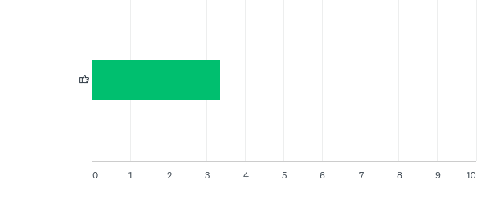
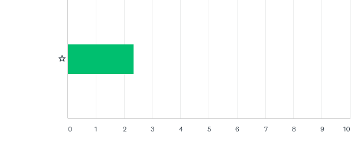
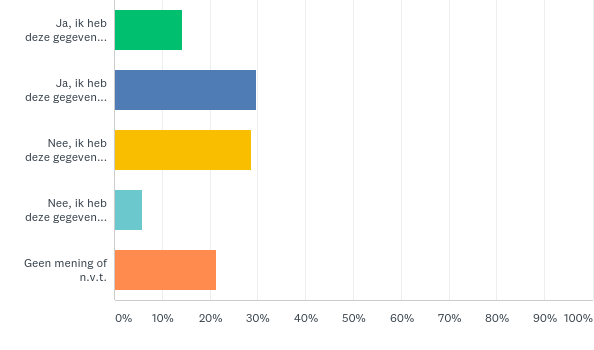
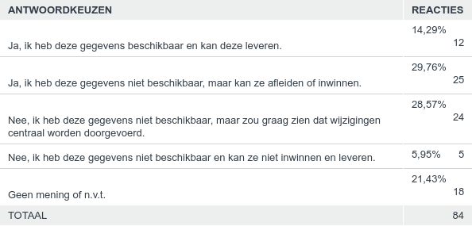
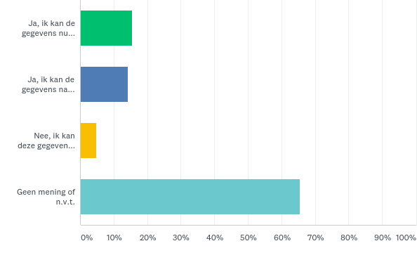

Opnemen overbouw en onderbouw bij panden in de BGT
--------------------------------------------------

Op het IMGeo voorstel voor het opnemen van afbakeningscriteria voor bos zijn in
totaal 85 reacties ontvangen. Hieronder staat een samenvatting van de respons.

### Vraag 1. Hoe vindt u deze wijziging?

Beantwoord: 83 Overgeslagen: 2

*Toelichting score:*

Respondenten konden een score van 1 (HEEL SLECHT) tot 5 (ZEER GOED) geven. Ca.
38% van de respondenten beoordeelt dit voorstel met GOED (4) tot ZEER GOED (5).
Ca. 12% van de respondenten beoordeelt dit voorstel met SLECHT (2) tot ZEER
SLECHT (1).

*Samenvatting toelichtingen:*

Over het algemeen positieve reacties om meer uniformiteit en duidelijkheid in
het model te krijgen. Hoewel er geen probleem wordt herkend en dus de
toegevoegde waarde ofwel het voordeel niet bekend is. Ook wordt opgemerkt dat
het vaststellen van percentages in de praktijk moeilijk zal zijn, en toch ook
natte vingerwerk blijft. Dus percentages zouden moeten gelden als een richtlijn.

### Vraag 2. Hoe groot schat u de impact van deze wijziging voor uw organisatie?

Beantwoord: 83 Overgeslagen: 2

*Toelichting score:*

Respondenten konden een score van 1 (ZEER LAAG) tot 5 (ZEER GROOT) geven. Ca.
42% van de respondenten beoordeelt de impact van dit voorrstel met LAAG (2) tot
ZEER LAAG (1). Ca. 20% van de respondenten beoordeelt dit voorstel met GROOT (2)
tot ZEER GROOT (1).

*Samenvatting toelichtingen:*

Het nalopen van de huidige populatie wordt als ‘werk’ en negatief punt op dit
voorstel aangegeven. Er wordt geen technische impact aan software verwacht.

### Vraag 3. Indien bronhouder, kunt u de gegevens conform deze wijziging leveren?

Beantwoord: 84 Overgeslagen: 1

*Samenvatting toelichtingen:*

Respondenten geven aan om (eenmalig) vanuit de BRT op te werken, hetzij
automatisch of via een werklijst met geconstateerde afwijkingen. Een bronhouder
geeft aan een bosbeheerkaart te hebben met boomsoort en percentages. Andere
bronhouders geven aan dit opnieuw te moeten inwinnen met bijvoorbeeld
luchtfoto’s.

### Vraag 4. Indien gebruiker, kunt u de gegevens met deze wijziging beter gebruiken?

Beantwoord: 84 Overgeslagen: 1

*Samenvatting toelichtingen:*

Het gebruik van het ‘type bos’ is niet bekend bij respondenten. BOR gebruikt dit
bijvoorbeeld niet, maar mogelijk natuurbeheerders / staatsbosbeheer wel. Voor
aansluiting BGT en BRT is dit wel een (kwaliteits)verbetering.
