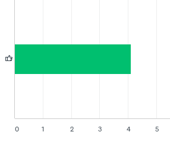
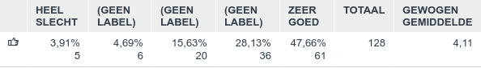
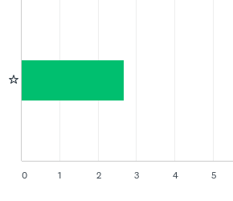
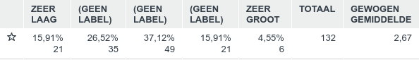
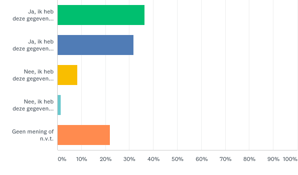
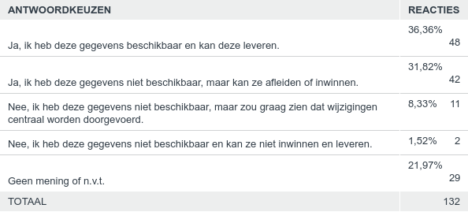
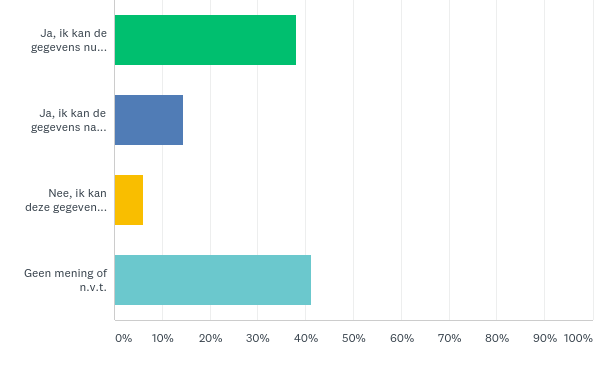
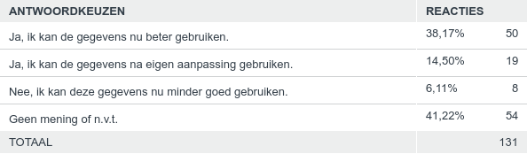

## Opnemen overbouw en onderbouw bij panden in de BGT

Op het IMGeo voorstel voor het opnemen van overbouw en onderbouw bij panden in de BGT zijn in totaal 135 reacties ontvangen. 
Hieronder staat een samenvatting van de respons.

### Vraag 1. Hoe vindt u deze wijziging?

Beantwoord: 128 Overgeslagen: 7

*Toelichting score:*

Respondenten konden een score van 1 (HEEL SLECHT) tot 5 (ZEER GOED) geven. Ca.
75% van de respondenten beoordeelt dit voorstel met GOED (4) tot ZEER GOED (5).
Ca. 9% van de respondenten beoordeelt dit voorstel met SLECHT (2) tot ZEER
SLECHT (1).

*Samenvatting toelichtingen:*

Over het algemeen positieve reacties om zo meer samenhang te krijgen tussen BAG
en BGT, en stappen te zetten richting 3D en één-objectenregistratie.

Een meerdere keren genoemd alternatief voorstel is om panddelen als aparte
objecten met een BAG-identificatie vast te leggen om de koppeling te kunnen
leggen tussen object Pand en één of meer objecten Panddeel. Belangrijk is dan
wel dat een Panddeel een juiste BAG-identificatie krijgt.

### Vraag 2. Hoe groot schat u de impact van deze wijziging voor uw organisatie?

Beantwoord: 132 Overgeslagen: 3

*Toelichting score:*

Respondenten konden een score van 1 (ZEER LAAG) tot 5 (ZEER GROOT) geven. Ca.
42% van de respondenten beoordeelt de impact van dit voorrstel met LAAG (2) tot
ZEER LAAG (1). Ca. 20% van de respondenten beoordeelt dit voorstel met GROOT (2)
tot ZEER GROOT (1).

*Samenvatting toelichtingen:*

Meerdere respondenten geven aan al onderbouw of overbouw in hun eigen applicatie
bij te houden.

Bepaalde respondenten geven aan al onderbouw en overbouw in de eigen applicatie
te hebben met een hogere nauwkeurigheid dan het voorstel. Dit betekent dat
gefilterd/opgeschoond moet worden alvorens de te kunnen leveren.

De impact zit naar verwachting vooral in de inwinning van onderbouw.

De huidige formulering laat (te) veel vrijheidsgraden voor vastlegging en
gebruik; met name met betrekking tot de specificaties voor relatieve hoogten en
verdieping. Als gevolg daarvan wordt de technische impact als relatief groot
ingeschat.

Om de inwinlast te beperken wordt voorgesteld dit om alleen bij nieuwe
afbakening/panden te verplichten, en bestaande inhoud niet actief bij te werken.
Andere voorstel is om panddelen in het optionele deel van IMGeo op te nemen.

Een aantal respondenten zien het als grote inspanning, maar wel met
kwaliteitsverbetering voor BAG en BGT. Een aantal respondenten zien dit als
grote inspanning zonder toegevoegde waarde of voordelen.

### Vraag 3. Indien bronhouder, kunt u de gegevens conform deze wijziging leveren?

Beantwoord: 132 Overgeslagen: 3

*Samenvatting toelichtingen:*

Meerdere respondenten geven aan de gegevens in een aparte laag al bij te houden
in de eigen applicatie en kunnen (na omzetting) deze gegevens leveren. Aandacht
wordt gevraagd voor automatische snijding van BGT en BAG geometrie om panddelen
af te leiden.

### Vraag 4. Indien gebruiker, kunt u de gegevens met deze wijziging beter gebruiken?

Beantwoord: 131 Overgeslagen: 4

*Samenvatting toelichtingen:*

Een duidelijk inzicht in de voordelen en toegevoegde waarde ontbreekt, maar
meerdere respondenten geven aan te verwachten dat er een (kwaliteits)verbetering
optreedt, dat BAG en BGT beter integraal beheerd kunnen worden, en berekeningen
van verharding en bebouwingscapaciteit nauwkeuriger worden.

Een aantal respondenten geeft ook aan de toegevoegde waarde en nut voor
gebruikers niet in te zien.
