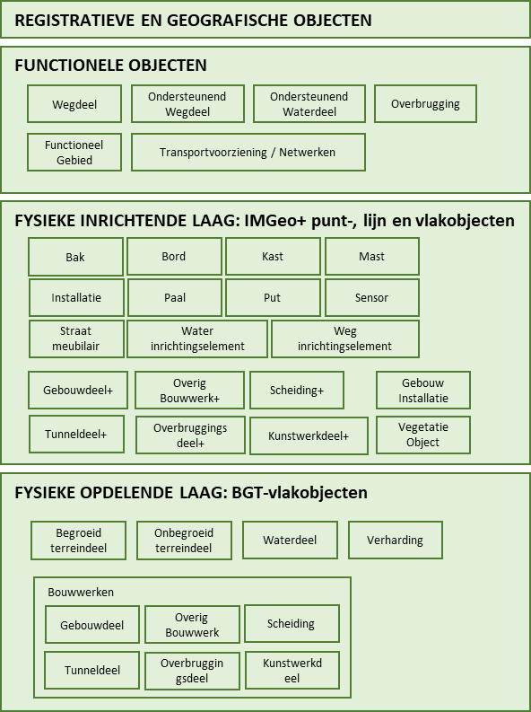

Samenvatting
============

Scheiden van functie en fysiek
------------------------------

Oevers, bermen, overbruggingen en functies van wegdelen worden opgenomen in de
(niet-opdelende) functionele laag. De gaten op maaiveld worden opgevuld met
fysieke objecten (weg)verharding en (on)begroeid terrein.

Herindeling van gebouwen, kunstwerken en overige bouwwerken
-----------------------------------------------------------

Gebouwen en overige bouwwerken worden opnieuw ingedeeld op basis van INSPIRE en
CityGML. Het Pand verschuift van de BAG naar een Gebouwdeel in de BGT, en een
Verblijfsobject in de BAG maakt voortaan deel uit van één of meer Gebouwdelen in
de BGT.

Een aantal kerende kunstwerken worden verplaatst van objectklasse Scheiding naar
Kunstwerkdeel. In de BGT wordt verduidelijkt dat een Kunstwerkdeel een
objectklasse voor overige kunstwerken, niet zijnde overbrugging(sdeel) of
tunneldeel, is; een Tunneldeel is een ondergrondse verbinding voor transport.

Toevoegen netwerken
-------------------

De BGT wordt uitgebreid met netwerken van wegen, spoorwegen, vaarwegen en
watersystemen. Een netwerk bestaat uit een verzameling
verbindingen en knooppunten waarbij gebruik/functies en andere eigenschappen
kunnen worden opgenomen. Het BGT object Spoor wordt opgenomen in deze structuur. 

Uitbreiden registratieve gebieden
---------------------------------

De bestuurlijke grenzen van het rijk, provincies en gemeenten verplaatsen van
BRK naar de BGT. Woonplaats en OpenbareRuimte verplaatsen van BAG naar de BGT.

Scheiden van objecten en labels
-------------------------------

Labels zijn niet langer een eigenschap van objecten, maar worden opgenomen in
een aparte annotatielaag conform het model van de BRT. Van huisnummerreeksen,
openbare ruimten worden de labelposities en relaties met de objecten opgenomen. Alleen labels van officiële benamingen
worden opgenomen als label.

