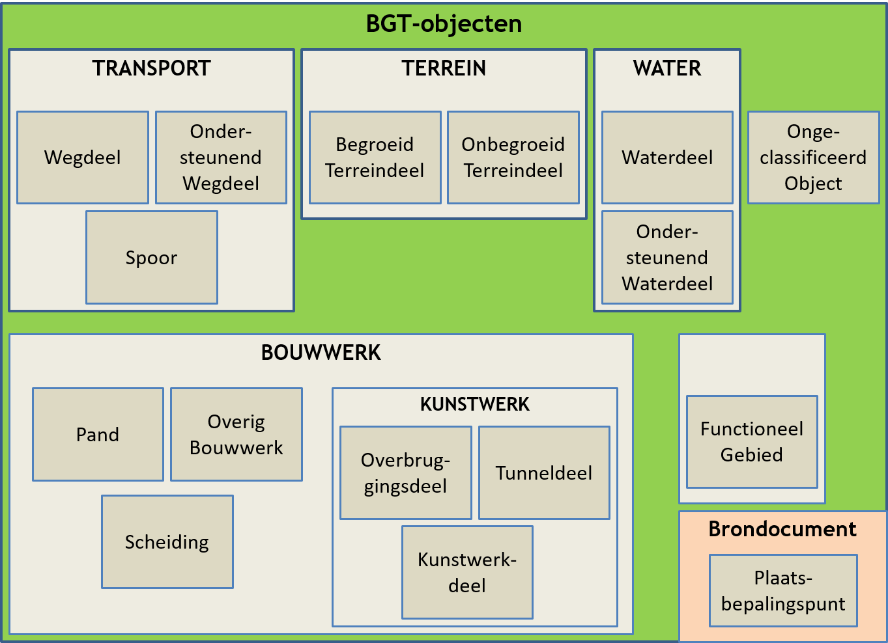

# 2 Ontwerpprincipes

Voor de inhoud van de BGT zijn de volgende ontwerpprincipes gehanteerd.

## 2.1 Topografie

De BGT bestaat uit abstracties van objecten in de werkelijkheid, gelimiteerd tot de be­schre­ven, fysieke, op enig moment in de werkelijkheid voorkomende, zichtbare to­po­grafische objecten met een duidelijk meervoudig gebruik, samengevat onder de term basistopografie. De BGT neemt deze op als authentieke, wettelijk vastgestelde objecten. Deze objecten vormen het verplichte deel van IMGeo 2.1.

## 2.2 Schaalbereik

De BGT beschrijft de geometrie van objecten voor een afbeeldingbereik van schaal 1:500 tot 1: 5.000.

## 2.3 Fysieke objecten

De BGT bevat fysieke topografische objecten. Uitzonderingen hierop zijn het functioneel gebied Kering (zie paragraaf 3.4) en de (kunstmatig) gekozen vlakobjectbegrenzingen bij wegdelen, waterdelen en terreindelen.

Figuur 1: Overzicht BGT-objecten.

## 2.4 Dekking

De BGT wordt landsdekkend beheerd voor het grondgebied van Nederland binnen de gemeentegrenzen. Daartoe behoren ook industriële complexen, zoals Schiphol, de Hoogovens en Europoort.

Niet tot de inhoud van de BGT behoort het grondgebied van Nederland in de Noordzee (Continentaal Plat) en de overzeese gebiedsdelen (Antillen).

## 2.5 IMGeo-objecten in de BGT

Objecten, die aan elkaar grenzen, met voor de BGT of IMGeo gelijke eigenschappen kunnen als afzonderlijke objecten in de BGT worden geregistreerd.

De BGT stelt geen maximale limieten aan de omvang van oppervlakten maar legt de verantwoordelijkheid hiervan bij de bronhouder.

## 2.6 Modellering

De BGT hanteert het Basismodel Geo-informatie (NEN 3610:2011) voor de modellering. NEN 3610:2011 conformeert zich aan de ISO 19100 standaarden voor geo-informatie. Deze gelden daarom ook voor de BGT.

De BGT is een tweedimensionale objectenverzameling. Om de stap naar 3D op een later moment te kunnen maken, is het BGT-model gebaseerd op CityGML 2.0. CityGML is de internationale standaard voor groot­scha­lige topografie in 3D van het Open Geospatial Consortium (OGC).

## 2.7 Geen inhoud van de BGT: macro-objecten

Het informatiemodel BGT is bedoeld voor grootschalige toepassing (zie paragraaf 2.2). Het model bevat daarom bijvoorbeeld geen klasse Weg, maar alleen een klasse Wegdeel; geen Water maar Waterdeel, geen Terrein maar Begroeid- en Onbegroeid Terreindeel, geen Kunstwerk maar Kunstwerkdeel. Een object Weg, bijvoorbeeld de rijksweg A1, zou veel te omvangrijk zijn voor gebruik in een grootschalige toepassing. Om die reden wordt een weg opgeknipt in wegdelen, die een veel kleinere omvang hebben.

Gebruikers kunnen echter voor het eigen werkproces behoefte hebben aan een clustering van BGT-objecten, die voor een specifieke situatie als één object moet fungeren: een macro- of superobject. Voorbeelden van macro-objecten zijn: 

-   gebieden met een agrarische, natuur- of recreatiebestemming of een combinatie hiervan, bijvoorbeeld de Veluwe;
-   rivieren, bijvoorbeeld de Rijn, Maas en IJssel;
-   rijkswegen, bijvoorbeeld de A1 en A12.

Ook voor een minder groot oppervlak kunnen geclusterde BGT-objecten als macro-object gewenst zijn. Denk bijvoorbeeld aan industrie- en rangeerterreinen en complexen, zoals Schiphol.

Tot slot kunnen macro-objecten voor nog kleinere oppervlakten gewenst zijn, bijvoorbeeld een sluiscomplex. Voor gebruikers (beheerders) behoren tot een sluiscomplex onder meer panden, muren, kademuren, overbruggingen en sluisdeuren. Alleen de sluisdeuren komen expliciet in de BGT als kunstwerkdeel voor. De andere objecten en -typen worden in de BGT opgenomen onder andere klassen (Pand,
Scheiding en Overbruggingsdeel).

Macro-objecten zijn geen inhoud van de BGT; in het eigen beheersysteem kan men indien gewenst macro-objecten definiëren, die een clustering van BGT objecten bevatten. In het optionele deel van IMGeo kunnen deze worden uitgewisseld als Functioneel Gebied.

Figuur 2: Johannes Vermeer - De Geograaf (1669)
