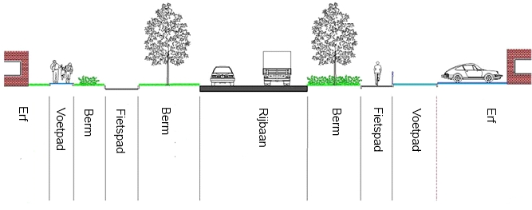

# 10 Objectafbakening

Dit hoofdstuk beschrijft de regels en aandachtspunten voor het afbakenen van BGT-objecten. Voor de inwinning is het van belang dat er naast de tekst ook visuele ondersteuning beschikbaar is. Hiervoor dient het BGT Objectenhandboek.

## 10.1 Wegdeel

### 10.1.1 Indeling

Om de wegdelen in te delen wordt een ordeningsprincipe gehanteerd. De verzameling wegdelen wordt ingedeeld naar de functie van het wegdeel en naar het fysieke voorkomen.

Het attribuut fysiek voorkomen geldt voor het gehele wegdeel. Een overgang van fysiek voorkomen is dus altijd ook een grens tussen twee wegdelen. Het gaat hierbij over het voorkomen waarmee het wegdeel overwegend is bedekt. Voor minimale stukjes, 5m2, met andere verharding hoeft geen apart wegdeel te worden gevormd.

### 10.1.2 Regels voor opname

Bestrate gedeelten in voor- en achtertuinen van panden worden beschouwd als onderdeel van het erf (onbegroeid terreindeel) en worden niet nader ingewonnen.

Brandgangen, met een openbaar karakter en waarvan de breedte \>0,90 m bedraagt, worden opgenomen tot de bebouwingslijn van gebouwen als wegdeel type voetpad. Brandgangen met een ontsluitingsfunctie van kennelijk openbaar terrein worden altijd opgenomen.

Grasklinkers (open klinkers, groenstenen) kunnen voorkomen als verhardingssoort van parkeervlakken. Voor de BGT is dan het fysiek voorkomen daarvan: open verharding. Wanneer ze als strookverharding voor komen langs wegdelen behoren tot de berm (ondersteunend wegdeel) waar ze in liggen.

Figuur 12: Voorbeeld van weg- en terreindelen

De kruinlijn moet bij het wegdeel worden opgenomen indien de helling een verhouding heeft van verticaal:horizontaal van 1:4 of steiler en het hoogteverschil \> 1 m bedraagt.

Eén van de zijden van het wegdeel valt altijd samen met de kruinlijn, zijnde bovenkant talud. Het gedeelte van een object dat op het talud ligt, is altijd een apart begrensd vlak ten opzichte van het deel van het object dat niet op het talud ligt.

Als er meer dan een objecttype op een talud ligt, bevat alleen het hoogst gelegen object een kruinlijngeometrie.

### 10.1.3 Aandachtspunten

Het begin van een wegdeel van een auto(snel)weg wordt aangegeven middels een bord G1 (autosnelweg) en G3 (autoweg). Dit kan zijn ter plaatse van een kruispunt. In de praktijk staat zo'n bord nooit precies op het kruispunt, maar enkele meter verder, de praktische werking van het bord geldt vanaf dat kruispunt.

Een autosnelweg kan ook beginnen zonder dat er kruispunt aanwezig is.

Het beëindigen van een wegdeel van een auto(snel)weg kan gebeuren door een bord G2 (einde autosnelweg) of G4 (einde autoweg). Een autoweg kan ook eindigen bij een kruispunt. Het bord G3 moet namelijk ná elk kruispunt worden herhaald.

Een autosnelweg kan ook eindigen zonder aanwezig kruispunt. Dan wordt het bord G2 gebruikt en gaat de weg over in een regionale weg.

Samenvattend geldt dat voor het begin en einde van een wegdeel van een auto(snel)weg de plaats van het bord bepalend is, op basis van de betekenis in het RVV 1990.

Molgoten langs wegdelen maken deel uit van dat wegdeel, ook als zij uit een andere ver­harding bestaan. De buitenzijde van de molgoot vormt de begrenzing van het wegdeel met vrijwel gelijke hoogte.

Een afsluitende band hoort bij het wegdeel, verkeerseiland of berm dat gelijk ligt met de bovenzijde van de band.

Aaneengesloten parkeervakken die zijn bedoeld voor één voertuig, worden ingewonnen als één aaneengesloten wegdeel waarbij functieWeg de waarde ‘parkeervlak’ heeft.

Uitsparingen in wegdelen, meestal van het type voetpad, voor stedelijk groen worden niet afzonderlijk geregistreerd indien \<5 m2. Het wegdeel wordt daarbij geacht door te lopen.

Belijning, kleur en symboliek zijn geen begrenzingen van wegdelen, zoals rijbanen, OV-banen, fietsstroken en parkeervakken.

## 10.2 OndersteunendWegdeel

### 10.2.1 Indeling

Dit object kent een onderverdeling in de typen verkeerseiland en berm. Berm kent als fysiek voorkomen de verschillende verhardingssoorten en groenvoorziening.

### 10.2.2 Regels voor opname

In de regel is dit object scherp begrensd met het aanliggende wegdeel door bijvoorbeeld een band. Als een berm bestaat uit een deel verhard (bijvoorbeeld grasklinkers) en een deel begroeid, ontstaan er voor de BGT twee objecten OndersteunendWegdeel.

De niet-wegdeel begrenzing van een begroeide berm met een aanliggend begroeid terrein zal niet altijd even duidelijk herkenbaar zijn. Als begrenzing hanteert men dan een herkenbare overgang met een ander gewas of een ander maairegime.

Bij een naast een wegdeel liggend waterdeel geldt dat als de afstand tussen wegdeel en waterbegrenzing \>30 cm bedraagt, het deel daartussen als berm wordt opgenomen. Mogelijke waterbegrenzingen staan beschreven bij Waterdeel.

De kruinlijn moet bij het ondersteunend wegdeel worden opgenomen indien de helling een verhouding heeft van verticaal:horizontaal van 1:4 of steiler en het hoogteverschil \>1m bedraagt. Eén van de zijden van het ondersteunend wegdeel valt altijd samen met de kruinlijn, zijnde bovenkant talud. Het gedeelte van een object dat op het talud ligt is altijd een apart begrensd vlak ten opzichte van het deel van het object dat niet op het talud ligt.

Als er meer dan een objecttype op een talud ligt, bevat alleen het hoogst gelegen object een kruinlijngeometrie.

## 10.3 Spoor

### 10.3.1 Regels voor opname

Het midden tussen de twee staven van een spoor, de as van het spoor, wordt als lijn vastgelegd.

De as van elk afzonderlijk spoor wordt weergegeven.

## 10.4 OnbegroeidTerreindeel

### 10.4.1 Indeling

Om de onbegroeide terreindelen in te delen is het fysieke voorkomen bepalend.

### 10.4.2 Regels voor opname

Uitsparingen voor stedelijk groen in onbegroeid terrein van het type gesloten, open of half verhard worden niet apart ingewonnen indien \<5m2. Het onbegroeide terreindeel wordt dan geacht door te lopen. Als deze uitsparingen groter zijn dan 5m2 worden deze opgenomen als begroeid terreindeel.

Het attribuut fysiek voorkomen geldt voor het gehele onbegroeide terreindeel. Een overgang van fysiek voorkomen is dus altijd ook een grens tussen twee onbegroeide terreindelen. Het gaat hierbij over het voorkomen waarmee het onbegroeide terreindeel overwegend is bedekt. Voor minimale stukjes met andere verharding hoeft geen apart onbegroeid terreindeel te worden gevormd.

De kruinlijn moet bij het onbegroeid terreindeel worden opgenomen indien de helling een verhouding heeft van verticaal:horizontaal van 1:4 of steiler en het hoogteverschil \>1m bedraagt. Een van de zijden van het onbegroeid terreindeel valt altijd samen met de kruinlijn, zijnde bovenkant talud. Het gedeelte van een object dat op het talud ligt is altijd een apart begrensd vlak ten opzichte van het deel van het object dat niet op het talud ligt.

Als er meer dan een objecttype op een talud ligt, bevat alleen het hoogst gelegen object een kruinlijngeometrie.

### 10.4.3 Aandachtspunten

Aaneengesloten voor- en achtertuinen van panden worden als één onbegroeid terreindeel opgenomen met het type ‘erf’. Er worden binnen een erf geen tussenliggende scheidingen opgenomen.

Braakliggende grond in stedelijk gebied is een onbegroeid terreindeel met een fysiek voorkomen ‘onverhard’.

## 10.5 BegroeidTerreindeel

### 10.5.1 Indeling

Deze terreindelen worden eveneens ingedeeld naar fysiek voorkomen en ook hier wordt, indien noodzakelijk, een kruinlijn opgenomen.

# 10.6 Waterdeel en ondersteunend waterdeel

De volgende paragrafen beschrijven op welke wijze land en water zijn gescheiden in de BGT.

### 10.6.1 Algemeen

De BGT kent vier typen waterdeel:

-   zee;
-   waterloop;
-   watervlakte;
-   greppel, droge sloot.

En twee typen ondersteunend waterdeel:

-   oever, slootkant;
-   slik.

De kruinlijngeometrie wordt bij het ondersteunend waterdeel niet opgenomen. Impliciet is de – niet waterbegrenzing – van een oever altijd de hoogste kant ervan en is dan de kruinlijn.

Voor de begrenzing van land en zee maakt de BGT onderscheid in de begrenzing langs de Noordzee enerzijds en die langs de Waddenzee en de Zuidwestelijke delta in Zeeland en Zuid-Holland anderzijds.

Onder waterlopen vallen rivieren, kanalen, beken, sloten en grachten. 

Watervlakten zijn meren, plassen, vennen en vijvers. Ook havens vallen in de regel hieronder.

Greppels en droge sloten hebben een functie in de waterhuishouding.

Oevers en slootkanten zijn de delen die enerzijds begrensd worden door de waterlijn en anderzijds door een kant insteek.

Slikken zijn bij laagwater droogvallende delen. Zij komen uitsluitend voor in de Waddenzee en in de Zuidwestelijke delta.

In het algemeen geldt dat zichtbare topografie altijd als begrenzing voorkomt, in de beschreven situaties aangevuld met niet of niet-altijd zichtbare topografische begrenzingen.

### 10.6.2 Noordzee

Voor de begrenzing van terrein en water langs de Noordzee gebruikt de BGT de UNCLOS-basislijn. Deze basislijn valt onder verantwoording van de Dienst der Hydrografie van het ministerie van Defensie. Deze dienst voert deze taak uit op basis van het Zeerechtverdrag van de Verenigde Naties uit 1982 "United Nations Convention on the Law of the Sea (UNCLOS)". Dit verdrag regelt de rechten die staten hebben op zee en de manier waarop buurstaten deze rechten begrenzen. Centraal in dit verdrag staat de basislijn, die het verloop van de kust definieert.

De Nederlandse basislijn is een combinatie van normale basislijnen en rechte (‘getrokken’) basislijnen. In tegenstelling tot de normale basislijn, zijn de rechte basislijnen onveranderlijk en bij Nederlandse wet vastgesteld. De rechte basislijnen vormen de af­sluiting van zeegaten, en daarmee de begrenzing tussen de territoriale zee en de binnenwateren.

Sluit de basislijn een waterdeel af zoals onder meer van de Westerschelde, Nieuwe Waterweg en Waddenzee, dan vormt de basislijn de begrenzing van dat waterdeel met de Noordzee.

#### 10.6.2.1 Actualiteit

Een of enkele keren per jaar publiceert de Dienst der Hydrografie een nieuwe UNCLOS-basislijn. De dienst maakt gebruikers attent op deze wijzigingen, onder meer via de eigen website[^1] en via een mailing per e-mail.

[^1]: Zie www.hydro.nl

#### 10.6.2.2 Strand

Langs de Noordzee bezit het onbegroeid terreindeel grenzend aan de basislijn het fysiek voorkomen ‘zand’.

Aan de ‘landzijde’ wordt het strand altijd begrensd door zichtbare topografie, zoals de overgang naar de duinen bestaande uit een hek of duinvoet. In het geval een kunstmatige aangelegde waterkering aanwezig is, zoals bij de Hondsbossche Zeewering, bestaat de begrenzing uit kademuur of walbescherming.

### 10.6.3 Waddenzee en Zuidwestelijke delta

In deze wateren is altijd een kunstmatig aangelegde waterkering aanwezig in de vorm van een kademuur of walbescherming. Deze vormen altijd een begrenzing voor de BGT.

Daarnaast worden in deze wateren peilingen verricht voor het Lowest Astronomical Tide (LAT). Als de ligging daarvan beschikbaar is voor de BGT vormt het de scheiding tussen het waterdeel en het ondersteunend waterdeel type slik. Ontbreekt het LAT dan vormt de kunstmatige waterkering de scheiding tussen terrein en water.

### 10.6.4 Rivieren

In de BGT komt bij rivieren of een begrenzing voor in de vorm van een kademuur of walbescherming, of een oever. Van nature komt er een variabel peil voor. In de grote, bevaarbare rivieren hanteert Rijkswaterstaat hier een peil met de naam Overeengekomen Lage Rivierwaterstand (OLR). Als een presentatie van dit peil beschikbaar is, vormt het voor de BGT de begrenzing van waterdeel met
ondersteunend waterdeel type oever. Bij het ontbreken van het OLR vormt het laagste streefpeil, eveneens onder verantwoording van Rijkswaterstaat, deze begrenzing. Is de ligging van een peil niet beschikbaar voor de BGT dan vormt de kunstmatige waterkering de scheiding tussen terrein en water.

### 10.6.5 Meren

Bij meren komen kunstmatig aangelegde waterkeringen voor in de vorm van een kademuur of walbescherming, soms is er sprake van een oever. Als een kunstmatige waterkering aanwezig is in de vorm van een kademuur of walbescherming vormt dit de begrenzing van terrein en water. Bij het ontbreken daarvan vormt het object begrensd door waterlijn en de bovenzijde van een herkenbare insteek een ondersteunend waterdeel type oever/slootkant.

In meren wordt een streefpeil beheerd door bemalen en/of spuien. Als de ligging van een peil bekend is en de horizontale afstand tussen een herkenbare insteek bedraagt 1m of meer dan ontstaat in de BGT een ondersteunend waterdeel van het type oever. Waar sprake is van meerdere streefpeilen, wordt uitgegaan van het laagste niveau of ondergrenspeil.

### 10.6.6 Overige waterlopen en -vlakken

Hier geldt onderstaand stroomdiagram. Als kant water de begrenzing van objecten vormt, geldt dat dit een presentatie is van het laagst mogelijke streefpeil ter plaatse. Als de horizontale afstand tussen waterlijn en de bovenkant van een herkenbare insteek 1m of meer bedraagt dan ontstaat in de BGT een ondersteunend waterdeel van het type oever/slootkant.

Figuur 13: Stroomdiagram begrenzing waterlopen en -vlakken

# 10.7 Pand

### 10.7.1 Regels voor opname

De BGT bevat alleen die objecten die de bestaande situatie in de werkelijkheid
representeren. Uitsluitend panden die in de BAG voorkomen met de volgende status
maken met hun grondvlakgeometrie deel uit van de BGT:

-   ‘Bouw gestart’;
-   ‘Pand in gebruik (niet ingemeten)’;
-   ‘Pand in gebruik’;
-   ‘Sloopvergunning verleend’;
-   ‘Pand buiten gebruik’.

De voorwaarde is wel dat deze panden al zijn ingemeten en/of dat het gaat om bestaande panden, waarvoor een bouwvergunning is verleend.

De grondvlakgeometrie is waar de ‘footprint’ van het pand de ondergrond raakt. 

Uitstulpingen in gevels, zoals steunberen, behoren tot de pandgeometrie als de afmetingen groter zijn dan 30x30cm. Als zij kleiner zijn, worden zij niet opgenomen (generalisatie).

Als zich op de hoeken van een gebouw uitstulpingen bevinden \<30cm wordt de lijn die over de uiteinden van deze uitstulpingen loopt, beschouwd als gevellijn voor het pand.

De gevel van erkers en schoorstenen, die meer dan 30cm buiten de doorgaande gevellijn van de voorgevel liggen, behoren tot het pand.

Indien de grondvlakgeometrie van een pand uit meerdere losse vlakken bestaat, worden deze in één multivlak vastgelegd.

Kolommen van een dak, luifel of uitbouw (overbouw) van een pand behoren tot de grondvlakgeometrie als de kleinste afmeting (rechthoekzijde of middellijn) op het grondvlak meer dan 30cm bedraagt.

### 10.7.2 Aandachtspunten

Voor veel panden is de grondvlakgeometrie overgenomen door de BAG als geometrie voor de buitenomtrek van het pand omdat deze geometrieën identiek zijn. 

## 10.8 Overig bouwwerk

### 10.8.1 Regels voor opname

De geometrie is waar het grondvlak van het overig bouwwerk de ondergrond raakt.

### 10.8.2 Aandachtspunten

Bassins en bezinkbakken bij zuiveringsinstallaties zijn geen waterdelen, maar worden geclassificeerd als overig bouwwerk.

Zwembaden worden als type bassin vastgelegd.

Bij overkappingen wordt de grondvlakgeometrie van de pilaren (footprint) waarop de overkapping rust geregistreerd wanneer de afmetingen (rechthoekzijde of middellijn) ≥ 0,30 m bedraagt.

Het afdak van de overkapping is eventueel IMGeo inhoud.

## 10.9 Overbruggingsdeel

### 10.9.1 Regels voor opname

Delen van overbruggingen worden in de BGT niet verder getypeerd. Zo worden zowel het brugdek als de pijler van een overbrugging in de BGT aangeduid als overbruggingsdeel.

Eén van de in onderstaande tabel vermelde situaties zal voorkomen om een overbrugging in delen te kunnen opknippen.

| Rij-ijzer of voeg     | Object met hoogste hiërarchie     | Uitwerking     |
|-----------------------|-----------------------------------|----------------|
| Aanwezig              | n.v.t.                            | A              |
| Niet aanwezig         | Onder overbrugging                | B              |
| Niet aanwezig         | Op overbrugging                   | C              |

Een schematische visualisatie van deze situaties staat in paragraaf 2.9.2 van het BGT IMGeo Objectenhandboek.

Indien een rij-ijzer of voeg zichtbaar is in het brugdek worden daarmee de overbrugging en de op de overbrugging gelegen objecten afgebakend volgens uitwerking A.

Indien er geen rij-ijzer of voeg zichtbaar is, dan is de uitwerking afhankelijk van de hiërarchie van de objecten ter plekke van de overbrugging. Van belang is het object met de hoogste hiërarchie op de overbrugging en het object met de hoogste hiërarchie onder de overbrugging. Voor de hiërarchie geldt de volgorde van het objecttype uit hoofdstuk 8 van deze gegevenscatalogus (wegen, onbegroeid terrein, begroeid terrein etc.). Is het objecttype gelijk dan geldt de volgorde van de attributen en domeinwaarden uit hoofdstuk 9. Als algemene regel geldt dat een waterdeel altijd niveau nul heeft. Water heeft in deze uitwerking de hoogste hiërarchie.

Ligt het object met de hoogste hiërarchie onder de overbrugging dan is de uitwerking volgens B. Ligt het object met de hoogste hiërarchie op de overbrugging dan is de uitwerking volgens C.

Voorbeelden zonder rij-ijzer of voeg in de overbrugging zijn:

-   Op de overbrugging loopt een weg (rijbaan lokale weg) met een fietspad.
    Eronder loopt een weg (rijbaan autoweg). De uitwerking is dan volgens B,
    omdat de functie van de weg onder de overbrugging eerder in de tabel met
    functies van wegen staat.
-   Op de overbrugging loopt een weg (rijbaan lokale weg, gesloten verharding)
    met een fietspad. Er onder loopt een weg (rijbaan lokale weg, open
    verharding). De uitwerking is dan volgens C, omdat de functie van de wegen
    gelijk is, maar de weg op de overbrugging staat eerder in de tabel met
    fysiek voorkomen van wegen.

### 10.9.2 Niveau-aanduiding

Voor het toekennen van de niveau-aanduiding geldt de algemene regel dat een waterdeel onder of op een overbrugging (aquaduct) altijd niveau 0 heeft.

Verder geldt het attribuut relatieve hoogteligging voor elk afzonderlijk overbruggingsdeel, niet voor de gehele overbrugging.

Wegdelen krijgen dezelfde relatieve hoogte aanduiding als het overbruggingsdeel waarop zij liggen. Hierbij geldt één uitzondering: in de hierboven onder C beschreven situatie, heeft het op het brugdeel gelegen wegdeel niveau 0. Het brugdeel waarop dat wegdeel ligt, heeft één niveau lager: -1.Dit is vanwege het feit dat er geen overlappende objecten mogen voorkomen op niveau 0.

Het object dat onder deze overbrugging ligt, wordt onder meer opgeknipt door de projectie van de bovenliggende begrenzing van het wegdeel. Dit is vanwege de regel dat er een aaneengesloten oppervlakte op niveau 0 in de BGT moet voorkomen.

Pijlers van een overbrugging krijgen de niveauaanduiding van het object waarop zij staan en zullen dus een lagere waarde hebben voor dit attribuut dan het brugdek dat op de pijlers ligt. Het wegdeel dat daarop kan voorkomen, heeft dezelfde waarde voor de relatieve hoogteligging als het brugdek.

In het BGT Objectenhandboek zijn voornoemde uitwerkingen A, B en C schematisch gevisualiseerd.

## 10.10 Tunneldelen

### 10.10.1 Regels voor opname

De buitenste begrenzing van tunneldelen ligt onder het maaiveld en is niet zichtbaar. Opname daarvan in de BGT gebeurt aan de hand van beschikbare informatie, zoals bouwtekeningen. Dat geldt ook voor de in het tunneldeel gelegen wegdelen.

Interieur van tunnels, zoals (scheidings)muren, trappen, vormen geen BGT-inhoud, omdat dit nadere invulling is van CityGML LOD1 en hoger. 

### 10.10.2 Aandachtspunten

Zichtbare muren enzovoort die de buitenste delen van een tunnel vormen worden in de BGT als muur enzovoort geclassificeerd.

### 10.10.3 Relatieve hoogte

In tunneldelen ligt of liggen altijd één of meer wegdelen. Deze wegdelen bezitten dezelfde aanduiding voor relatieve hoogte als het tunneldeel waarin zij liggen.

## 10.11 Kunstwerkdelen

### 10.11.1 Regels voor opname

Een kunstwerkdeel wordt opgenomen met de buitenste begrenzing die is bepaald door karakteristieke punten.

Als de breedte van het kunstwerkdeel \<30cm is, wordt het object als lijn vastgelegd.

### 10.11.2 Aandachtspunten

Kunstwerkdelen worden getypeerd naar het geheel waarvan zij deel uitmaken.

De aanduiding voor het kunstwerkdeel in de BGT heeft betrekking op die delen van het kunstwerk die nog niet als een ander object of objecttype tot de BGT- inhoud behoren.

Het kunstwerkdeel erft het attribuut relatieve hoogteligging van het object waarop het staat of ligt.

#### 10.11.3 Hoogspanningsmast

Alleen masten van het type hoogspanningsmast zijn onderdeel van de BGT. De voet van de mast wordt als multipunt of multivlak vastgelegd.

Als er geen afzonderlijke afmeting van de mastvoeten beschikbaar is, wordt elk hoekpunt van de omtrek om de mastvoeten als multipunt van de hoogspanningsmast geclassificeerd.

Als er afzonderlijke afmetingen van de mastvoeten bekend zijn, wordt elke mastvoet als multivlak van de hoogspanningsmast geclassificeerd wanneer de afmetingen van de mastvoet (rechthoekzijde of middellijn) ≥ 0,30 m bedraagt.

#### 10.11.4 Gemaal, sluis, stuw

Tot deze typen kunstwerkdelen behoren die objecten die niet tot een ander BGT-objecttype behoren. Dit betekent in de regel dat bij een gemaal de bakken waar het water door wordt geleid tot dat object behoren. Een pand waarin de pompen staan, vormt als pand inhoud van de BGT.

Bij een sluiscomplex zullen alleen de sluisdeuren tot BGT-inhoud behoren en bij een stuw uitsluitend de klep of schuif.

De eventuele overige objecten zoals muren, kademuren, panden en overbruggingen vormen als zodanig inhoud van de BGT.

## 10.12 Scheiding

### 10.12.1 Indeling

De volgende scheidingen zijn BGT-inhoud: hekken, geluidsschermen, muren, kademuren en walbeschermingen.

### 10.12.2 Regels voor opname

Scheidingen worden als lijnobject vastgelegd als de breedte kleiner is dan 30cm. Bij scheidingen breder dan 30cm moet de buitenomtrek waar het object de grond raakt worden ingewonnen en vastgelegd als vlakgeometrie.

Een scheiding wordt vastgelegd waar het object de ondergrond raakt.

In de scheidingen worden onderbrekingen van \<1m genegeerd. Doorgangen worden gezien als integraal onderdeel van de scheiding.

Scheidingen van het type hek die een minimale lengte van 10m en een minimale hoogte van 1m hebben, worden vastgelegd.

Scheidingen van de typen kademuur en walbescherming worden opgenomen aan de bovenzijde aan de waterkant. Kademuren breder dan 30cm worden ingewonnen als vlakobject; de omtrek van het object aan de bovenzijde wordt dan vastgelegd.

Scheidingen van het type muur, met een minimale lengte van 1m en met een minimale breedte van 30cm worden opgenomen. Een muur smaller dan 30cm wordt als lijnobject vastgelegd, een bredere muur als vlakobject. Muren met een minimale hoogte van 50cm worden vastgelegd.

In terreinen met een fysiek voorkomen ‘erf’ worden alleen die scheidingen opgenomen die direct aan de straatzijde zijn gelegen.

## 10.13 Ongeclassificeerd object

Om tijdens de transitie naar de BGT het probleem van de zogenoemde ‘weesobjecten’ op te vangen, is het ongeclassificeerd object geïntroduceerd. Dit is een extra objecttype als klasse op het hoogste niveau.

Het kan terrein of water zijn en het doet mee aan de topologische structuur op niveau 0.

Zodra er een terugmelding op dit object ontstaat, moet het worden geclassificeerd overeenkomstig de geldende BGT-regels.
