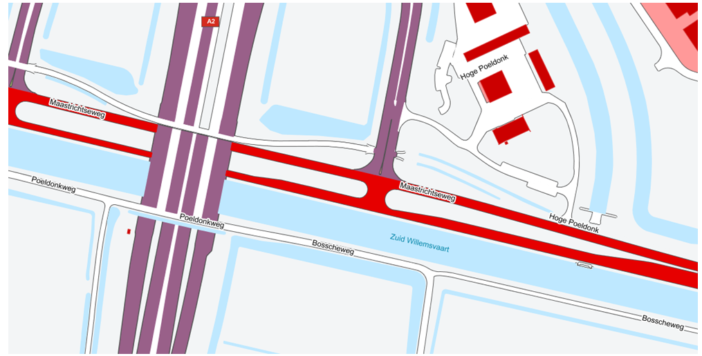
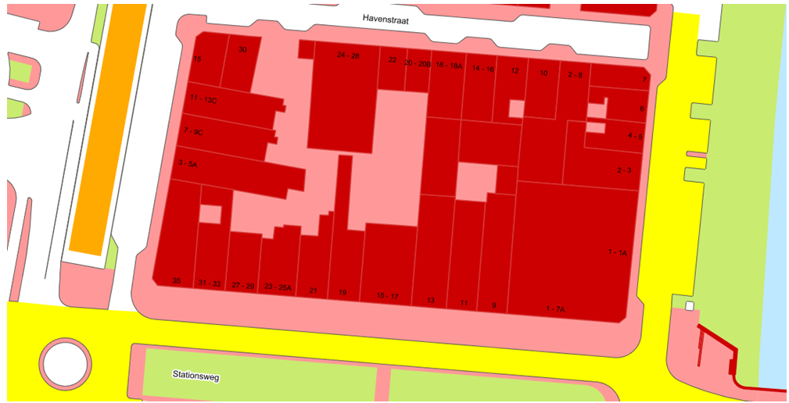

# Teksten

Visualisatie is geen onderdeel van het BGT-informatiemodel, maar een apart aspect. Deze gegevenscatalogus bevat de objectdefinities. De visualisatie van deze objecten wordt beschreven in het document Visualisatieregels BGT en IMGeo. In deze gegevenscatalogus worden dan ook geen uitspraken gedaan over hoe de producten van de BGT er uit moeten zien.

Alleen over de visualisatie van teksten wordt in deze gegevenscatalogus iets gezegd. Dit is nodig, omdat deze zaken al door de bronhouders in acht moeten worden genomen, om uiteindelijk een kaartbeeld van de BGT landelijk op een uniforme wijze te kunnen presenteren.

In de BGT worden teksten opgenomen voor visualisatie en oriëntatie. Waar deze teksten zijn opgenomen, worden zij vergezeld van een geometriepunt en eventuele rotatie. Deze teksten betreffen namen van openbare ruimten en een nummeraanduidingreeks bij panden.

_Figuur 9: Visualisatie van openbare ruimtenamen op de BGT achtergrondkaart_

## Namen

In de visualisatie van de BGT worden namen gepresenteerd van alle openbare ruimten, zoals gedefinieerd in de BAG. Dit is bedoeld ter oriëntatie. Een naam van een openbare ruimte kan meerdere malen worden gepresenteerd. Dit heeft te maken met het gebruik binnen het schaalbereik van 1:500 tot 1:5.000. Als een openbare ruimte een lengte heeft van meer dan 300 meter, dan is het noodzakelijk om de naam vaker af te beelden.

Strikt genomen is het niet bekend waar een openbare ruimte van de BAG is gelegen, omdat de BAG bij de vorming van de BGT nog geen geometrie van openbare ruimten kent. De BGT ziet deze geometrie als een verantwoordelijkheid van de BAG en heeft deze niet in de gegevenscatalogus opgenomen. De BGT ziet de openbare ruimte niet als ‘harde’ topografie maar als een virtuele ruimte, zoals ook wijken en buurten dat zijn. Mede daarom is de vlakgeometrie van de openbare ruimte niet in de BGT opgenomen. IMGeo bevat wel een optionele uitbreiding, die voorziet in een vlakgeometrie van de openbare ruimte.

De visualisatie van een openbare ruimtenaam vindt plaats door de coördinaten van het midden (centrum) van de tekst vast te leggen, evenals de rotatie van de tekst ten opzichte van de normale tekstrichting. De normale tekstrichting is van links naar rechts oftewel, in een kaartbeeld met de noordrichting aan de bovenzijde, van west naar oost. Voor namen van wegen, waterlopen en spoorbanen dient de rotatiehoek te worden vastgelegd, zodat de naam met de richting van de weg, waterloop of spoorbaan mee kan worden gevisualiseerd. De naam wordt geautomatiseerd uit de BAG overgenomen.

## Nummeraanduidingen

In de visualisatie van de BGT worden nummeraanduidingen gepresenteerd, die horen bij panden, zoals gedefinieerd in de BAG voor de verblijfsobjecten in die panden. Dit is bedoeld ter oriëntatie.

_Figuur 10: Visualisatie van nummeraanduidingen op de BGT hoofdthema kaart_

De nummeraanduidingen van verblijfsobjecten in een pand worden verzameld tot een nummeraanduidingreeks. Als er slechts één huisnummer voorkomt, wordt alleen deze getoond. Bij meerdere huisnummers worden het eerste en het laatste huisnummer getoond, gescheiden door een koppelteken, bijvoorbeeld 33-39.

Als in een reeks ook huisletters voorkomen, dan worden deze ook afgebeeld, bijvoorbeeld 33A-33Z of 33A-39A. Als in een reeks ook toevoegingen voorkomen dan worden deze niet afgebeeld.

Als in een pand één en slechts één verblijfsobject voorkomt, dan wordt de nummeraanduiding hiervan volledig weergegeven, dus zowel het huisnummer als de eventueel aanwezige huisletter en/of toevoeging.

Een speciaal geval treedt op als een pand op de grens van twee of meer openbare ruimten is gelegen en nummeraanduidingen daarbinnen bij meerdere openbare ruimten horen. In dit geval worden er meerdere (reeksen van) nummeraanduidingen afgebeeld overeenkomstig bovenstaande regels.

De visualisatie van een nummeraanduidingreeks vindt plaats door de coördinaten van het midden (centrum) van de tekst vast te leggen, alsmede de rotatie van de tekst ten opzichte van de normale tekstrichting. Het coördinatenpunt van de nummeraanduidingreeks wordt circa 4 meter vanaf de voorgevel (‘straatzijde’) binnen het pand geplaatst.

De nummeraanduidingreeks wordt bij voorkeur geplaatst met een minimale rotatie ten opzichte van de tekstrichting (zie Figuur 10).

Locaties van nummeraanduidingen van lig- en standplaatsen worden in de BGT niet geregistreerd. Locaties van individuele verblijfsobjecten zijn geen onderdeel van de BGT. Deze worden in de BAG vastgelegd.

N.B. Bij het maken van producten uit het stelsel zijn ook gecombineerde producten mogelijk, waarbij bijvoorbeeld zowel gegevens uit de BGT als de BAG worden gevisualiseerd.
