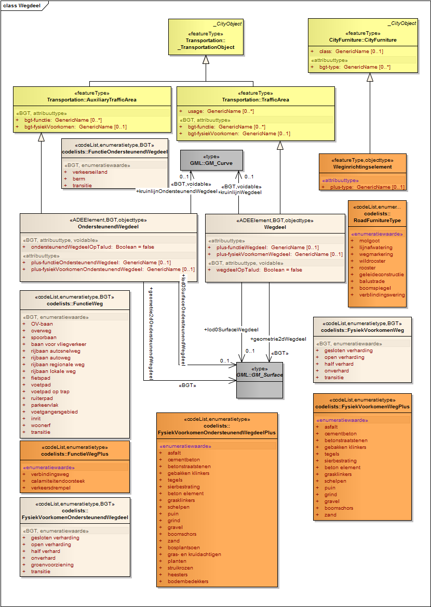
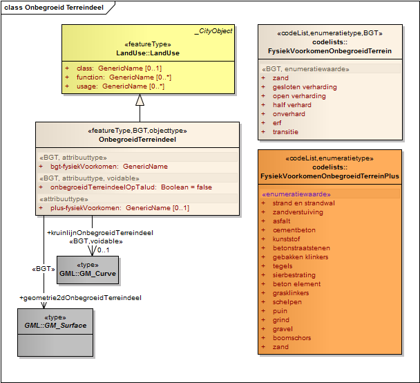
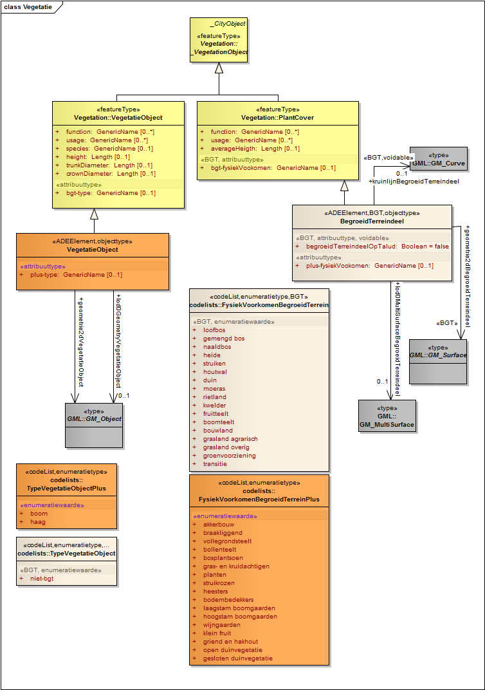
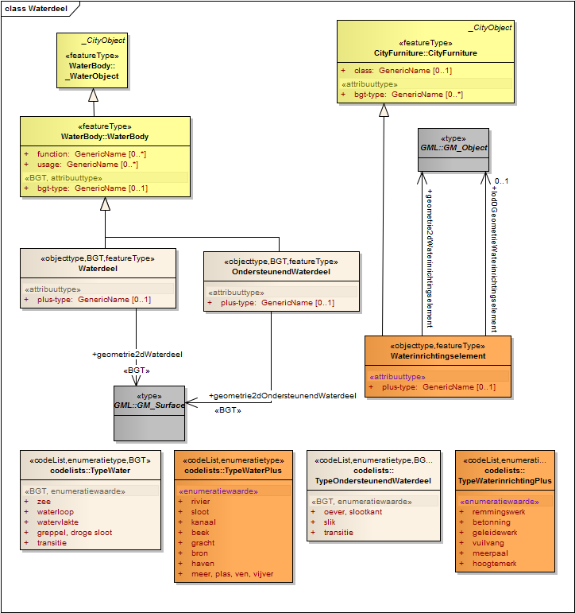
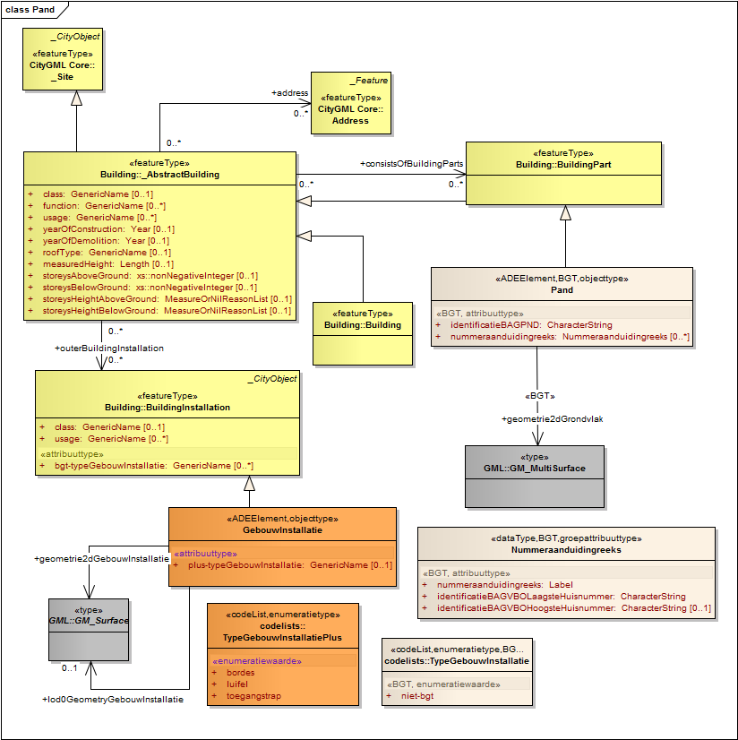
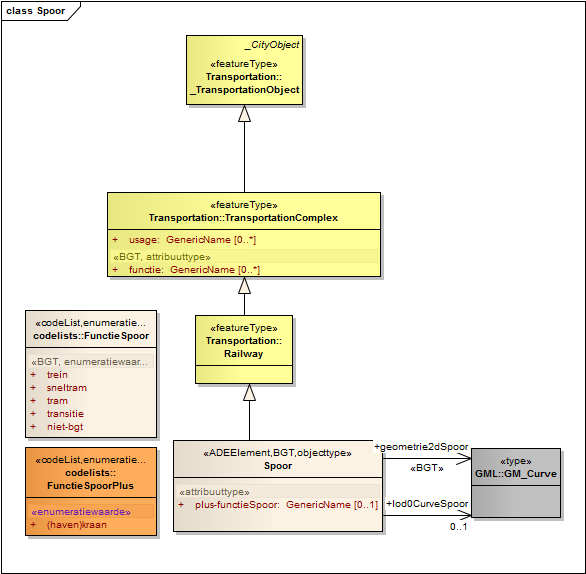
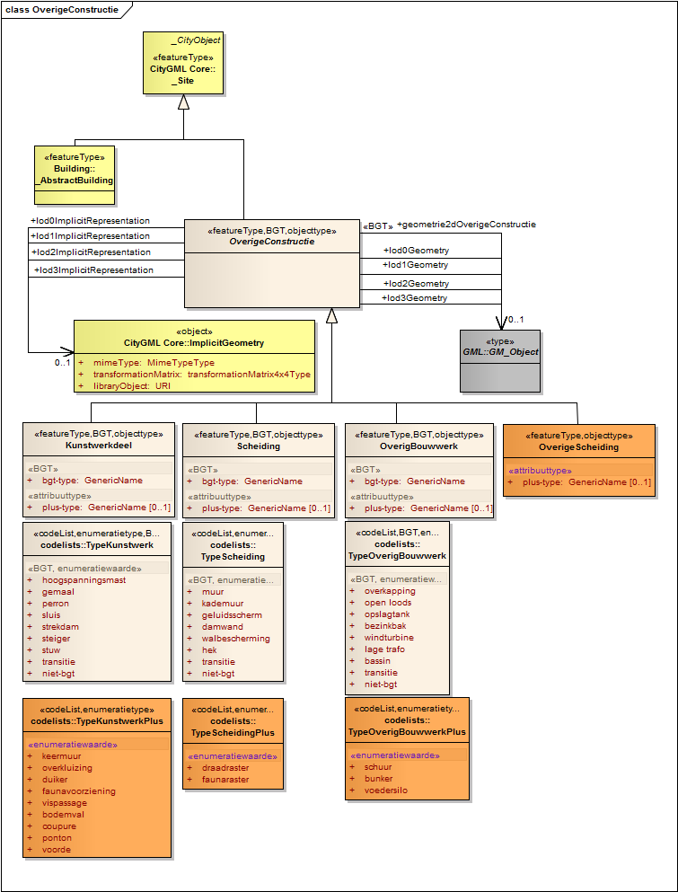
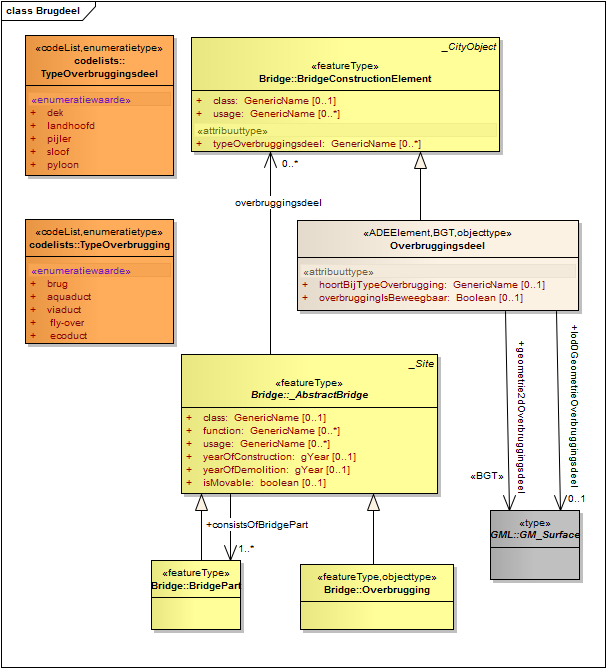
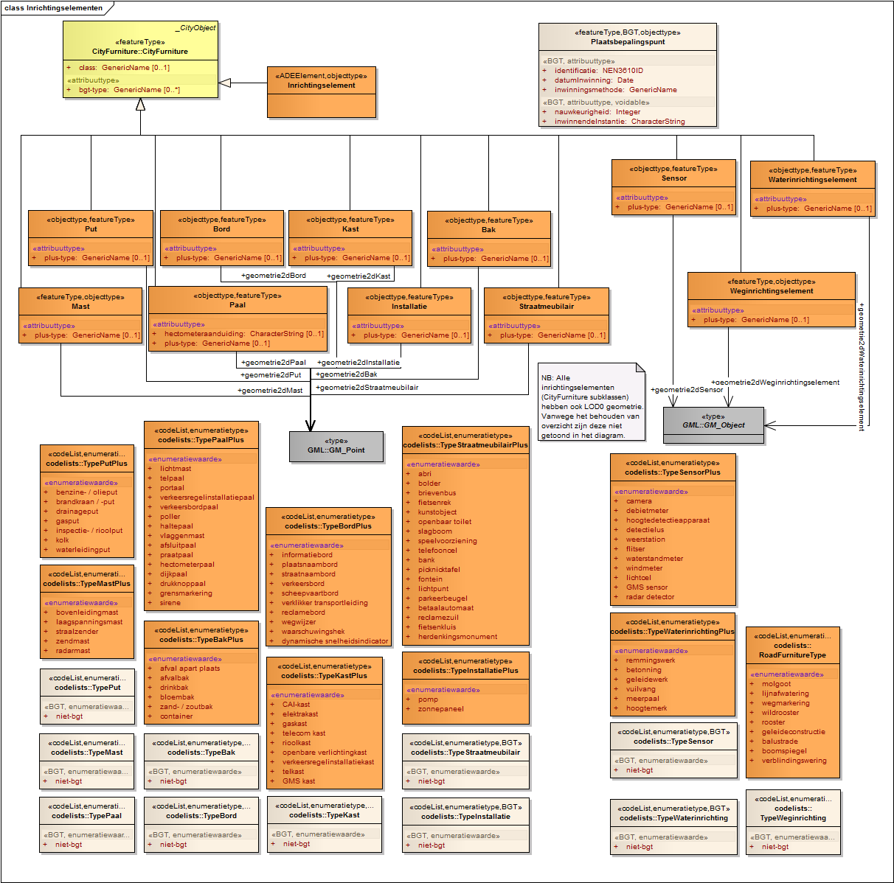
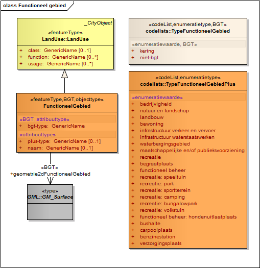

Semantisch gegevensmodel
========================

Het IMGeo gegevensmodel is te uitgebreid om in één plaat te laten zien.
Hieronder wordt het overzicht getoond in twee delen waarop de objecttypen, die tot de BGT behoren, in lichtroze zijn afgebeeld en de objecttypen, die tot het optionele IMGeo deel behoren, in oranje.

In het model is te zien dat de IMGeo klassen zijn afgeleid van klassen van CityGML. De klasse IMGeo-Object is gedefinieerd als een \«ADEElement\» specialisatie die extra eigenschappen toevoegt aan \_CityObject uit CityGML. Via die klasse erven alle IMGEO objecttypen deze eigenschappen.

_Figuur 5: IMGeo model overzicht deel I: constructies en transport_

_Figuur 6: IMGeo model overzicht deel II: terrein, water, inrichtingselementen en gebieden_

In de rest van dit hoofdstuk wordt de detailmodellering getoond in meerdere figuren. In deze diagrammen zijn de IMGeo klassen uitgewerkt als specialisaties van klassen uit CityGML. Deze OGC-standaard bevat een uitgebreid semantisch model voor 3D topografie. IMGeo is van CityGML afgeleid om zo het informatiemodel 3D klaar te maken. Zoals beschreven in paragraaf 2.6.2 zijn de IMGeo klassen gemodelleerd als subklasse van CityGML van de vorm \«ADEElement\» of \«featureType\». De laatsten zijn volwaardige subklassen, de eersten komen conceptueel volledig overeen met de CityGML superklasse en voegen er alleen eigenschappen aan toe.

In de diagrammen is gebruik gemaakt van kleur om te laten zien welke klassen bij CityGML, BGT of het optionele IMGeo deel horen:

-   CityGML: geel
-   BGT: beige
-   IMGeo optioneel: oranje

In het informatiemodel zijn BGT en IMGeo samen gemodelleerd. Niet alleen op klasseniveau, maar ook op attribuut-, associatie- en domeinwaardenlijstenniveau is het onderscheid tussen BGT en IMGeo gemaakt. Een BGT klasse kan een attribuut of associatie hebben die bij het optionele IMGeo deel hoort en voor de BGT niet geleverd hoeft te worden. Een domeinwaardenlijst (enumeratie) kan onderdeel van BGT of IMGeo zijn, waarbij een IMGeo waardenlijst waarden bevat die die optioneel zijn en ofwel een optionele nadere detaillering bieden, ofwel objecten aanduiden die voor de BGT niet geleverd hoeven te worden maar in IMGeo wel toegestaan zijn.

Alle objecten, attributen, associaties en domeinwaardenlijsten die onderdeel zijn van de BGT zijn aangemerkt met een \«BGT\» stereotype. Alle objecten, attributen, associaties en domeinwaardenlijsten die deze markering niet hebben, horen bij het optionele deel van IMGeo.

De rest van dit hoofdstuk bevat figuren van alle IMGeo UML diagrammen.

_Figuur 7: Wegdeel, ondersteunend wegdeel en weginrichtingselement_

_Figuur 8: Onbegroeid terreindeel_

_Figuur 9: Begroeid terreindeel en vegetatieobject_

_Figuur 10: Waterdeel en waterinrichtingselement_

_Figuur 11: Pand en gebouwinstallatie_

_Figuur 12: Spoor_

_Figuur 13: Abstracte superklasse OverigeConstructie met subklassen:
kunstwerkdeel, overig bouwwerk, scheiding en overige scheiding_

Figuur 14: Overbruggingsdeel

Figuur 15: Tunneldeel

Figuur 16: Inrichtingselementen

_Figuur 17: Registratief gebied_

_Figuur 18: Functioneel gebied_
