# Inleiding

In deze praktijkrichtlijn wordt verstaan onder een inrit (ofwel uitrit):

-   de ingang voor voertuigen vanaf een openbaar toegankelijk wegdeel.

-   een uitgang voor voertuigen van een pand of terreindeel naar een openbaar
    toegankelijk wegdeel, en/of

Een inrit of uitrit vormt in feite de verbinding tussen een pand of terreindeel
en de openbare weg. In deze praktijkrichtlijn wordt zowel een inrit als uitrit
met de term ‘inrit’ aangeduid.

In deze praktijkrichtlijn worden de eisen en afbakeningsregels voor inritten
nader toegelicht voor de juiste toepassing van de BGT\|IMGeo standaarden. Deze
praktijkrichtlijn bevat

-   de eisen en afbakeningsregels voor inritten in de BGT\|IMGeo standaarden

-   een beslisboom als hulpmiddel voor de afbakening van inritten

-   voorbeelden van enkele gecombineerde en bijzondere situaties.

## Eisen en regels in de BGT\|IMGeo standaarden

Een inrit is als (classificatie van een) object geen onderdeel van IMGeo.
Inritten kunnen worden opgenomen in de eigen beheeromgeving, bijvoorbeeld
gekoppeld via een extra BOR-attribuut aan een bestaand IMGeo-object.

In hoofdstuk 10 van de BGT gegevenscatalogus is/wordt als eis opgenomen voor de
afbakening van inritten, dat

1.  Inritten langer dan 30 meter worden afgebakend als Wegdeel met functie
    ‘toegangsweg’

2.  Inritten korter dan 30 meter die een wegdeel van het type rijbaan, fietspad
    of voetpad doorkruisen, worden afgebakend als Wegdeel met als functie de
    rijbaan, fietspad of voetpad die het doorkruist.

3.  Inritten korter dan 6 meter, die geen wegdeel van het type rijbaan, fietspad
    of voetpad doorkruisen, worden afgebakend als OndersteunendWegdeel met
    functie ‘berm’.

4.  Inritten tussen de 6 en 30 meter, die geen rijbaan, fietspad of voetpad
    doorkruisen, worden afgebakend als Wegdeel, Begroeid- of
    OnbegroeidTerreindeel.

Belangrijk aandachtspunt bij het toetsen van inritten tegen eis 2) zijn de
regels voor hiërarchie in objecten en domeinwaarden voor BGT-objecten, zoals
beschreven in paragraaf 3.9 van de BGT gegevenscatalogus. Voor het afbakenen van
objecten en het toekennen van domeinwaarden geldt dat

>   *“het object met de beste idealisatiewaarde voorrang heeft boven een object
>   met een minder goede waarde. Als objecten dezelfde idealisatiewaarde hebben,
>   dan geldt de volgorde van de beschrijving van de objecten in hoofdstuk 8 en
>   de volgorde van de domeinwaarden in hoofdstuk 9. Een eerder beschreven
>   object of domeinwaarde heeft dan voorrang boven het daarna vermelde object
>   of domeinwaarde.”*

Een voorbeeld hiervan is een Wegdeel dat bestemd is voor gebruik door fietsers
en voetgangers. Dit Wegdeel voldoet dus zowel aan definities van een Wegdeel als
‘fietspad’ en ‘voetpad’. Volgens de hiërarchische toekenningsregels wordt dit
Wegdeel als ‘fietspad’ afgebakend omdat deze domeinwaarde eerder staat vermeld
in de waardenlijst FunctieWeg. Deze eis wordt toegepast bij vraag 2 van de
beslisboom inritten bij het doorkruisen van meer dan één wegdeel van het type
rijbaan, fietspad en/of voetpad (zie gecombineerde situaties).

# Beslisboom inritten

Hieronder wordt een beslisboom gepresenteerd die bronhouders kan helpen bij het
afbakenen van een inrit.

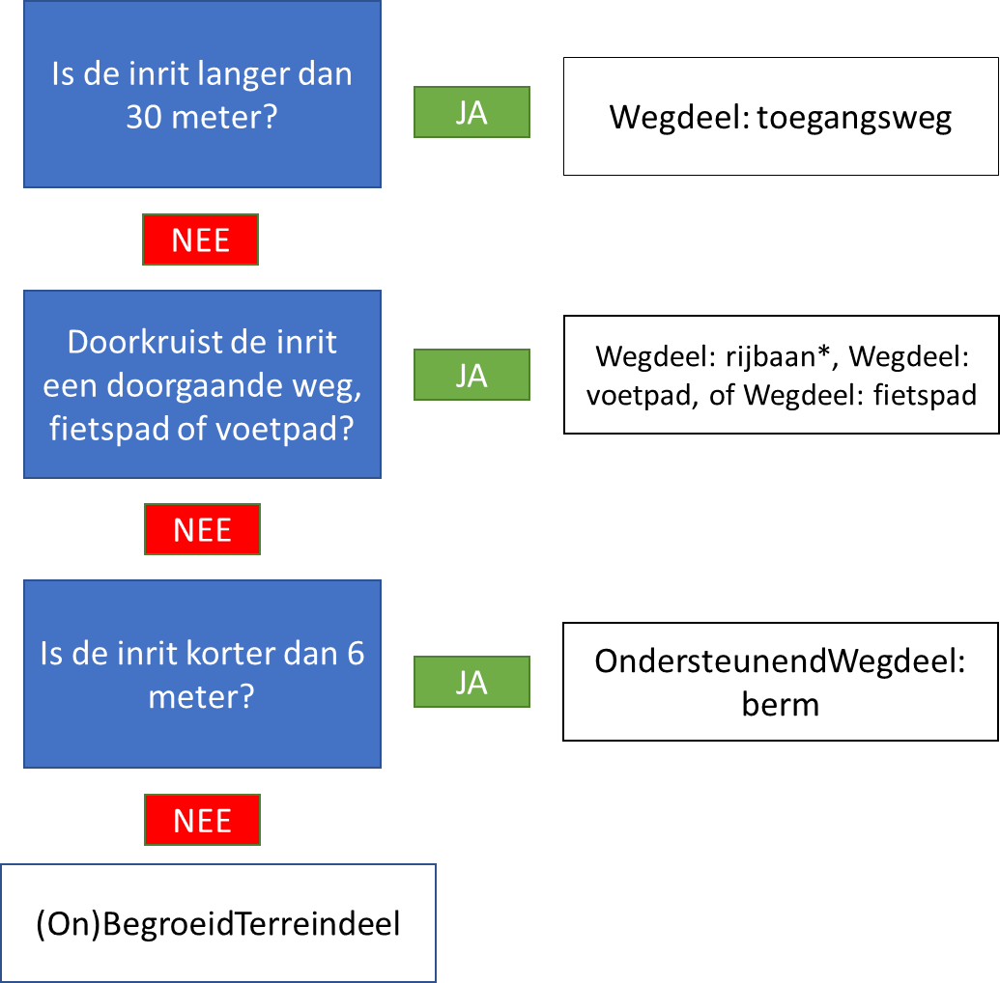

## Toelichting op de beslisboom

### Vraag 1. Is de inrit langer dan 30 meter?**

<ja>JA </ja> Als de inrit langer is dan 30 meter, wordt de inrit afgebakend als **Wegdeel** met functie **toegangsweg**.

<nee>NEE </nee> Als de inrit korter is dan 30 meter, ga door naar vraag 2.

**Voorbeeld**

In onderstaand voorbeeld is de inrit langer dan 30 meter. De inrit wordt afgebakend als Wegdeel met bgt-functie ‘toegangsweg’.

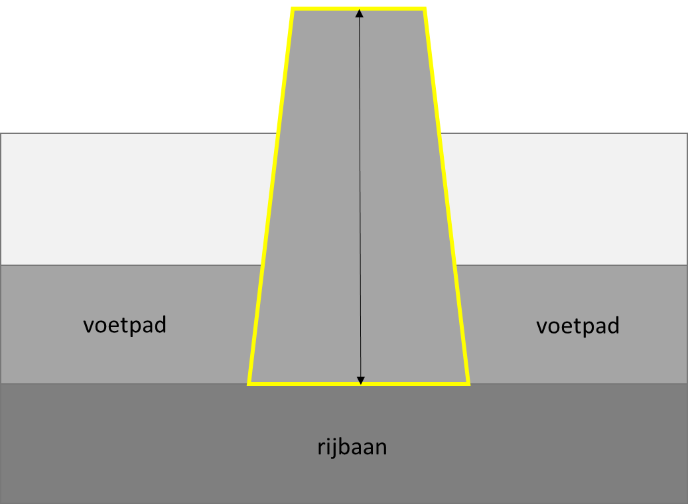

### Vraag 2. Doorkruist de inrit een weg, voetpad of fietspad?**

<ja>JA</ja> Als de inrit een weg, voetpad of fietspad doorkruist, dan wordt de
inrit afgebakend als **Wegdeel** met de functie van de weg (**rijbaan**),
**fietspad** of **voetpad** dat het doorkruist.

<nee>NEE</nee> Als de inrit geen doorgaande weg, voetpad of fietspad doorkruist, ga
door naar vraag 3.

   **Voorbeeld**

   In onderstaand voorbeeld is de inrit korter dan 30 meter, en doorkruist de
   inrit een voetpad. De inrit wordt afgebakend als Wegdeel met bgt-functie
   ‘voetpad’.

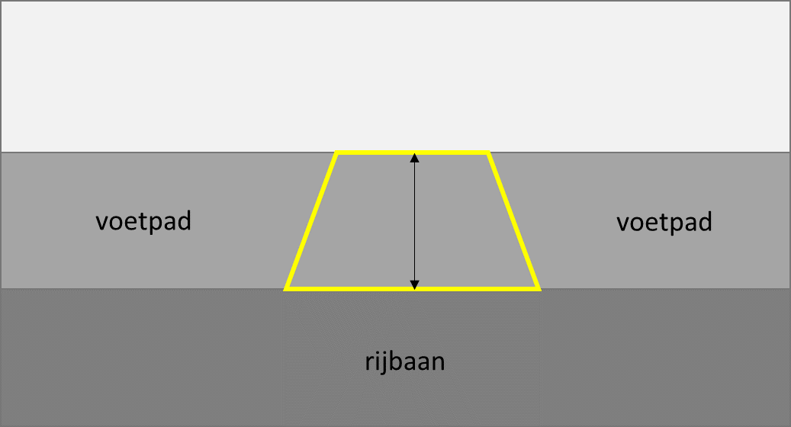

### Vraag 3 Is de inrit korter dan 6 meter?**

   <ja>JA</ja> Als de inrit is korter dan 6 meter, dan wordt de inrit afgebakend als
   OndersteunendWegdeel met functie ‘berm’.

   <nee>NEE</nee> Als de inrit langer is dan 6 meter, wordt de inrit afgebakend als
   (On)BegroeidTerreindeel.

   **Voorbeeld**

   In onderstaand voorbeeld is de inrit korter dan 6 meter, en doorbreekt de
   inrit geen rijbaan, fietspad en/of voetpad. De inrit wordt afgebakend als
   Wegdeel met bgt-functie ‘berm’ en een eigen fysiek voorkomen.

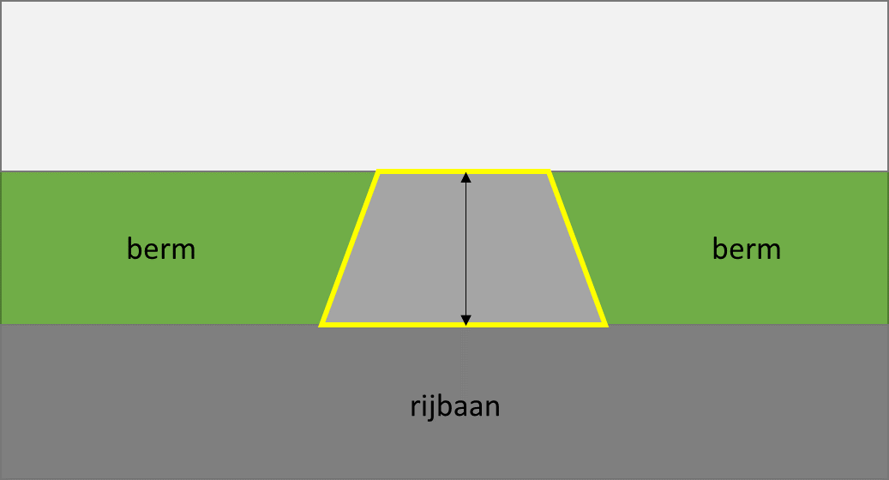

   **Voorbeeld**

   In onderstaand voorbeeld is de inrit langer dan 6 meter en korter dan 30
   meter, en doorbreekt de inrit geen rijbaan, fietspad en/of voetpad. De inrit
   wordt afgebakend als BegroeidTerreindeel of OnbegroeidTerreindeel met een
   eigen fysiek voorkomen.

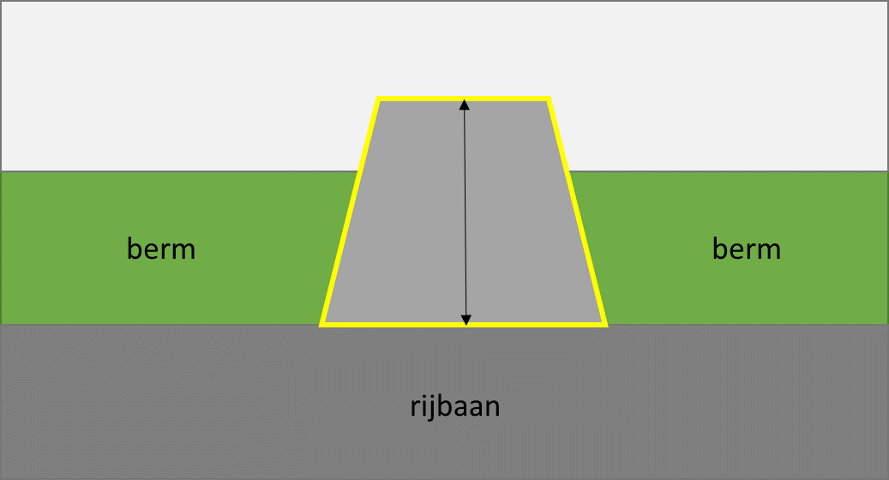

## Voorbeelden van gecombineerde en bijzondere situaties

Als een inrit een berm en een doorgaande weg doorkruist, of als een inrit
meerdere doorgaande wegen doorkruist, dan gelden de hiërarchische
afbakeningsregels conform de BGT catalogus 3.9.

   **Voorbeeld**

   In onderstaand voorbeeld is de inrit korter dan 30 meter en langer dan 6
   meter, en doorkruist de inrit een berm en een voetpad. Deze inrit wordt
   afgebakend als Wegdeel met bgt-functie ‘voetpad’.

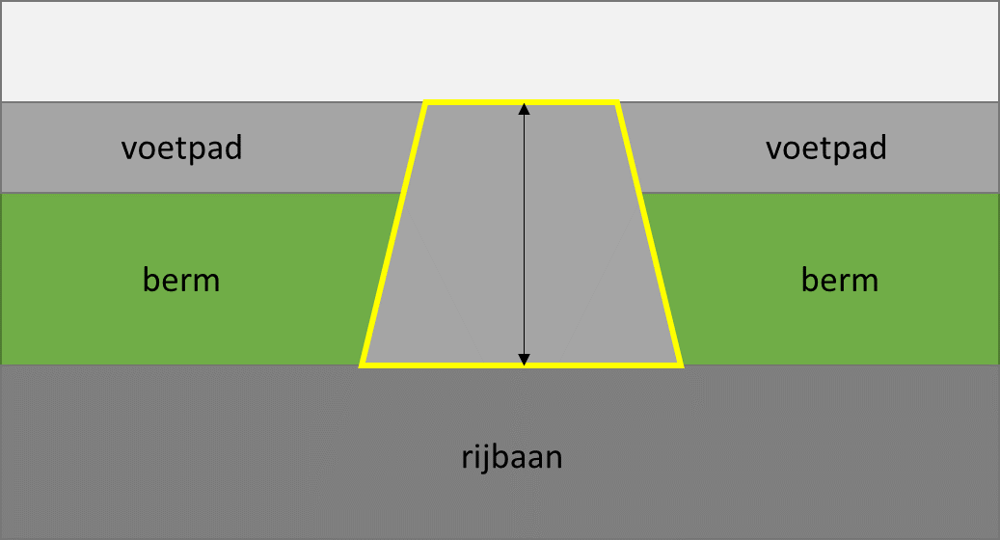

   **Voorbeeld**

   In onderstaand voorbeeld is de inrit korter dan 30 meter en langer dan 6
   meter, en doorkruist de inrit een fietspad en een voetpad. Deze inrit wordt
   afgebakend als Wegdeel met bgt-functie ‘fietspad’.

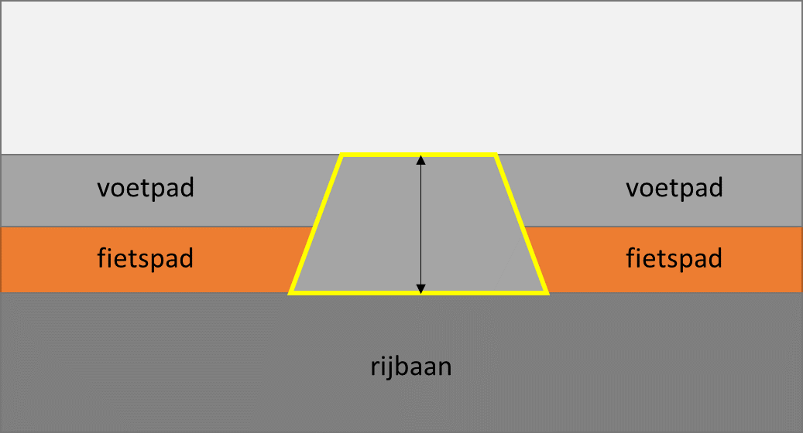

Als een inrit over een waterdeel loopt, dan wordt de inrit afgebakend met een
Overbruggingsdeel op niveau 1 met daarop op dezelfde relatieve hoogte een
OndersteunendWegdeel:berm met een eigen fysiekvoorkomen.

   **Voorbeeld**

   In onderstaand voorbeeld is de inrit korter dan 30 meter, en ligt de inrit
   over het water. Deze inrit wordt afgebakend als Overbruggingsdeel.

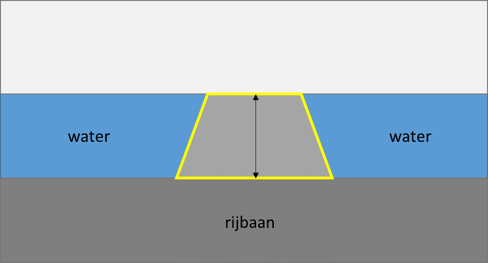

**Voorbeeld**

   In onderstaand voorbeeld ligt de inrit op een (toegangs)dam. Als de inrit
   korter dan 6 meter is, wordt de inrit afgebakend als OndersteunendWegdeel
   met functie ‘berm’. Als de inrit langer dan 6 meter en korter dan 30 meter
   is, wordt deze inrit afgebakend als BegroedTerreindeel of
   OnbegroeidTerreindeel.

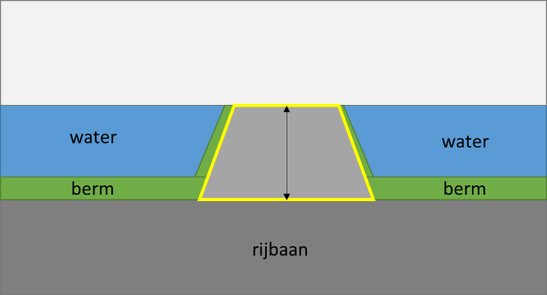

Hieronder volgen enkele foto’s van praktijksituaties.

   **Voorbeeld**

   In onderstaand voorbeelden is de inrit korter dan 30 meter en doorkruist de
   inrit een voetpad en een groenstrook langs de rijbaan. Deze inrit wordt
   afgebakend als Wegdeel met bgt-functie ‘voetpad’.

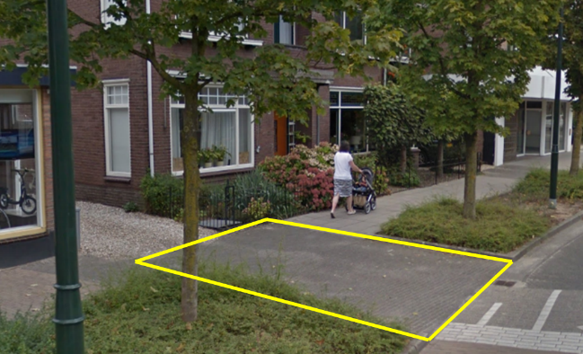

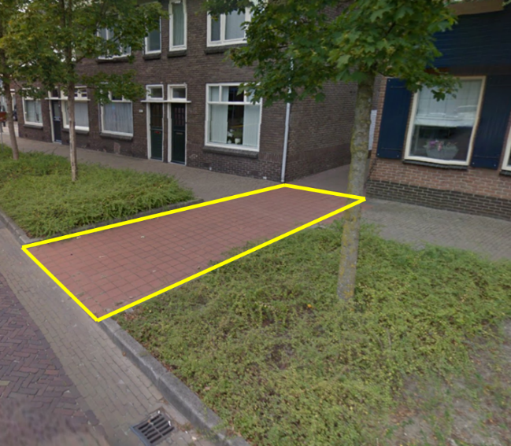

**Voorbeeld**

   In onderstaand voorbeeld is de inrit korter dan 6 meter en doorkruist de
   inrit enkel de berm. Deze inrit wordt afgebakend als OndersteunendWegdeel
   met bgt-functie ‘berm’ en een eigen fysiek voorkomen.

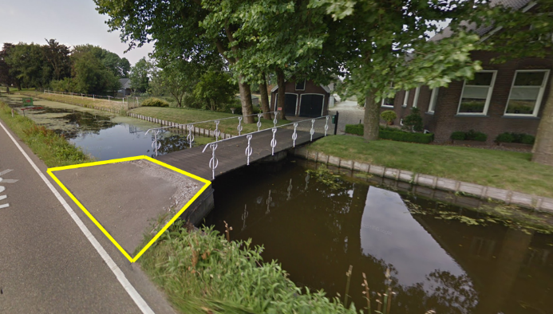

**Voorbeeld**

   In onderstaand voorbeeld is de inrit langer dan 6 meter en korter dan 30
   meter, en de inrit doorkruist geen rijbaan, voetpad, of fietspad. Deze inrit
   wordt afgebakend als OnbegroeidTerreindeel met een bgt-fysiekvoorkomen ‘open
   verharding’.

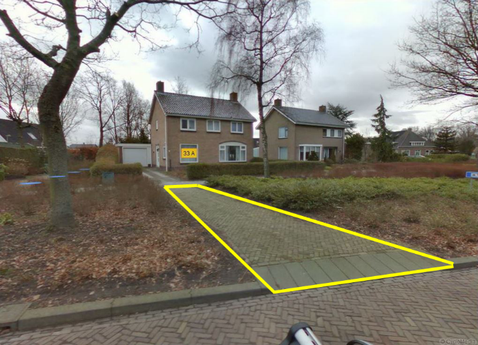
