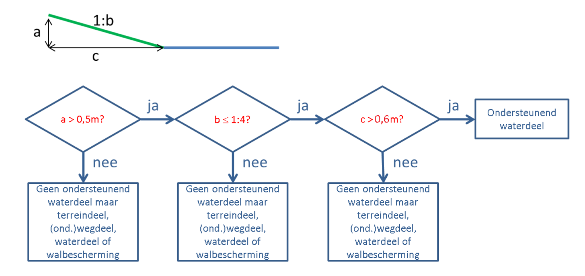

Afbakening
==========

Dit hoofdstuk geeft een toelichting op de voorstellen voor het onderdeel
Afbakening. Het betreft voorstellen voor het aanscherpen van inwinningsregels.

**Impact** De impact van dit voorstel wordt ingeschat op relatief ‘**hoog**’.

-   *Verplicht/niet verplicht:* dit betreft een wijziging in het verplichte deel
    van IMGeo.

-   *Software:* er is geen aanpassing van de software nodig.

-   *Dataconversie:* bestaande gegevens hoeven niet te worden geconverteerd.

-   *Inwinning:* bronhouders dienen de huidige populatie van ondersteunende
    waterdelen na te lopen om vast te stellen of deze objecten aan de nieuwe
    afbakeningsregels voldoen.

-   *Samenhang basisregistraties:* er is geen impact voor andere
    basisregistraties voorzien; IMGeo past met dit voorstel aan op de
    systematiek vanuit waterbeheer (IMWA).

**Implementatieadvies** Implementatie-afspraken/termijnen dienen nader te worden
bepaald t.a.v. wanneer bronhouders hun bestaande gegevens hebben gecontroleerd
en aangepast conform de nieuwe afbakeningsregels.

Aanpassen afbakeningsregels voor OndersteunendWaterdeel
-------------------------------------------------------

**Gerelateerde
Github-issue(s)** [\#](https://github.com/Geonovum/IMGeo2018/issues/50)50,
[\#74](https://github.com/Geonovum/IMGeo2018/issues/74),
[\#76](https://github.com/Geonovum/IMGeo2018/issues/76) 

**Gerelateerde voorstel(len)** n.v.t.

**Huidige situatie** In de hoofdstuk 10 van de BGT gegevenscatalogus is voor de
eisen van afbakening van ondersteunende waterdelen bij meren en waterlopen het
volgende opgenomen:

>   "Als de horizontale afstand tussen waterlijn en de bovenkant van een
>   herkenbare insteek 1m of meer bedraagt dan ontstaat in de BGT een
>   ondersteunend waterdeel van het type oever/slootkant."

**Nieuwe situatie** Het voorstel is om de afbakeningscriteria van
OndersteunendWaterdeel voor oevers, slootkant al volgt te wijzigen:

>   "Ondersteunende waterdelen komen voor wanneer er sprake is van een talud dat
>   een minimumwaarde voor de helling heeft van 1:4 èn de horizontale afstand
>   tussen kant insteek èn waterlijn (c) minimaal 0,5 m bedraagt"

De volgende beslisboom wordt toegevoegd aan de afbakeningsregels voor
OndersteunendWaterdeel:

**Onderbouwing** Met deze afbakeningsregels sluit de BGT beter aan op de
afbakening van oevers vanuit waterbeheer (IMWA).

**Impact** De impact van dit voorstel wordt ingeschat op relatief ‘**hoog**’.

-   *Verplicht/niet verplicht:* dit betreft een wijziging in het verplichte deel
    van IMGeo.

-   *Software:* er is geen aanpassing van de software nodig.

-   *Dataconversie:* bestaande gegevens hoeven niet te worden geconverteerd.

-   *Inwinning:* bronhouders dienen de huidige populatie van ondersteunende
    waterdelen na te lopen om vast te stellen of deze objecten aan de nieuwe
    afbakeningsregels voldoen.

-   *Samenhang basisregistraties:* er is geen impact voor andere
    basisregistraties voorzien; IMGeo past met dit voorstel aan op de
    systematiek vanuit waterbeheer (IMWA).

**Implementatieadvies** Implementatie-afspraken/termijnen dienen nader te worden
bepaald t.a.v. wanneer bronhouders hun bestaande gegevens hebben gecontroleerd
en aangepast conform de nieuwe afbakeningsregels.

Opnemen van afbakeningsregels voor bos
--------------------------------------

**Gerelateerde issue(s)**
[\#161](https://github.com/Geonovum/IMGeo2018/issues/161)

**Huidige situatie** In BGT gegevenscatalogus paragraaf 9.8 staat in de
definitie van loofbos, gemengd bos, en naaldbos als classificatie van een
Begroeidterreindeel de zinsnede ‘een dusdanige aantal’. In de afbakeningsregels
wordt ‘dusdanige aantal’ niet nader gespecificeerd met criteria als
aantallen/percentages.

**Nieuwe situatie** In de BGT gegevenscatalogus hoofdstuk 10 worden
afbakeningsregels voor bos toegevoegd:

>   Om een terreindeel als loofbos af te bakenen dient het minimimum percentage
>   loofboom groter dan of gelijk aan 90% te zijn. Om een terreindeel als
>   naaldbos af te bakenen dient het minimum percentage naaldboom groter dan of
>   gelijk aan 90 % te zijn. Om een terreindeel als gemengd bos af te bakenen
>   dient het maximum percentage naaldboom of het maximum percentage loofboom
>   kleiner dan 90% te zijn. Bij deze percentages worden het eventueel aanwezige
>   onderhout en smalle stroken loof- en of naaldbos gelegen naast of als
>   uitloper van het bos buiten beschouwing gelaten.

**Onderbouwing** Met deze afbakeningscriteria kunnen bronhouders eenduidig en
uniform een classificatie loofbos, gemengd bos of naaldbos toekennen aan een
bos. De percentages zijn gebaseerd op de afbakeningscriteria voor bos in de
Basisregistratie Topografie (BRT). Met deze wijziging sluiten BGT en BRT beter
op elkaar aan. We streven er naar om uiteindelijk als de BGT volledig gereed is,
de BRT af te leiden uit de BGT.

**Impact** De impact van dit voorstel wordt ingeschat op relatief ‘**laag**’.

-   *Verplicht/niet verplicht:* dit betreft een wijziging in het verplichte deel
    van IMGeo.

-   *Software:* er is geen aanpassing van de software nodig.

-   *Dataconversie:* bestaande gegevens hoeven niet te worden geconverteerd.

-   *Inwinning:* bronhouders dienen de huidige populatie van begroeide
    terreindelen met een functie gerelateerd aan bos na te lopen om vast te
    stellen of deze objecten aan de nieuwe afbakeningsregels voldoen.

-   *Samenhang basisregistraties:* er is geen impact voor andere
    basisregistraties voorzien; IMGeo past met dit voorstel aan op de BRT.

**Implementatieadvies** Implementatie-afspraken/termijnen dienen nader te worden
bepaald t.a.v. wanneer bronhouders hun bestaande gegevens hebben gecontroleerd
en aangepast conform de nieuwe afbakeningsregels.

Het volgende kan daarbij onderzocht worden: - Het confronteren van bossen in de
BRT met de huidige objecten bos in de . Objecten die niet een overeenkomstige
classificatie hebben kunnen in het kwaliteitsdashboard aan de werkvoorraad van
de bronhouders worden toegevoegd.

**Gerelateerde voorstellen** Geen

Opnemen afbakeningsregels voor toegangsweg en inrit
---------------------------------------------------

**Gerelateerde issue(s)**
[\#126](https://github.com/Geonovum/IMGeo2018/issues/126)

**Huidige situatie** In de BGT komt de functie 'inrit' voor bij een Wegdeel met
de volgende definitie:

*"Toegangswegen oprijlanen en dergelijke met verkeersfunctie die leiden naar
afgelegen erven en terreinen."*

Afgelegen is niet nader gespecificeerd in de afbakeningsregels. Als gevolg
daarvan zijn zowel de langere toegangswegen naar afgelegen percelen en gebouwen
als de korte inritten voor toegang van een openbare weg naar een perceel of
gebouw door bijna alle bronhouders opgenomen in de BGT. 

**Nieuwe situatie** Het voorstel is om in de afbakeningsregels van de BGT het
volgende op te nemen:

*“Inritten en toegangswegen*

*Inritten (of uitritten) zijn wegdelen die de verbinding vormen tussen een pand,
erf/perceel of terrein en de openbare weg. Voor deze inritten geldt het
volgende:*

-   *Inritten langer dan 30 meter worden afgebakend als Wegdeel met functie
    ‘toegangsweg’*

-   *Inritten korter dan 30 meter die een wegdeel van het type rijbaan, fietspad
    of voetpad doorkruisen, worden afgebakend als Wegdeel met als functie de
    rijbaan, fietspad of voetpad die het doorkruist.*

-   *Inritten korter dan 6 meter, die geen wegdeel van het type rijbaan,
    fietspad of voetpad doorkruisen, worden afgebakend als OndersteunendWegdeel
    met functie ‘berm’.*

-   *Inritten tussen de 6 en 30 meter, die geen rijbaan, fietspad of voetpad
    doorkruisen, worden afgebakend als Wegdeel, Begroeid- of
    OnbegroeidTerreindeel.”*

In een
[praktijkrichtlijn](https://geonovum.github.io/IMGeo2018/standaarden/informatiemodel/praktijkrichtlijn/inritten/index.html) wordt
extra toelichting gegeven aan bronhouders voor de juiste toepassing van de BGT
afbakeningsregels voor inritten.

**Onderbouwing** Het opnemen van korte inritten (enkele meters lang) in de BGT
is nooit de bedoeling geweest. Met deze wijziging wordt de BGT uniformer door
het nader specificeren van de term ‘afgelegen’ (30 meter of meer vanaf de
openbare weg) voor een toegangsweg.

Voor beheer openbare ruimte kan in de eigen beheeromgeving worden toegevoegd of
het Wegdeel, OndersteunendWegdeel of Terreindeel een inrit is.

**Impact** De impact van dit voorstel wordt ingeschat op ‘**zeer groot**‘:

-   *Verplicht/niet verplicht:* dit betreft een wijziging in het verplichte deel
    van IMGeo.

-   *Software:* er is geen aanpassing van de software nodig.

-   *Dataconversie:* bestaande gegevens hoeven niet worden geconverteerd.

-   *Inwinning:* bronhouders dienen de huidige populatie van inritten (total \~)
    na te lopen om vast te stellen of deze objecten aan de nieuwe
    afbakeningsregels voldoen.

-   *Samenhang basisregistraties:* er is geen impact voor andere
    basisregistraties voorzien; IMGeo past met dit voorstel aan op de BRT.

**Implementatie-advies** Implementatie-afspraken/termijnen dienen nader te
worden bepaald t.a.v. wanneer bronhouders hun bestaande gegevens hebben
gecontroleerd en aangepast conform de nieuwe afbakeningsregels. Het volgende kan
daarbij onderzocht worden:

-   Het signaleren in het kwaliteitsdashboad van elk Wegdeel met functie ‘inrit‘
    (of ‘toegangsweg’) korter dan 30 meter.

Zie ook de gerelateerde voorstellen. Dit voorstel alleen doorvoeren als ook de
gerelateerde voorstellen worden ingevoerd.

Opnemen afbakeningsregels voor bermen
-------------------------------------

**Gerelateerde
Github-issue(s)** [\#8](https://github.com/Geonovum/IMGeo2018/issues/8)

**Gerelateerde voorstellen** Geen

**Huidige situatie** In de BGT komt de functie 'berm' voor bij een
OndersteunendWegdeel met de volgende definitie:

*"Een strook grond langs een weg of spoorweg."*

Een OndersteunendWegdeel 'berm' heeft een eigen fysiek voorkomen. Deze keuze in
het model is gemaakt voor de afstemming/koppeling met de internationale
uitwisselstandaard CityGML. Voorts kent de BGT terreindelen (begroeid en
onbegroeid) zonder functie, maar wel met een fysiek voorkomen. In de praktijk
blijkt dat bermen soms door bronhouders afgebakend worden als
OndersteunendWegdeel en soms als Terreindeel. 

**Nieuwe situatie** In de afbakeningsregels van de BGT wordt onderstaande
[beslisboom](https://github.com/Geonovum/IMGeo2018/raw/master/issues/beslisboom-bermen.png) opgenomen
met nadere eisen en regels voor de afbakening van bermen.

In zijn algemeenheid geldt dat indien een terreindeel tussen of naast wegdelen
smaller is dan 6 meter of als er naast het wegdeel op minder dan 6 meter van het
wegdeel een zichtbare overgang is (hek, ander gewas, maairegiem), het
terreindeel wordt afgebakend als OndersteunendWegdeel 'berm'. Anders wordt het
afgebakend als Terreindeel (Begroeid of Onbegroeid).

[beslisboom
bermen](https://github.com/Geonovum/IMGeo2018/raw/master/issues/beslisboom-bermen.png) 

**Onderbouwing** Met deze beslisboom en aangescherpte afbakeningsregels wordt de
afbakening van bermen in de BGT uniformer en eenvoudiger. Met de 6 meter-eis
stemt de BGT af op de BRT.

**Impact** De impact van dit voorstel wordt ingeschat op ‘*groot tot zeer
groot*‘:

-   *Verplicht/niet verplicht:* dit betreft een wijziging in het verplichte deel
    van IMGeo.

-   *Software:* er is geen aanpassing van de software nodig.

-   *Dataconversie:* bestaande gegevens hoeven niet worden geconverteerd.

-   *Inwinning:* bronhouders dienen de huidige populatie van bermen en
    terreindelen na te lopen om vast te stellen of deze objecten aan de nieuwe
    afbakeningsregels voldoen.

-   *Samenhang basisregistraties:* er is geen impact voor andere
    basisregistraties voorzien; IMGeo past met dit voorstel aan op de BRT.

**Implementatie-advies** Implementatie-afspraken/termijnen dienen nader te
worden bepaald t.a.v. wanneer bronhouders hun bestaande gegevens hebben
gecontroleerd en aangepast conform de nieuwe afbakeningsregels. Het volgende kan
daarbij onderzocht worden:

-   Het automatisch omzetten in BRAVO of LV-BGT van elk
    OndersteunendWegdeel:berm dat breder is dan 6 meter vanaf het Wegdeel naar
    een BegroeidTerreindeel of OnbegroeidTerreindeel.

-   Het signaleren in het kwaliteitsdashboad elk OndersteunendWegdeel:berm dat
    breder is dan 6 meter vanaf het Wegdeel als werkvoorraad voor bronhouders.

**Gerelateerde voorstellen** Geen.

Opnemen afbakeningsregels Panden boven water
--------------------------------------------

**Gerelateerde
Github-issue(s):** [\#61](https://github.com/Geonovum/IMGeo2018/issues/61). 

**Gerelateerde voorstellen** Geen

**Huidige situatie** In de BGT wordt in principe waterdeel opgenomen met
relatieve hoogte 0. Voor panden wordt de maaiveldgeometrie opgenomen wat
impliceert dat een pand ook een relatieve hoogte 0 heeft. Onduidelijkheid
bestaat hoe een pand boven water moet worden afgebakend, en welke relatieve
hoogte deze moet krijgen.

**Nieuwe situatie** Het voorstel is om a*an* de afbakeningsregels voor Pand het
volgende toe te voegen:

*“Voor panden die in hun geheel boven water liggen, bijvoorbeeld een
brugwachtershuis dat aan een brug hangt, geldt dat dit pand in de BGT voorkomt
met een relatieve hoogte (rh) van één hoger dan het water waar het zich boven
bevindt.”*

**Onderbouwing** Met deze wijziging worden regels toegevoegd aan de afbakening
van panden boven water, waardoor afbakening door bronhouders gemakkelijker en
uniformer wordt.

**Impact** De impact van dit voorstel wordt ingeschat op ‘**laag**‘:

-   *Verplicht/niet verplicht:* dit betreft een wijziging in het verplichte deel
    van IMGeo.

-   *Software:* er is geen aanpassing van de software nodig.

-   *Dataconversie:* bestaande gegevens hoeven niet worden geconverteerd.

-   *Inwinning:* bronhouders dienen de huidige populatie van panden
    boven/naast/onder water na te lopen om vast te stellen of deze objecten aan
    de nieuwe afbakeningsregels voldoen.

-   *Samenhang basisregistraties:* er is geen impact voor andere
    basisregistraties voorzien; de eisen t.a.v. maaiveldniveau en topologie zijn
    BGT-eigen principes en raken als zodanig niet aan de BAG.

**Implementatie-advies** Implementatie-afspraken/termijnen dienen nader te
worden bepaald t.a.v. wanneer bronhouders hun bestaande gegevens hebben
gecontroleerd en aangepast conform de nieuwe afbakeningsregels.

Opnemen afbakeningsregels overbouw en onderbouw
-----------------------------------------------

**Gerelateerde
Github-issue(s)** [\#19](https://github.com/Geonovum/IMGeo2018/issues/19), [\#43](https://github.com/Geonovum/IMGeo2018/issues/43)

**Gerelateerde voorstel(len)**

\- Toevoegen overbouw en onderbouw aan Pand en OverigBouwwerk 

**Huidige situatie** Bij een Pand en OverigBouwwerk in de BGT wordt de
grondvlakgeometrie opgenomen. De grondvlakgeometrie is waar de ‘footprint’ van
het pand de ondergrond raakt. Overbouw en onderbouw kunnen nu niet opgenomen
worden bij een Pand en OverigBouwwerk in de BGT.

**Nieuwe situatie** In IMGeo wordt Pand en OverigBouwwerk uitgebreid met
overbouw en onderbouw voor het opnemen van uitstekende delen van een bouwwerk
welke boven of onder de grondvlakgeometrie liggen. De volgende afbakeningsregels
worden opgenomen in de BGT catalogus die gelden voor opname van overbouw en
onderbouw bij een Pand en OverigBouwwerk:

>   Wanneer buitenomtrek en grondvlak op beide volgende twee wijzen van elkaar
>   afwijken:

>   \-          De horizontale afwijking ten opzichte van de situatie met het
>   grondvlak bedraagt 1 m of meer;  
>   -          De hoogte van de over- en/of onderbouw bedraagt minimaal één
>   verdieping.

>   ontstaat er voor uitstekende delen van het bouwwerk een eigen geometrie voor
>   de overbouw of onderbouw van dat bouwwerk.

>   Er ontstaat dan één Pand of OverigBouwwerk met als geometrie het grondvlak
>   (rh = 0) plus één of meer panddelen voor elke afwijkende over- of onderbouw
>   van dat BAG-pand. 

>   De begrenzing van de geometrie van overbouw of onderbouw wordt gevormd door
>   de geometrie van het grondvlak en de van het grondvlak afwijkende geometrie
>   dat daar aan grenst.

**Onderbouwing** Meerdere bronhouders en gebruikers hebben het verzoek gedaan om
overbouw en onderbouw op te nemen in IMGeo.

Door het opnemen van alleen overbouw en onderbouw dat aan minimale afmetingen
voor uitsteek en hoogte voldoet, wordt de BGT niet vervuild met kleine
uitstekende delen zoals dakgoten en wordt de inwinlast voor bronhouders beperkt
(immers minder objecten).

**Impact** De impact van dit voorstel wordt ingeschat op relatief ‘hoog‘:

-   *Verplicht/niet verplicht:* dit betreft een wijziging in het verplichte deel
    van IMGeo.

-   *Software:* er is een aanpassing van de software nodig (zie gerelateerd
    voorstel).

-   *Dataconversie:* bestaande gegevens hoeven niet worden geconverteerd.

-   *Inwinning:* bronhouders dienen de huidige populatie van bouwwerken na te
    lopen om vast te stellen of deze objecten overbouw of onderbouw hebben. Voor
    optionele typen voor OverigBouwwerk geldt de verplichting van het opnemen
    van overbouw en onderbouw niet.

-   *Samenhang basisregistraties:* er is een relatie met de basisregistraties
    BAG en WOZ. WOZ heeft panddelen en BAG heeft eisen voor
    bovenaanzichtgeometrie. Afstemming hiermee is noodzakelijk.

**Implementatie-advies** Implementatie-afspraken/termijnen dienen nader te
worden bepaald t.a.v. wanneer bronhouders hun bestaande gegevens hebben
gecontroleerd en aangepast conform de nieuwe afbakeningsregels.

Opnemen afbakeningsregels voor onderscheid tussen viaduct en tunneldeel
-----------------------------------------------------------------------

**Gerelateerde
Github-issue(s)** [\#12](https://github.com/Geonovum/IMGeo2018/issues/12). 

**Gerelateerde voorstellen** Geen

**Huidige situatie** In de BGT wordt onderscheid gemaakt tussen object
Overbruggingsdeel van het type viaduct en het object Tunneldeel. Bij bronhouders
zijn er onduidelijkheden en interpretatieverschillen wanneer een situatie als
Overbruggingsdeel en wanneer als Tunneldeel moet worden afgebakend.

**Nieuwe situatie** Voor de afbakening van Overbruggingsdeel en Tunneldeel
worden extra afbakeningsregels gegeven:

>   “Overbruggingsdeel:  
>   - Er is sprake van een overbrugging wanneer een van de onderdelen bestaat
>   uit een los dek dat op een bak en/of pijlers rust.  
>   - Dit in tegenstelling tot een tunnel, die uit een gesloten kokerconstructie
>   met een in- en uitgangt bestaat.”

>   “Tunneldeel:  
>   - Er is sprake van een tunnel wanneer deze bestaat uit een gesloten
>   kokerconstructie met een in- en een uitgang.  
>   - Bij overbruggingsdelen zoals bijvoorbeeld een viaduct is er altijd sprake
>   van een los dek dat op een bak en/of pijlers rust.”

**Onderbouwing** Met deze wijziging worden meer eisen opgelegd aan de afbakening
van overbruggingsdeel en tunneldeel, waardoor afbakening door bronhouders
gemakkelijker en uniformer wordt.

**Impact** De impact van dit voorstel wordt ingeschat op ‘laag tot zeer laag’:

-   *Verplicht/niet verplicht:* dit betreft een wijziging in het verplichte deel
    van IMGeo.

-   *Software:* er is geen aanpassing van de software nodig.

-   *Dataconversie:* bestaande gegevens hoeven niet worden geconverteerd.

-   *Inwinning:* bronhouders dienen de huidige populatie van overbruggingsdelen
    en tunneldelen na te lopen om vast te stellen of deze objecten aan de nieuwe
    afbakeningsregels voldoen.

-   *Samenhang basisregistraties:* er is geen impact voor andere
    basisregistraties voorzien.

**Implementatie-advies** Implementatie-afspraken/termijnen dienen nader te
worden bepaald t.a.v. wanneer bronhouders hun bestaande gegevens hebben
gecontroleerd en aangepast conform de nieuwe afbakeningsregels.

Aanpassen afbakeningsregels voor gemaal, sluisdeur en stuw
----------------------------------------------------------

**Toelichting op voorstel Wijzigen classificatie Aanscherpen afbakeningsregels
voor gemaal, sluisdeur en stuw**

**Gerelateerde
Github-issue(s)** [\#37](https://github.com/Geonovum/IMGeo2018/issues/37), [\#72](https://github.com/Geonovum/IMGeo2018/issues/72) 

**Gerelateerde voorstellen**

-   Uitbreiden van typen bij FunctioneelGebied

-   Hernoemen ‘sluis’ naar ‘sluisdeur’.

**Huidige situatie** In de BGT catalogus worden de volgende afbakeningsregels
voor gemaal, sluis en stuw gegeven:

>   Tot deze typen kunstwerkdelen behoren die objecten die niet tot een ander
>   BGT-objecttype behoren. Dit betekent in de regel dat bij een gemaal de
>   bakken waar het water door wordt geleid tot dat object behoren. Een pand
>   waarin de pompen staan, vormt als pand inhoud van de BGT.

>   Bij een sluiscomplex behoren alleen de sluisdeuren tot BGT-inhoud en bij een
>   stuw uitsluitend de klep of schuif.  
>   Sluisdeuren worden in gesloten stand in het BGT-bestand opgenomen.

**Nieuwe situatie** Het voorstel is om de volgende afbakeningsregels voor
gemaal, sluis en stuw in de BGT gegevenscatalogus op te nemen:

>   Bij een gemaal worden de eventueel aanwezige bakken waar het water door
>   wordt geleid als gemaaldeel opgenomen in de BGT. 

>   De eventuele overige objecten zoals muren, kademuren, panden en
>   overbruggingen vormen als zodanig inhoud van de BGT. Over al deze relevante
>   BGT-objecten is het mogelijk om het, niet verplichte, IMGeo functioneel
>   gebied gemaalcomplex op te nemen.  
>   Nadere typeringen van gemaal wordt beschouwd als beheerinformatie en niet
>   opgenomen in de BGT.

>   Bij een sluis behoren alleen de sluisdeuren, in gesloten stand, tot
>   BGT-inhoud.

>   De eventuele overige objecten zoals muren, kademuren, panden en
>   overbruggingen vormen als zodanig inhoud van de BGT. Over al deze relevante
>   BGT-objecten is het mogelijk om het, niet verplichte, IMGeo functioneel
>   gebied sluiscomplex op te nemen.  
>   Nadere typeringen van sluis wordt beschouwd als beheerinformatie en niet
>   opgenomen in de BGT.

>   Bij een stuw behoort uitsluitend de klep of schuif waarover het water kan
>   stromen tot BGT-inhoud.  
>   De eventueel aanwezige bakken waar het water door wordt geleid, worden als
>   stuwdeel opgenomen in de BGT. Eventuele overige objecten zoals muren,
>   kademuren, panden en overbruggingen vormen als zodanig inhoud van de BGT.
>   Over al deze relevante BGT-objecten is het mogelijk om het, niet verplichte,
>   IMGeo functioneel gebied stuwcomplex op te nemen.  
>   Nadere typeringen van stuw wordt beschouwd als beheerinformatie en niet
>   opgenomen in de BGT.

**Onderbouwing** Met deze afbakeningsregels sluit de BGT beter aan op de
afbakeningsregels van de waterwereld (IMWA).

**Impact** De impact van dit voorstel wordt ingeschat op ‘**laag tot zeer
laag**’:

-   *Verplicht/niet verplicht:* dit betreft een wijziging in het verplichte deel
    van IMGeo.

-   *Software:* er is geen aanpassing van de software nodig.

-   *Dataconversie:* bestaande gegevens hoeven niet worden geconverteerd.

-   *Inwinning:* bronhouders dienen de huidige populatie van objecten van het
    type gemaal , sluis(deur) en stuw na te lopen om vast te stellen of deze
    objecten aan de nieuwe afbakeningsregels voldoen.

-   *Samenhang basisregistraties:* er is geen impact voor andere
    basisregistraties voorzien.

**Implementatie-advies** Implementatie-afspraken/termijnen dienen nader te
worden bepaald t.a.v. wanneer bronhouders hun bestaande gegevens hebben
gecontroleerd en aangepast conform de nieuwe afbakeningsregels.

Opnemen afbakeningsregels voor tunneldeel en duiker
---------------------------------------------------

Altijd een niveau lager dan 0, want geen open water.

Opnemen extra afbakeningsregels voor onderscheid tussen muur, kademuur, en keermuur
-----------------------------------------------------------------------------------

**Gerelateerde
Github-issue(s)** [\#14](https://github.com/Geonovum/IMGeo2018/issues/14), [\#30](https://github.com/Geonovum/IMGeo2018/issues/30),
[\#69](https://github.com/Geonovum/IMGeo2018/issues/69).

**Gerelateerde voorstellen**

-   Samenvoegen scheiding en overigscheiding

-   Uitbreiden typen Scheiding

**Huidige situatie** In de BGT wordt onderscheid gemaakt tussen type ‘muur’,
‘kademuur’, ‘keermuur’, ‘damwand’, en ‘dam’ (zie gerelateerd voorstel) van
Scheiding.

Bij bronhouders zijn er onduidelijkheden en interpretatieverschillen wanneer een
situatie met welk type Scheiding moet worden afgebakend.

**Nieuwe situatie** Het voorstel is om de volgende beslisboom op te nemen in de
BGT catalogus voor de afbakening van Scheidingen van het type ‘muur’,
‘kademuur’, ‘keermuur’, ‘damwand’, en ‘dam’.

N.B. toevoegen beslisboom

**Onderbouwing** Met deze wijziging worden meer eisen opgelegd aan de afbakening
van overbruggingsdeel en tunneldeel, waardoor afbakening door bronhouders
gemakkelijker en uniformer wordt.

**Impact** De impact van dit voorstel wordt ingeschat op ‘laag tot zeer laag’:

-   *Verplicht/niet verplicht:* dit betreft een wijziging in het verplichte deel
    van IMGeo.

-   *Software:* er is geen aanpassing van de software nodig.

-   *Dataconversie:* bestaande gegevens hoeven niet worden geconverteerd.

-   *Inwinning:* bronhouders dienen de huidige populatie van betreffende
    scheidingen na te lopen om vast te stellen of deze objecten aan de extra
    afbakeningsregels voldoen.

-   *Samenhang basisregistraties:* er is geen impact voor andere
    basisregistraties voorzien.

**Implementatie-advies** Implementatie-afspraken/termijnen dienen nader te
worden bepaald t.a.v. wanneer bronhouders hun bestaande gegevens hebben
gecontroleerd en aangepast conform de nieuwe afbakeningsregels.

Toevoegen regels voor remmingswerk en geleidewerk
-------------------------------------------------

[\#38](https://github.com/Geonovum/IMGeo2018/issues/38)

Remmingswerk, geleidewerk afbakenen op de zijde waar het scheepvaartkaart langs vaart.
--------------------------------------------------------------------------------------

Toelichten samenvallen coördinaten kruinlijn en objectbegrenzing
----------------------------------------------------------------

**Gerelateerde
Github-issue(s)** [\#36](https://github.com/Geonovum/IMGeo2018/issues/36), [\#175](https://github.com/Geonovum/IMGeo2018/issues/175)

**Gerelateerde voorstellen**

**Huidige situatie**

**Nieuwe situatie**

**Onderbouwing**

**Impact**

**Implementatie-advies**

Toelichten samenvallen functionele gebieden en objectgrenzen
------------------------------------------------------------

**Gerelateerde
Github-issue(s)** [\#119](https://github.com/Geonovum/IMGeo2018/issues/119)

**Gerelateerde voorstellen**

**Huidige situatie**

**Nieuwe situatie**

**Onderbouwing**

**Impact**

**Implementatie-advies**
