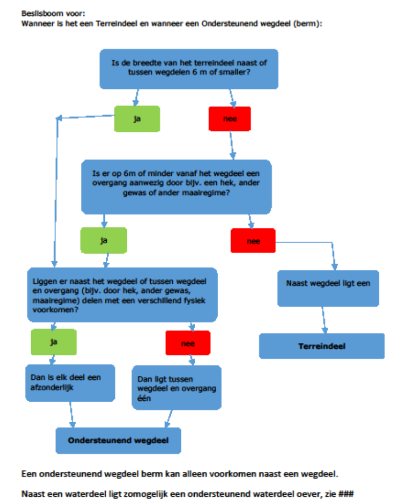

Afbakening
==========

Dit hoofdstuk geeft een toelichting op de voorstellen voor het onderdeel
definities.

Aanpassen afbakeningsregels voor OndersteunendWaterdeel
-------------------------------------------------------

Opnemen van afbakeningsregels voor bos
--------------------------------------

**Gerelateerde issue(s)**
[\#161](https://github.com/Geonovum/IMGeo2018/issues/161)

**Huidige situatie** In BGT gegevenscatalogus paragraaf 9.8 staat in de
definitie van loofbos, gemengd bos, en naaldbos als classificatie van een
Begroeidterreindeel de zinsnede ‘een dusdanige aantal’. In de afbakeningsregels
wordt ‘dusdanige aantal’ niet nader gespecificeerd met criteria als
aantallen/percentages.

**Nieuwe situatie** In de BGT gegevenscatalogus hoofdstuk 10 worden
afbakeningsregels voor bos toegevoegd:

*“Om een terreindeel als loofbos af te bakenen dient het minimimum percentage
loofboom groter dan of gelijk aan 90% te zijn.”*

*“Om een terreindeel als naaldbos af te bakenen dient het minimum percentage
naaldboom groter dan of gelijk aan 90 % te zijn.”*

*“Om een terreindeel als gemengd bos af te bakenen dient het maximum percentage
naaldboom of het maximum percentage loofboom kleiner dan 90% te zijn.”*

*“Bij deze percentages worden het eventueel aanwezige onderhout en smalle
stroken loof- en of naaldbos gelegen naast of als uitloper van het bos buiten
beschouwing gelaten.”*

**Onderbouwing** Met deze afbakeningscriteria kunnen bronhouders eenduidig en
uniform een classificatie loofbos, gemengd bos of naaldbos toekennen aan een
bos. De percentages zijn gebaseerd op de afbakeningscriteria voor bos in de
Basisregistratie Topografie (BRT). Met deze wijziging sluiten BGT en BRT beter
op elkaar aan. We streven er naar om uiteindelijk als de BGT volledig gereed is,
de BRT af te leiden uit de BGT.

**Impact** De impact van deze wijziging wordt ingeschat op relatief ‘*laag*’.

-   *Verplicht/niet verplicht:* dit betreft een wijziging in het verplichte deel
    van IMGeo.

-   *Software:* er is geen aanpassing van de software nodig.

-   *Dataconversie:* bestaande gegevens hoeven niet te worden geconverteerd.

-   *Inwinning:* bronhouders dienen bermen na te lopen om vast te stellen of
    deze aan de nieuwe afbakeningsregels voldoen.

-   *Samenhang basisregistraties:* er is geen impact voor andere
    basisregistraties voorzien; IMGeo past met dit voorstel aan op de BRT.

**Implementatieadvies** Implementatie-afspraken/termijnen dienen nader te worden
bepaald t.a.v. wanneer bronhouders hun bestaande gegevens hebben gecontroleerd
en aangepast conform de nieuwe afbakeningsregels.

Het volgende kan daarbij onderzocht worden:

-   Het confronteren van bossen in de BRT met de huidige objecten bos in de .
    Objecten die niet een overeenkomstige classificatie hebben kunnen in het
    kwaliteitsdashboard aan de werkvoorraad van de bronhouders worden
    toegevoegd.

**Gerelateerde voorstellen** Geen

Opnemen afbakeningsregels voor inritten
---------------------------------------

Opnemen afbakeningsregels voor bermen
-------------------------------------

**Gerelateerde
Github-issue(s)** [\#8](https://github.com/Geonovum/IMGeo2018/issues/8)  
  
**Huidige situatie** In de BGT komt de functie 'berm' voor bij een
OndersteunendWegdeel met de volgende definitie:  
  
*"Een strook grond langs een weg of spoorweg."*  
  
Een OndersteunendWegdeel 'berm' heeft een eigen fysiek voorkomen. Deze keuze in
het model is gemaakt voor de afstemming/koppeling met de internationale
uitwisselstandaard CityGML. Voorts kent de BGT terreindelen (begroeid en
onbegroeid) zonder functie, maar wel met een fysiek voorkomen. In de praktijk
blijkt dat bermen soms door bronhouders afgebakend worden als
OndersteunendWegdeel en soms als Terreindeel.   
  
**Nieuwe situatie** In de afbakeningsregels van de BGT wordt onderstaande
[beslisboom](https://github.com/Geonovum/IMGeo2018/raw/master/issues/beslisboom-bermen.png) opgenomen
met nadere eisen en regels voor de afbakening van bermen.  
  

  
[beslisboom
bermen](https://github.com/Geonovum/IMGeo2018/raw/master/issues/beslisboom-bermen.png)   
In zijn algemeenheid geldt dat indien een terreindeel tussen of naast wegdelen
smaller is dan 6 meter of als er naast het wegdeel op minder dan 6 meter van het
wegdeel een zichtbare overgang is (hek, ander gewas, maairegiem), het
terreindeel wordt afgebakend als OndersteunendWegdeel 'berm'. Anders wordt het
afgebakend als Terreindeel (Begroeid of Onbegroeid).  
  
**Onderbouwing** Met deze beslisboom en aangescherpte afbakeningsregels wordt de
afbakening van bermen in de BGT uniformer en eenvoudiger. Met de 6 meter-regel
stemt de BGT af op de BRT.  
  
**Impact** De impact van dit voorstel is relatief ‘**groot**‘:

-   *Verplicht/niet verplicht:* dit betreft een wijziging in het verplichte deel
    van IMGeo.

-   *Software:* er is geen aanpassing van de software nodig.

-   *Dataconversie:* bestaande gegevens hoeven niet worden geconverteerd.

-   *Inwinning:* bronhouders dienen bermen na te lopen om vast te stellen of
    deze aan de nieuwe afbakeningsregels voldoen.

-   *Samenhang basisregistraties:* er is geen impact voor andere
    basisregistraties voorzien; IMGeo past met dit voorstel aan op de BRT.

**Implementatie-advies** Implementatie-afspraken/termijnen dienen nader te
worden bepaald t.a.v. wanneer bronhouders hun bestaande gegevens hebben
gecontroleerd en aangepast conform de nieuwe afbakeningsregels. Het volgende kan
daarbij onderzocht worden:

-   Het automatisch omzetten in BRAVO of LV-BGT van elk
    OndersteunendWegdeel:berm dat breder is dan 6 meter vanaf het Wegdeel naar
    een BegroeidTerreindeel of OnbegroeidTerreindeel.

-   Het signaleren in het kwaliteitsdashboad elk OndersteunendWegdeel:berm dat
    breder is dan 6 meter vanaf het Wegdeel als werkvoorraad voor bronhouders.

**Gerelateerde voorstellen** Geen.

Opnemen afbakeningsregels Panden boven water
--------------------------------------------

Opnemen afbakeningsregels voor onderscheid tussen viaduct en tunneldeel
-----------------------------------------------------------------------

Aanpassen afbakeningsregels voor gemaal, sluisdeur en stuw
----------------------------------------------------------

Opnemen afbakeningsregels voor minimale en maximale afmetingen van objecten
---------------------------------------------------------------------------

Opnemen afbakeningsregels voor onderscheid tussen muur, kademuur, en keermuur
-----------------------------------------------------------------------------

Toelichten samenvallen coördinaten kruinlijn en objectbegrenzing
----------------------------------------------------------------

Toelichten samenvallen functionele gebieden en objectgrenzen
------------------------------------------------------------

Opnemen afbakeningsregels voor indeling van particuliere en bedrijventerreinen
------------------------------------------------------------------------------
