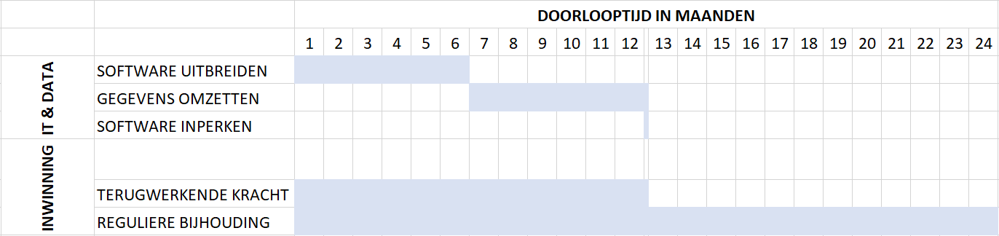

Samenvatting IMGeo 2.2
======================

Huidige situatie en probleem
----------------------------

De opbouw van de Basisregistratie Grootschalige Topografie (BGT) is bijna
gereed: de laatste restjes van de transitie worden weggewerkt door bronhouders,
en afnemers sluiten aan op de BGT. Door een unieke samenwerking van bronhouders
is een landsdekkende zeer gedetailleerde objectgerichte kaart van Nederland
gerealiseerd om met een ruimtelijke blik maatschappelijke vraagstukken te
benaderen.

Tijdens de omzetting van de lijngerichte grootschalige kaart (GBKN) naar
objectgerichte BGT is veel ervaring opgedaan met de toepassing van het
BGT\|IMGeo model. Hieruit zijn twee knelpunten naar voren gekomen:

Knelpunt 1) Het model bevat ruimte voor interpretatie met als gevolg dat
bronhouders het model **niet-uniform** hebben toegepast.

Zo bakent de ene bronhouder een stuk gras langs de weg af als berm, de andere
bronhouder als oever als het ook aan water grenst, of gewoon als
groenvoorziening bij een terreindeel. Of een stuk grond rondom een boomstam
wordt als terreindeel, óf als weginrichtingselement opgenomen.

Het probleem hierbij is dat gegevens over dezelfde dingen op verschillende
plekken in IMGeo worden opgenomen. Dit maakt gegevens voor afnemers moeilijk
vindbaar, opvraagbaar en toepasbaar. Ook is het nu niet mogelijk om een uniforme
kleinschalige kaart (BRT) uit de BGT te generaliseren.

Knelpunt 2) Het model biedt **geen plaats voor alle objecten** in de openbare
ruimte op te nemen.

Het is niet mogelijk om alle *assets* in beheer bij bronhouders af te bakenen en
te classificeren in IMGeo. Bijvoorbeeld verhardingstypen van wegen/voetpaden als
metaal en hout ontbreken, laadpalen voor elektrische voertuigen komen niet voor
in de lijst met installaties of straatmeubilair.

Het probleem hierbij is dat (interne afnemers van) bronhouders met de huidige
versie van het model nu niet kunnen overstappen op één integrale beheerkaart.
Als gevolg daarvan blijven schaduwregistraties en maatwerkkoppelingen bestaan.

Door deze twee knelpunten kunnen organisatie niet overstappen op één integrale
beheerkaart, twijfelen afnemers aan de kwaliteit van de BGT met als gevolg zelf
inwinnen, en overall worden de baten van de BGT niet volledig gerealiseerd.

Oplossing en nut
----------------

IMGeo 2.2 is een nieuwe geoptimaliseerde versie van het model, waarin

-   afbakeningsregels worden aangescherpt, zodat de BGT uniformer voor afnemers
    en makkelijker maakbaar voor bronhouders wordt.

-   subclassificaties (ookwel: domeinwaarden) worden uitgebreid, zodat sectoren
    (IMBOR, OOV) volledig kunnen aansluiten op IMGeo.

Een overzichtstabel van de voorstellen voor IMGeo 2.2 en welke
issues/verbetersuggesties dit oplost is opgenomen in bijlage 3; een
overzichtstabel met objecten, attributen en classificaties in IMGeo 2.2 na
uitbreiding (en herindeling) van classificaties is opgenomen in bijlage 4.

Het doel van IMGeo 2.2 is te komen tot een goed maakbare en bruikbare
registratie met grootschalige topografie voor Nederland. Als de BGT goed
maakbaar en bruikbaar is worden de baten gerealiseerd zoals beschreven in de
Maatschappelijke Kosten Baten Analyse (MKBA), zie [bijlage
3](https://geonovum.github.io/IMGeo22/wijzigingsvoorstel/#bijlage-kosten-en-baten-bgt-mkba-2013).
Met IMGeo 2.2 wordt verwacht een forse stap te zetten in het realiseren van de
volgende baten:

Door het uitbreiden van IMGeo sluiten basis- en plustopografie (lees: BGT en
IMGeo) en beheertopografie (lees: IMBOR) beter op elkaar aan, en kunnen
bronhouders **overstappen op één integrale beheerkaart**. Een volledige
aansluiting van IMGeo en IMBOR draagt bij aan de standaardisatie van BOR en het
het efficiënter bijhouden van de BGT (‘opbouwen vanuit beheer’).

>   In de MKBA BGT 2013 is ingeschat dat voor beheer en beheerkaarten openbare
>   ruimte een kostenbesparing van 22 tot 47 miljoen euro gerealiseerd kan
>   worden. IMGeo sluit nu voor 40-50% aan op beheertopografie, met het voorstel
>   voor het uitbreiden van IMGeo voor betere aansluiting met beheertopografie
>   wordt dit 90-95%.

Door meer uniformiteit kunnen **betere landelijke beleidsanalyses en onderzoek**
worden gedaan. Gegevens zijn consistent opgenomen in het model en daardoor
makkelijker vindbaar en toepasbaar voor eindgebruikers. Ook wordt een stap
gemaakt in de potentie om **BRT uit BGT** af te leiden.

>   In de MKBA BGT 2013 is ingeschat voor de baten binnen beleidsanalyses en
>   onderzoek een behoudend scenario van 11+PM en een potentiescenario van 26+PM
>   miljoen euro (NCW). Voor het afleiden van BRT uit BGT is in potentie een
>   kostenbesparing van 6 miljoen euro (NCW) ingeschat door het eenmalig
>   inwinnen van topografie. Als de verbetering van de kwaliteit en uniformiteit
>   met IMGeo 2.2 maar een fractie (5-10%) bijdragen aan het realiseren van deze
>   baten, dan gaat het om een aanzienlijke bedrag aan baten en kostenbesparing.

Door het uniformeren en uitbreiden van IMGeo met extra gegevens, kunnen
overheidsorganisatie **betere dienstverlening aan burgers en bedrijven** geven.
Meldkamer en hulpdiensten krijgen met IMGeo 2.2 meer informatie over o.a. de
indeling van en toegangswegen naar erven en terreinen, opstelpunten voor de
brandweer voor toegang tot bluswater, opslagtanken met gevaarlijke stoffen en
het soort bos voor een brandverspreidingsanalyse. Zo kan de plaats van een
incident accuraat in beeld worden gekregen, kunnen mensen en materieel efficiënt
worden ingezet, en kunnen hulpdiensten sneller ter plaatse zijn en sneller
handelen: dit bespaart kosten, en voorkomt schade en slachtoffers.

>   In de MKBA BGT 2013 is ingeschat voor de baten door betere dienstverlening
>   aan burgers en bedrijven een scenario van 37+PM miljoen euro (NCW). Als de
>   verbetering van de kwaliteit en uniformiteit, en de uitbreiding van gegevens
>   met IMGeo 2.2 maar een fractie (5-10%) bijdragen aan het realiseren van deze
>   baten, dan gaat het om een aanzienlijk bedrag aan baten en kostenbesparing .

Door eenduidige en consistente inwinregels kunnen **bronhouders beter
samenwerken in de bijhouding van de BGT**. Door minder ruis in de toepassing van
het model, kunnen bestekken verder gestandaardiseerd worden, en kan goedkoper en
beter worden ingewonnen.

Het is moeilijk om een exacte inschatting te geven van de baten in euro’s van
IMGeo 2.2 te geven, omdat het vooral het oplossen van inconsistenties in
werkafspraken en gegevensbijhouding betreft (lees: achterstallig onderhoud).

In zijn algemeenheid kunnen we zeggen dat met deze ‘bug’-fix van IMGeo de
bijhouding van de BGT eenvoudiger wordt en de algehele kwaliteit en
bruikbaarheid van de BGT wordt vergroot. Als deze ‘bug’-fix van IMGeo niet wordt
doorgevoerd, kunnen de baten van MKBA 2013 niet volledig worden gehaald.

Impact en implementatie
-----------------------

De impact van de voorstellen voor IMGeo 2.2 is relatief laag: de software
aanpassing blijft beperkt tot het uitbreiden of inkorten van
classificatielijsten, en veel gegevens moeten (technisch) worden omgezet naar
een andere subclassificatie of objectklasse.

Uitzondering hierop zijn:

-   bermen zullen handmatig opgedeeld moeten opgeknipt om aan de maximale
    breedte-eis te voldoen.

-   voor het uitbreiden van informatie over opslagtanken en de indeling van
    particuliere terreinen moet met terugwerkende kracht gegevens worden
    ingewonnen.

-   het toevoegen van een eigenschap fysiekvoorkomen aan OndersteunendWaterdeel
    en het opnemen van gerelateerde PBP’s bij een object vereist een uitbreiding
    van het datamodel.

-   het opnemen van een nieuwe objectklasse Gebouwdeel vereist een uitbreiding
    van het datamodel.

**Aanpak**

De implementatie-aanpak die wordt voorgesteld is generiek: software uitbreiden,
gegevens omzetten, software inperken.

1.  Software uitbreiden: als software niet voldoet, wordt de software aangepast
    door het uitbreiden met subclassificaties, attributen en/of objectklasse.

2.  Gegevens omzetten: waar mogelijk wordt centraal gesignaleerd welke gegevens
    decentraal moeten worden omgezet.

3.  Software inperken: de vervallen classificaties, attributen en/of
    objectklasse worden geschrapt uit de software zodat deze niet meer geleverd
    kunnen worden.

Tijdens de overgangsperiode (fase 2) wanneer nog niet alle gegevens zijn
aangepast zal een centrale voorziening vertalen tussen de oude versie en de
nieuwe versie (zie bijlage 5 Twee versies en overgangsperiode). Deze centrale
voorziening houdt op objectniveau (lokaalID) bij welke gegevens een object heeft
in versie IMGeo 2.1.1 en welke gegevens in versie IMGeo 2.2.

**Implementatielast**

Hieronder wordt een inschatting gegeven van het uitbreiden en schrappen van
classificaties. De voorstellen waarbij attributen (OndersteunendWaterdeel en
Plaatsbepalingspunten) of objectklasse (Gebouwdeel) worden toegevoegd zijn (nog)
niet ingeschat.

Softwareleveranciers hebben gemiddeld 12 dagen nodig om de software aan te
passen met uitbreiding van de classificaties. Bronhouder kan zelf deze
uitbreiding van classificaties in de software uitrollen in de desktopomgeving
(patch), of de nieuwe versie van de software komt in de webomgeving direct
beschikbaar.

De verwachting is dat een bronhouder gemiddeld 2 tot 5 dagen nodig heeft om de
bestaande gegevens (vooral technisch) om te zetten. De impact van het aanpassen
van gegevens (fase 2) hangt sterk af van hoe bronhouder dit aanpakt: objecten
die naar een andere objectklasse verschuiven krijgen een nieuwe identificatie.
Dit vraagt veelal dat deze objecten opnieuw gekoppeld worden aan gegevens in
achterliggende registraties (BOR). Deze actie kan handmatig worden uitgevoerd,
echter de aanbeveling is om dit binnen een organisatie te automatiseren met een
conversiescript: bijvoorbeeld BGT-software genereert bij technische omzetting
een CSV met WAS-WORDT van lokaalID’s, en BOR leest deze in op de eigen database.

De verwachting is dat een bronhouder gemiddeld 5 tot 10 dagen nodig heeft om de
aanvullende gegevens met terugwerkende kracht aan te leveren. Veel gegevens zijn
beschikbaar via vergunninglening (opslagtanken) en luchtfoto’s (particuliere
terreinen) en dienen als BGT objecten te worden afgebakend en geleverd.

De totale implementielast van IMGeo 2.2 komt daarmee decentraal naar inschatting
op, rekening houdend met 14 BGT- en BOR-leveranciers en 350 bronhouders:

-   ca. 150-200 dagen voor aanpassing software bij bronhouders,

-   ca. 750-3.750 dagen voor omzetten van gegevens door bronhouders, waarbij
    opgemerkt dat een groot deel van deze aanpassingen ook zonder IMGeo 2.2
    zouden oeten worden doorgevoerd.

-   ca. 3.750-7.000 dagen voor aanvullen extra gegevens met terugwerkende kracht
    door bronhouders.

**Doorlooptijd**

De volgende doorlooptijden worden voorgesteld voor de IT & data aanpassing:

1.  Software uitbreiden: subclassificaties implementatietijd inclusief uitrol
    van 6 maanden, attributen of objectklasse implementatietijd van 12 maanden
    en uitrol van 24 maanden.

2.  Gegevens omzetten: 6 maanden voor bestaande objecten muteren of technisch
    omzetten.

3.  Software inperken: na overgangsperiode van 6 maanden.

De volgende doorlooptijden worden voorgesteld voor het inwinnen van aanvullende
gegevens:

1.  Terugwerkende kracht: periode van 12 maanden

2.  Reguliere bijhouding: periode van 24 maanden gebaseerd op twee rondes
    luchtfoto’s.

Onderstaande figuur toont de fasering en doorlooptijd van implementatie van
voorstellen waarbij de IT-impact beperkt blijft tot het uitbreiden en schrappen
van subclassificaties.

