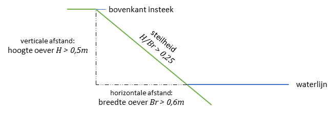
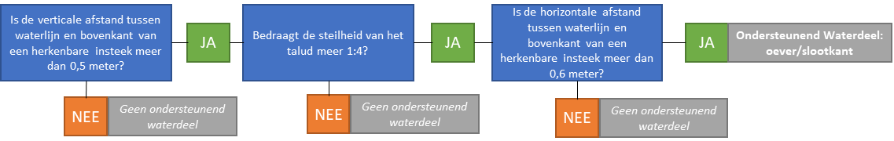

Aanscherpen afbakeningsregels met extra criteria
================================================

De volgende voorstellen betreffen het aanscherpen van afbakeningsregels met
extra criteria.

|                                                                                          | **IMGeo 2.1.1 (WAS)**                                                                                                                                                                                                                                                                                                                                                                     | **IMGeo 2.2 (WORDT)**                                                                                                                                                                                                                                                                                                                                                                                                                                                                                                                                                                 | **Github-issue**                                                                                                                                                           |
|------------------------------------------------------------------------------------------|-------------------------------------------------------------------------------------------------------------------------------------------------------------------------------------------------------------------------------------------------------------------------------------------------------------------------------------------------------------------------------------------|---------------------------------------------------------------------------------------------------------------------------------------------------------------------------------------------------------------------------------------------------------------------------------------------------------------------------------------------------------------------------------------------------------------------------------------------------------------------------------------------------------------------------------------------------------------------------------------|----------------------------------------------------------------------------------------------------------------------------------------------------------------------------|
| OndersteunendWegdeel: **berm**                                                           | \-                                                                                                                                                                                                                                                                                                                                                                                        | *‘Een terreindeel langs een weg dat niet breder is dan 25 meter gemeten t.o.v. de kant van de weg en met verharding of begroeiing conform de fysieke voorkomens van OndersteunendWegdeel wordt in de BGT opgenomen als berm.’*                                                                                                                                                                                                                                                                                                                                                        |                                                                                                                                                                            |
| BegroeidTerreindeel: **naaldbos**, **loofbos** en **gemengd bos**                        | \-                                                                                                                                                                                                                                                                                                                                                                                        | Om een terreindeel als loofbos af te bakenen dient het minimimum percentage loofboom groter dan of gelijk aan 90% te zijn. Om een terreindeel als naaldbos af te bakenen dient het minimum percentage naaldboom groter dan of gelijk aan 90 % te zijn. Om een terreindeel als gemengd bos af te bakenen dient het maximum percentage naaldboom of het maximum percentage loofboom kleiner dan 90% te zijn. Bij deze percentages worden het eventueel aanwezige onderhout en smalle stroken loof- en of naaldbos gelegen naast of als uitloper van het bos buiten beschouwing gelaten. | [\#161](https://github.com/Geonovum/IMGeo2018/issues/161)                                                                                                                  |
| OndersteunendWaterdeel: **oever/slootkant**                                              | Als de **horizontale afstand** tussen waterlijn en de bovenkant van een herkenbare **insteek 1m** of meer bedraagt dan ontstaat in de BGT een ondersteunend waterdeel van het type oever/slootkant.                                                                                                                                                                                       | Als tussen waterlijn en de bovenkant van een herkenbare insteek **de verticale afstand** (ofwel: hoogte oever) **minimaal 50 centimeter** is, **de steilheid (H/Br) 1:4 of meer** bedraagt, en de **horizontale afstand** (ofwel: breedte oever) **60 centimeter of meer** bedraagt, dan ontstaat in de BGT een ondersteunend waterdeel van het type oever/slootkant.                                                                                                                                                                                                                 | [\#50](https://github.com/Geonovum/IMGeo2018/issues/50), [\#74](https://github.com/Geonovum/IMGeo2018/issues/74), [\#76](https://github.com/Geonovum/IMGeo2018/issues/76)  |
| Overbruggingsdeel: onderscheid viaduct en tunnel                                         | \-                                                                                                                                                                                                                                                                                                                                                                                        | Er is sprake van een overbrugging wanneer een van de onderdelen bestaat uit een los dek dat op een bak en/of pijlers rust.                                                                                                                                                                                                                                                                                                                                                                                                                                                            | [\#12](https://github.com/Geonovum/IMGeo2018/issues/12)                                                                                                                    |
|                                                                                          |                                                                                                                                                                                                                                                                                                                                                                                           | Dit in tegenstelling tot een tunnel, die uit een overwegend gesloten kokerconstructie met een in- en uitgang bestaat.”                                                                                                                                                                                                                                                                                                                                                                                                                                                                |                                                                                                                                                                            |
| Tunneldeel: onderscheid viaduct en tunnel                                                | \-                                                                                                                                                                                                                                                                                                                                                                                        | Er is sprake van een tunnel wanneer deze bestaat uit een overwegend gesloten kokerconstructie met een in- en een uitgang.                                                                                                                                                                                                                                                                                                                                                                                                                                                             | [\#12](https://github.com/Geonovum/IMGeo2018/issues/12)                                                                                                                    |
|                                                                                          |                                                                                                                                                                                                                                                                                                                                                                                           | Bij overbruggingsdelen zoals bijvoorbeeld een viaduct is er altijd sprake van een los dek dat op een bak en/of pijlers rust.”                                                                                                                                                                                                                                                                                                                                                                                                                                                         |                                                                                                                                                                            |
| Tunneldeel: relatieve hoogte                                                             | \-                                                                                                                                                                                                                                                                                                                                                                                        | 10.10.3 Relatieve hoogte                                                                                                                                                                                                                                                                                                                                                                                                                                                                                                                                                              |                                                                                                                                                                            |
| Kunstwerkdeel: relatieve hoogte duiker                                                   | \-                                                                                                                                                                                                                                                                                                                                                                                        | 9.9 Kunstwerkdeel                                                                                                                                                                                                                                                                                                                                                                                                                                                                                                                                                                     |                                                                                                                                                                            |
| Scheiding: damwand                                                                       | \-                                                                                                                                                                                                                                                                                                                                                                                        | Indien een deksloof aanwezig op de damwand, wordt deze meegenomen in de afbakening van damwand, en niet afzonderlijk afgebakend.                                                                                                                                                                                                                                                                                                                                                                                                                                                      | [\#14](https://github.com/Geonovum/IMGeo2018/issues/14), [\#30](https://github.com/Geonovum/IMGeo2018/issues/30), [\#69](https://github.com/Geonovum/IMGeo2018/issues/69)  |
| Waterinrichtingselement: geleidewerk, remmingswerk                                       | Van remmingswerk, geleidewerk en vuilvang wordt de lijngeometrie opgenomen.                                                                                                                                                                                                                                                                                                               | Van remmingswerk, geleidewerk en vuilvang wordt de lijngeometrie opgenomen **waarbij voor remmingswerk en geleidewerk geldt dat deze worden ingewonnen aan die zijde waar de scheepvaart langs vaart**.                                                                                                                                                                                                                                                                                                                                                                               | [\#38](https://github.com/Geonovum/IMGeo2018/issues/38)                                                                                                                    |
| Gebouwinstallatie: luifel                                                                | Uitstulpingen in gevels van panden zijn alleen BGT inhoud als ze groter zijn dan 30 cm. Kleinere uitstulpingen, kunnen, indien ze aan de definitie van het objecttype Gebouwinstallatie voldoen, in IMGeo worden opgenomen. Gebouwinstallaties zijn aan het pand verbonden toegangstrappen, luifels en bordessen. Overige uitstulpingen kleiner dan 30 cm worden niet in IMGeo opgenomen. | Gebouwinstallaties zijn aan het pand verbonden toegangstrappen, luifels en bordessen. Luifels worden opgenomen indien ze breder zijn dan 1 m vanaf de gevel.                                                                                                                                                                                                                                                                                                                                                                                                                          | [\#197](https://github.com/Geonovum/IMGeo2018/issues/197)                                                                                                                  |
| Scheiding en OverigeScheiding: **hek** en **muur**                                       | BGT catalogus                                                                                                                                                                                                                                                                                                                                                                             | BGT catalogus:                                                                                                                                                                                                                                                                                                                                                                                                                                                                                                                                                                        | [\#198](https://github.com/Geonovum/IMGeo2018/issues/198)                                                                                                                  |
| Wegdeel, BegroeidTerreindeel, OnbegroeidTerreindeel: uitsparingen stedelijk groen \< 5m2 | *BGT catalogus:*                                                                                                                                                                                                                                                                                                                                                                          | *geen; regels worden geschrapt*                                                                                                                                                                                                                                                                                                                                                                                                                                                                                                                                                       | [\#28](https://github.com/Geonovum/IMGeo2018/issues/28)                                                                                                                    |

>   **Tunneldelen hebben altijd een relatieve hoogte lager dan 0.**

>   In tunneldelen ligt of liggen altijd één of meer wegdelen. Deze wegdelen
>   bezitten dezelfde aanduiding voor relatieve hoogte als het tunneldeel waarin
>   zij liggen.

>   **Duikers hebben altijd een relatieve hoogte lager dan 0.**

>   IMGeo voegt enkele optionele kunstwerken toe. Dit zijn allemaal
>   vlakobjecten.

>   “Scheidingen worden als lijnobject vastgelegd als de breedte kleiner is dan
>   30cm. Bij scheidingen breder dan 30cm moet de buitenomtrek waar het object
>   de grond raakt worden ingewonnen en vastgelegd als vlakgeometrie. Een
>   scheiding wordt vastgelegd waar het object de ondergrond raakt. In de
>   scheidingen worden onderbrekingen van \< 1m genegeerd. Doorgangen worden
>   gezien als integraal onderdeel van de scheiding. Scheidingen van het **type
>   hek** die **een minimale lengte van 10m en een minimale hoogte van 1m**
>   hebben, worden vastgelegd. Scheidingen van de typen kademuur en
>   walbescherming worden opgenomen aan de bovenzijde aan de waterkant.
>   Kademuren breder dan 30cm worden ingewonnen als vlakobject; de omtrek van
>   het object aan de bovenzijde wordt dan vastgelegd. Scheidingen van het type
>   **muur, met een minimale lengte van 1m en met een minimale breedte van
>   30cm** worden opgenomen. Een muur smaller dan 30cm wordt als lijnobject
>   vastgelegd, een bredere muur als vlakobject. **Muren met een minimale hoogte
>   van 50cm worden vastgelegd.** In terreinen met een fysiek voorkomen ‘erf’
>   worden alleen die scheidingen opgenomen die direct aan de straatzijde zijn
>   gelegen.”

IMGeo catalogus:

>   “In de BGT worden **scheidingen** alleen vastgelegd als ze bepaalde minimum
>   afmetingen hebben, die per type scheiding verschillen (zie deel I). In IMGeo
>   kunnen scheidingen, die kleiner dan het BGT minimum zijn, worden opgenomen
>   als objecttype ‘overige scheiding’. **Deze kent dezelfde typen scheiding**.”

>   “Scheidingen worden als lijnobject vastgelegd als de breedte kleiner is dan
>   30cm**.** Bij scheidingen breder dan 30cm moet de buitenomtrek waar het
>   object de grond raakt worden ingewonnen en vastgelegd als vlakgeometrie.

>   Een scheiding wordt vastgelegd waar het object de ondergrond raakt. In de
>   scheidingen worden onderbrekingen van \<1m genegeerd. Doorgangen worden
>   gezien als integraal onderdeel van de scheiding.

>   Scheidingen van het type **hek die een minimale hoogte van 1m hebben**,
>   worden vastgelegd.

>   Scheidingen van de typen kademuur en walbescherming worden opgenomen aan de
>   bovenzijde aan de waterkant. Kademuren die als vlakobject worden ingewonnen
>   wordt de omtrek van het object aan de bovenzijde vastgelegd.

>   **Muren met een minimale hoogte van 50cm worden vastgelegd.**

>   In terreinen met een fysiek voorkomen ‘erf’ worden alleen die scheidingen
>   opgenomen die direct aan de straatzijde zijn gelegen.

IMGeo catalogus:

>   In de BGT worden **scheidingen van het type hek en muur** alleen vastgelegd
>   als ze bepaalde minimum afmeting hebben, die per type scheiding verschillen
>   (zie deel I). In IMGeo kunnen scheidingen van het type hek en muur, die
>   kleiner dan het BGT minimum zijn, worden opgenomen als objecttype ‘overige
>   scheiding’. **De populatie van Overige Scheiding bestaat uit: · Scheidingen
>   van type hek en muur die niet voldoen aan de BGT minimummaat; · scheidingen
>   in terrein met fysiek voorkomen ‘erf’ die niet aan de straatzijde gelegen
>   zijn.**

>   “Uitsparingen in wegdelen, meestal van het type voetpad, voor stedelijk
>   groen worden niet afzonderlijk geregistreerd indien \<5 m2 . Het wegdeel
>   wordt daarbij geacht door te lopen.”

*IMGeo catalogus:*

>   “In de BGT worden uitsparingen in wegdelen voor stedelijk groen niet apart
>   ingewonnen indien \< 5 m2. In IMGeo kunnen deze worden opgenomen als
>   ‘begroeid terreindeel groenvoorziening’.”

Toelichting:

-   *Berm:* Met de afbakeningsregel mag een berm ook smaller zijn dan 25 meter.
    De minimale breedte voor een berm wordt bepaald door de bronhouder (bijv.
    vanuit groenbeheer of wegbeheer). Een terreindeel langs een wegdeel smaller
    dan 25 meter wordt dus in principe opgenomen als berm, als de verharding of
    begroeiing matcht met de fysieke voorkomens van OndersteunendWegdeel. Als er
    geen berm aanwezig is naast een weg of spoorweg, dan wordt geen berm
    opgenomen. Bredere terreindelen en terreindelen die niet voldoen aan de
    fysieke voorkomens van OndersteunendWegdeel (bijv. bos, bouwland of grasland
    agrarisch) worden als BegroeidTerreindeel of OnbegroeidTerreindeel
    afgebakend.

-   *Naaldbos, loofbos, gemengd bos:* De percentages zijn gebaseerd op de
    afbakeningscriteria voor bos in de Basisregistratie Topografie (BRT). Met
    deze wijziging sluiten BGT en BRT beter op elkaar aan wat bijdraagt aan de
    geautomatiseerde generalisatie van BRT uit BGT.

-   *Oever/slootkant:* Met deze nieuwe afbakeningsregels sluit de BGT beter aan
    op de behoeften voor beheer openbare ruimte van waterschappen. De
    aanvullende eisen worden nader toegelicht in een technische afbeelding en
    een beslisboom.

*Tunneldeel/overbruggingsdeel:*

Scheiding en OverigeScheiding:

Uit analyse van de BGT-gegevens lijkt dat bronhouders massaal de regels voor
opname in de BGT catalogus en IMGeo catalogus niet opvolgen t.a.v de minimale
afmetingen voor de lengte van type ‘hek’ en ‘muur’ voor Scheiding en
OverigeScheiding. De minimale afmetingen voor lengte van hek en muur worden
daarom geschrapt.

Onderscheid tussen twee objecten Scheiding en OverigScheiding blijft wel nodig
voor bijvoorbeeld het opnemen van draadraster en faunaraster en scheidingen
tussen percelen. Om die reden kan OverigeScheiding als objecttype niet geschrapt
worden.

Het voorstel voor aanscherpen afbakeningsregels komt dan neer op dat:

Een hek hoger dan 1 meter is een BGT Scheiding; een hek lager dan 1 meter is een
IMGeo OverigeScheiding.

Een muur hoger dan 50cm is een BGT Scheiding; een muur lager dan 50cm is een
IMGeo OverigeScheiding

Elke kademuur, damwand, geluidscherm, walbescherming wordt voor de BGT
ingewonnen als Scheiding onafhankelijk van lengte, hoogte of breedte. Deze
objecten kunnen dus niet voorkomen als OverigeScheiding o.b.v. bovenstaande
criteria.

Alleen muur en hek kunnen voorkomen als typen van OverigeScheiding als niet aan
de minimale hoogte voor Scheiding wordt voldaan.

Elke (overige) scheiding met breedte meer dan 30 cm heeft vlakgeometrie; elke
(overige) scheiding met een breedte kleiner dan 30 cm heeft lijngeometrie.

Een hek of muur tussen perceel en openbare ruimte wordt als BGT Scheiding
opgenomen indien aan de minimale afmetingen wordt voldaan voor de hoogte, dus
minimaal 1 meter hoog voor hek en minimaal 50 cm hoog voor muur.

-   Scheidingen tussen percelen worden altijd als IMGeo OverigeScheiding
    opgenomen.

-   Onderscheid tussen twee objecten Scheiding en OverigScheiding blijft wel
    nodig voor bijvoorbeeld het opnemen van draadraster en faunaraster en
    scheidingen tussen percelen. Om die reden kan OverigeScheiding als
    objecttype niet geschrapt worden.

*Uitsparingen stedelijk groen:* Uit analyse van BGT-gegevens blijkt dat
bronhouders massaal kleine plantvakken (=kleiner dan 5m2) als
begroeidTerreindeel opnemen. Het vasthouden aan deze inwinregel voor kleine
plantvakken lijkt dus niet zinvol.

**Gerelateerde
Github-issue(s)** [\#50](https://github.com/Geonovum/IMGeo2018/issues/50),
[\#74](https://github.com/Geonovum/IMGeo2018/issues/74),
[\#76](https://github.com/Geonovum/IMGeo2018/issues/76) 

**Huidige situatie** In de hoofdstuk 10 van de BGT gegevenscatalogus is voor de
eisen van afbakening van ondersteunende waterdelen bij meren en waterlopen het
volgende opgenomen:

>   "Als de horizontale afstand tussen waterlijn en de bovenkant van een
>   herkenbare insteek 1m of meer bedraagt dan ontstaat in de BGT een
>   ondersteunend waterdeel van het type oever/slootkant."

**Nieuwe situatie** Het voorstel is om de afbakeningscriteria van
OndersteunendWaterdeel voor oevers, slootkant al volgt te wijzigen:

>   “Als tussen waterlijn en de bovenkant van een herkenbare insteek de
>   verticale afstand (ofwel: hoogte oever) minimaal 0,5 meter is, de steilheid
>   (*H/Br*) 1:4 of meer bedraagt, en de horizontale afstand (ofwel: breedte
>   oever) 0,6 meter of meer bedraagt, dan ontstaat in de BGT een ondersteunend
>   waterdeel van het type oever/slootkant."

De volgende beslisboom wordt toegevoegd aan de afbakeningsregels voor
OndersteunendWaterdeel:

**Onderbouwing** Met deze afbakeningsregels sluit de BGT beter aan op de
afbakening van oevers vanuit waterbeheer. De horizontale afstand wijzigt van 1
meter naar 60 centimeter, voorts worden er twee extra regels voor steilheid en
verticale afstand toegevoegd, o.a. voor (uitsluiting van) afbakening natuurlijke
vriendelijke oevers.

**Impact** De impact van dit voorstel wordt ingeschat op relatief ‘**hoog**’.

-   *Verplicht/niet verplicht:* dit betreft een wijziging in het verplichte deel
    van IMGeo.

-   *Software:* er is geen aanpassing van de software nodig.

-   *Dataconversie:* bestaande gegevens hoeven niet te worden geconverteerd.

-   *Inwinning:* bronhouders dienen de huidige populatie van ondersteunende
    waterdelen na te lopen om vast te stellen of deze objecten aan de nieuwe
    afbakeningsregels voldoen.

-   *Samenhang basisregistraties:* er is geen impact voor andere
    basisregistraties voorzien; IMGeo past met dit voorstel aan op de
    systematiek vanuit waterbeheer (IMWA).

**Implementatieadvies** Implementatie-afspraken/termijnen dienen nader te worden
bepaald t.a.v. wanneer bronhouders hun bestaande gegevens hebben gecontroleerd
en aangepast conform de nieuwe afbakeningsregels.

Opnemen regels voor onderscheid tussen naaldbos, loofbos en gemengd bos
-----------------------------------------------------------------------

**Gerelateerde Github-issue(s)**
[\#161](https://github.com/Geonovum/IMGeo2018/issues/161)

**Huidige situatie** In BGT gegevenscatalogus paragraaf 9.8 staat in de
definitie van loofbos, gemengd bos, en naaldbos als classificatie van een
Begroeidterreindeel de zinsnede ‘een dusdanige aantal’. In de afbakeningsregels
wordt ‘dusdanige aantal’ niet nader gespecificeerd met criteria als
aantallen/percentages.

**Nieuwe situatie** In de BGT gegevenscatalogus hoofdstuk 10 worden
afbakeningsregels voor bos toegevoegd:

>   Om een terreindeel als loofbos af te bakenen dient het minimimum percentage
>   loofboom groter dan of gelijk aan 90% te zijn. Om een terreindeel als
>   naaldbos af te bakenen dient het minimum percentage naaldboom groter dan of
>   gelijk aan 90 % te zijn. Om een terreindeel als gemengd bos af te bakenen
>   dient het maximum percentage naaldboom of het maximum percentage loofboom
>   kleiner dan 90% te zijn. Bij deze percentages worden het eventueel aanwezige
>   onderhout en smalle stroken loof- en of naaldbos gelegen naast of als
>   uitloper van het bos buiten beschouwing gelaten.

**Onderbouwing** Met deze afbakeningscriteria kunnen bronhouders eenduidig en
uniform een classificatie loofbos, gemengd bos of naaldbos toekennen aan een
bos. De percentages zijn gebaseerd op de afbakeningscriteria voor bos in de
Basisregistratie Topografie (BRT). Met deze wijziging sluiten BGT en BRT beter
op elkaar aan. We streven er naar om uiteindelijk als de BGT volledig gereed is,
de BRT af te leiden uit de BGT.

**Impact** De impact van dit voorstel wordt ingeschat op relatief ‘**laag**’.

-   *Verplicht/niet verplicht:* dit betreft een wijziging in het verplichte deel
    van IMGeo.

-   *Software:* er is geen aanpassing van de software nodig.

-   *Dataconversie:* bestaande gegevens hoeven niet te worden geconverteerd.

-   *Inwinning:* bronhouders dienen de huidige populatie van begroeide
    terreindelen met een functie gerelateerd aan bos na te lopen om vast te
    stellen of deze objecten aan de nieuwe afbakeningsregels voldoen.

-   *Samenhang basisregistraties:* er is geen impact voor andere
    basisregistraties voorzien; IMGeo past met dit voorstel aan op de BRT.

**Implementatieadvies** Implementatie-afspraken/termijnen dienen nader te worden
bepaald t.a.v. wanneer bronhouders hun bestaande gegevens hebben gecontroleerd
en aangepast conform de nieuwe afbakeningsregels.

Het volgende kan daarbij onderzocht worden: - Het confronteren van bossen in de
BRT met de huidige objecten bos in de . Objecten die niet een overeenkomstige
classificatie hebben kunnen in het kwaliteitsdashboard aan de werkvoorraad van
de bronhouders worden toegevoegd.

Opnemen regels voor onderscheid tussen viaduct en tunneldeel
------------------------------------------------------------

**Gerelateerde
Github-issue(s)** [\#12](https://github.com/Geonovum/IMGeo2018/issues/12) 

**Huidige situatie** In de BGT wordt onderscheid gemaakt tussen object
Overbruggingsdeel van het type viaduct en het object Tunneldeel. Bij bronhouders
zijn er onduidelijkheden en interpretatieverschillen wanneer een situatie als
Overbruggingsdeel en wanneer als Tunneldeel moet worden afgebakend.

**Nieuwe situatie** Voor de afbakening van Overbruggingsdeel en Tunneldeel
worden extra afbakeningsregels gegeven:

>   “Overbruggingsdeel:  
>   - Er is sprake van een overbrugging wanneer een van de onderdelen bestaat
>   uit een los dek dat op een bak en/of pijlers rust.  
>   - Dit in tegenstelling tot een tunnel, die uit een overwegend gesloten
>   kokerconstructie met een in- en uitgang bestaat.”

>   “Tunneldeel:  
>   - Er is sprake van een tunnel wanneer deze bestaat uit een overwegend
>   gesloten kokerconstructie met een in- en een uitgang.  
>   - Bij overbruggingsdelen zoals bijvoorbeeld een viaduct is er altijd sprake
>   van een los dek dat op een bak en/of pijlers rust.”

**Onderbouwing** Met deze wijziging worden meer eisen opgelegd aan de afbakening
van overbruggingsdeel en tunneldeel, waardoor afbakening door bronhouders
gemakkelijker en uniformer wordt.

**Impact** De impact van dit voorstel wordt ingeschat op ‘laag tot zeer laag’:

-   *Verplicht/niet verplicht:* dit betreft een wijziging in het verplichte deel
    van IMGeo.

-   *Software:* er is geen aanpassing van de software nodig.

-   *Dataconversie:* bestaande gegevens hoeven niet worden geconverteerd.

-   *Inwinning:* bronhouders dienen de huidige populatie van overbruggingsdelen
    en tunneldelen na te lopen om vast te stellen of deze objecten aan de nieuwe
    afbakeningsregels voldoen.

-   *Samenhang basisregistraties:* er is geen impact voor andere
    basisregistraties voorzien.

**Implementatie-advies** Implementatie-afspraken/termijnen dienen nader te
worden bepaald t.a.v. wanneer bronhouders hun bestaande gegevens hebben
gecontroleerd en aangepast conform de nieuwe afbakeningsregels.

Opnemen extra afbakeningsregels voor onderscheid tussen muur, kademuur, en keermuur
-----------------------------------------------------------------------------------

**Gerelateerde
Github-issue(s)** [\#14](https://github.com/Geonovum/IMGeo2018/issues/14), [\#30](https://github.com/Geonovum/IMGeo2018/issues/30),
[\#69](https://github.com/Geonovum/IMGeo2018/issues/69)

**Huidige situatie** In de BGT wordt onderscheid gemaakt tussen type ‘muur’,
‘kademuur’ van Scheiding en ‘keermuur’, ‘strekdam’, ‘damwand’ van Kunstwerkdeel.

Bij bronhouders zijn er onduidelijkheden en interpretatieverschillen wanneer een
situatie met welk type Scheiding of Kunstwerkdeel moet worden afgebakend.

**Nieuwe situatie** Het voorstel is om de volgende beslisboom op te nemen in de
BGT catalogus voor de afbakening van Scheidingen van het type ‘muur’,
‘kademuur’, ‘keermuur’, ‘damwand’, en ‘strekdam’.

Voor ‘damwand’ wordt de volgende afbakeningsregel toegevoegd aan de BGT
catalogus:

>   Indien een deksloof aanwezig op de damwand, wordt deze meegenomen in de
>   afbakening van damwand, en niet afzonderlijk afgebakend.

**Onderbouwing** Met deze wijziging worden meer eisen opgelegd aan de afbakening
van muur, kademuur, keermuur, alsook damwand en strekdam, waardoor afbakening
door bronhouders gemakkelijker en uniformer wordt. Voor de BGT is het niet de
bedoeling om de deksloof op een damwand apart af te bakenen, bijvoorbeeld als
kademuur.

**Impact** De impact van dit voorstel wordt ingeschat op ‘laag tot zeer laag’:

-   *Verplicht/niet verplicht:* dit betreft een wijziging in het verplichte deel
    van IMGeo.

-   *Software:* er is geen aanpassing van de software nodig.

-   *Dataconversie:* bestaande gegevens hoeven niet worden geconverteerd.

-   *Inwinning:* bronhouders dienen de huidige populatie van betreffende
    scheidingen na te lopen om vast te stellen of deze objecten aan de extra
    afbakeningsregels voldoen.

-   *Samenhang basisregistraties:* er is geen impact voor andere
    basisregistraties voorzien.

**Implementatie-advies** Implementatie-afspraken/termijnen dienen nader te
worden bepaald t.a.v. wanneer bronhouders hun bestaande gegevens hebben
gecontroleerd en aangepast conform de nieuwe afbakeningsregels.

Toevoegen regels voor remmingswerk en geleidewerk
-------------------------------------------------

**Gerelateerde
Github-issue(s)** [\#38](https://github.com/Geonovum/IMGeo2018/issues/38)

**Huidige situatie** In de IMGeo catalogus wordt bij de afbakeningsregels voor
Waterinrichtingselement het volgende voor remmingswerk en geleidewerk
beschreven:

>   Van remmingswerk, geleidewerk en vuilvang wordt de lijngeometrie opgenomen.

**Nieuwe situatie** Het voorstel is om de afbakeningsregel voor deze objecten
als volgt aan te scherpen:

>   Van remmingswerk, geleidewerk en vuilvang wordt de lijngeometrie opgenomen
>   **waarbij voor remmingswerk en geleidewerk geldt dat deze worden ingewonnen
>   aan die zijde waar de scheepvaart langs vaart**.

**Onderbouwing** Met deze afbakeningsregel sluit IMGeo beter aan op de bestaande
praktijk.

**Impact** De impact van dit voorstel wordt ingeschat op ‘laag tot zeer laag’:

-   *Verplicht/niet verplicht:* dit betreft een wijziging in het optionele deel
    van IMGeo.

-   *Software:* er is geen aanpassing van de software nodig.

-   *Dataconversie:* bestaande gegevens hoeven niet worden geconverteerd.

-   *Inwinning:* bronhouders dienen de huidige populatie van remmingswerk en
    geleidewerk na te lopen om vast te stellen of deze objecten aan de nieuwe
    afbakeningsregels voldoen.

-   *Samenhang basisregistraties:* er is geen impact voor andere
    basisregistraties voorzien.

**Implementatie-advies** Implementatie-afspraken/termijnen dienen nader te
worden bepaald t.a.v. wanneer bronhouders hun bestaande gegevens hebben
gecontroleerd en aangepast conform de nieuwe afbakeningsregels.

Opnemen regels voor minimale breedte luifel
-------------------------------------------

**Gerelateerde
Github-issue(s)** [\#197](https://github.com/Geonovum/IMGeo2018/issues/197)

**Gerelateerde voorstellen** Geen

**Huidige situatie** In de IMGeo catalogus wordt bij de afbakeningsregels voor
Gebouwinstallatie het volgende beschreven:

>   Uitstulpingen in gevels van panden zijn alleen BGT inhoud als ze groter zijn
>   dan 30 cm. Kleinere uitstulpingen, kunnen, indien ze aan de definitie van
>   het objecttype Gebouwinstallatie voldoen, in IMGeo worden opgenomen.
>   Gebouwinstallaties zijn aan het pand verbonden toegangstrappen, luifels en
>   bordessen. Overige uitstulpingen kleiner dan 30 cm worden niet in IMGeo
>   opgenomen.

**Nieuwe situatie** Het voorstel is om de afbakeningsregels voor
Gebouwinstallatie, en in het bijzonder luifel als volgt aan te passen, door
bovenstaande tekst te vervangen door:

>   Gebouwinstallaties zijn aan het pand verbonden toegangstrappen, luifels en
>   bordessen. Luifels worden opgenomen indien ze breder zijn dan 1 m vanaf de
>   gevel.

**Onderbouwing** Met deze afbakeningsregel wordt voorkomen dat smalle dakranden
als luifel worden opgenomen in IMGeo. Voorts wordt de inconsistentie tussen
kleine uitstulpingen van minder dan 30 cm opgelost.

**Impact** De impact van dit voorstel wordt ingeschat op ‘laag tot zeer laag’:

-   *Verplicht/niet verplicht:* dit betreft een wijziging in het optionele deel
    van IMGeo.

-   *Software:* er is geen aanpassing van de software nodig.

-   *Dataconversie:* bestaande gegevens hoeven niet worden geconverteerd.

-   *Inwinning:* bronhouders dienen de huidige populatie van luifel na te lopen
    om vast te stellen of deze objecten aan de nieuwe afbakeningsregels voldoen.

-   *Samenhang basisregistraties:* er is geen impact voor andere
    basisregistraties voorzien.

**Implementatie-advies** Implementatie-afspraken/termijnen dienen nader te
worden bepaald t.a.v. wanneer bronhouders hun bestaande gegevens hebben
gecontroleerd en aangepast conform de nieuwe afbakeningsregels.

Aanpassen definitie ‘oever/slootkant’
-------------------------------------

**Gerelateerde
Github-issue(s)** [\#76](https://github.com/Geonovum/IMGeo2018/issues/76) 

**Huidige situatie** In de BGT is bij het type 'oever, slootkant' van een
OndersteunendWaterdeel de volgende definitie opgenomen:

>   "De strook land die in direct contact staat met water, inclusief het gebied
>   tussen de hoogwaterlijn en laagwaterlijn. (bron: Inspire)"

**Nieuwe situatie** Het voorstel is om de definitie van oever/slootkant als
volgt op te nemen in de BGT:

>   “Oevers en slootkanten zijn stroken of gebieden met een functie voor
>   waterbeheersin, die enerzijds begrensd worden door de waterlijn of een
>   zichtbare bodem en anderzijds door een kant insteek.”

**Onderbouwing** Met aanpassen van de definitie sluit de BGT beter aan op de
definities zoals gehanteerd vanuit waterbeheer (IMWA).

**Impact** De impact van dit voorstel wordt ingeschat op relatief ‘laag’.

-   Verplicht/niet verplicht: Dit betreft een wijziging in het verplichte deel
    van IMGeo.

-   Software: er is geen aanpassing van de software nodig.

-   Dataconversie: bestaande gegevens hoeven niet worden geconverteerd.

-   Inwinning: bronhouders dienen de bestaande ondersteunende wegdelen na te
    lopen om vast te stellen of deze aan de nieuwe definities voldoen.

-   Samenhang basisregistraties: er is geen impact voor andere basisregistraties
    voorzien; IMGeo past met dit voorstel aan op de nationale systematiek van
    waterbeheer.

**Implementatie-advies** Implementatie-afspraken/termijnen dienen nader te
worden bepaald t.a.v. wanneer bronhouders hun bestaande gegevens hebben
gecontroleerd en aangepast conform de nieuwe definities.

Aanpassen definities duiker en brug
-----------------------------------

**Gerelateerde
Github-issue(s)** [\#176](https://github.com/Geonovum/IMGeo2018/issues/176)

**Huidige situatie** In IMGeo wordt onderscheid gemaakt tussen het object
Overbruggingsdeel brug en Kunstwerkdeel duiker: 

>   duiker: Kunstwerk voor de waterhuishouding, bestaande uit een kokervormige
>   constructie aangebracht onder een weg of spoorweg of in een dam. (bron:
>   CROW)

>   brug: Kunstwerk over een watervlakte of waterloop, bestaande uit een brugdek
>   gesteund door pijlers en/of landhoofden. (bron: CROW) 

Bij bronhouders zijn er onduidelijkheden en interpretatieverschillen wanneer een
situatie als Overbruggingsdeel en wanneer als Kunstwerkdeel moet worden
afgebakend, bijvoorbeeld bij een waco.

**Nieuwe situatie** Het voorstel is om de definities van duiker en brug in de
BGT aan te passen:

>   duiker: Kunstwerk voor de waterhuishouding, bestaande uit
>   een **gesloten** kokervormige constructie **met een in- en
>   uitstroomopening,** aangebracht onder een weg of spoorweg of in een dam **of
>   ander terreindeel**. (bron: CROW) 

>   brug: Kunstwerk over een watervlakte of waterloop, bestaande uit een apart,
>   al of niet beweegbaar brugdek gesteund door pijlers en/of landhoofden.
>   (bron: CROW) 

**Onderbouwing** Met deze nieuwe definities worden eenduidiger wanneer een
object een duiker is, en wanneer een brug, waardoor afbakening door bronhouders
gemakkelijker en uniformer wordt.

**Impact** De impact van dit voorstel wordt ingeschat op relatief ‘laag’.

-   Verplicht/niet verplicht: Dit betreft een wijziging in het verplichte deel
    van IMGeo.

-   Software: er is geen aanpassing van de software nodig.

-   Dataconversie: bestaande gegevens hoeven niet worden geconverteerd.

-   Inwinning: bronhouders dienen de bestaande ondersteunende wegdelen na te
    lopen om vast te stellen of deze aan de nieuwe definities voldoen.

-   Samenhang basisregistraties: er is geen impact voor andere basisregistraties
    voorzien; IMGeo past met dit voorstel aan op de nationale systematiek van
    waterbeheer.

**Implementatie-advies** Implementatie-afspraken/termijnen dienen nader te
worden bepaald t.a.v. wanneer bronhouders hun bestaande gegevens hebben
gecontroleerd en aangepast conform de nieuwe definities.

Aanpassen definitie opslagtank
------------------------------

**Gerelateerde
Github-issue(s)** [\#190](https://github.com/Geonovum/IMGeo2018/issues/90)

**Huidige situatie** In de BGT komt een ‘opslagtank’ als type van OverigBouwwerk
met de volgende definitie voor:

>   opslagtank: Opslagfaciliteit voor vloeistoffen. Alleen bovengrondse
>   opslagtanks worden opgenomen.

**Nieuwe situatie** Het voorstel is om de definitie ‘opslagtank’ in de BGT aan
te passen:

>   opslagtank: Opslagfaciliteit voor vloeistoffen **of gassen of energie**.
>   Alleen bovengrondse opslagtanks worden opgenomen.

**Onderbouwing** In de huidige BGT is de definitie van opslagtank beperkt tot
vloeistoffen. Met deze aanpassing wordt de toepassing van opslagtank in IMGeo
verruimt.

**Impact** De impact van dit voorstel wordt ingeschat op relatief ‘laag’.

-   Verplicht/niet verplicht: Dit betreft een wijziging in het verplichte deel
    van IMGeo.

-   Software: er is geen aanpassing van de software nodig.

-   Dataconversie: bestaande gegevens hoeven niet worden geconverteerd.

-   Inwinning: bronhouders dienen de bestaande objecten na te lopen om vast te
    stellen of deze aan de nieuwe definities voldoen, alsook mogelijk extra
    inwinning te doen voor opslagtanks waarin gassen zijn opgeslagen.

-   Samenhang basisregistraties: er is geen impact voor andere basisregistraties
    voorzien; IMGeo past met dit voorstel aan op de nationale systematiek van
    waterbeheer.

**Implementatie-advies** Implementatie-afspraken/termijnen dienen nader te
worden bepaald t.a.v. wanneer bronhouders hun bestaande gegevens hebben
gecontroleerd en aangepast conform de nieuwe definities.
