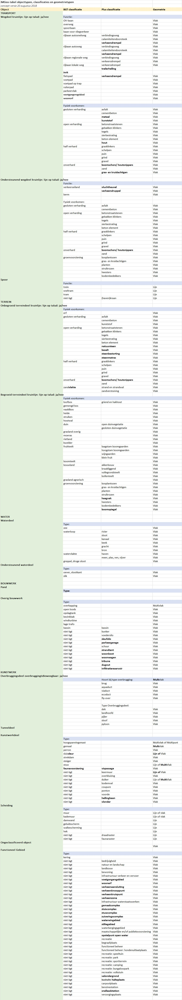
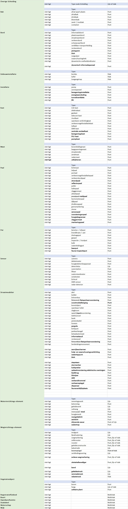

Samenvatting
============

Voorstellen
-----------

Hieronder volgt een lijst met de voorstellen voor IMGeo in dit
wijzigingsvoorstel, en de gerelateerde issue(s).

| **Voorstel**                                                                                                                                                                                                                                                                       | **Gerelateerde issue(s)**                                                                                                                                                                                                                                                                                                                                                                                            |
|------------------------------------------------------------------------------------------------------------------------------------------------------------------------------------------------------------------------------------------------------------------------------------|----------------------------------------------------------------------------------------------------------------------------------------------------------------------------------------------------------------------------------------------------------------------------------------------------------------------------------------------------------------------------------------------------------------------|
| **Bestaande werkafspraken en praktijk opnemen in het model**                                                                                                                                                                                                                       |                                                                                                                                                                                                                                                                                                                                                                                                                      |
| [Opnemen definitie ‘maaiveld’](https://geonovum.github.io/IMGeo2018/wijzigingsvoorstel/#opnemen-definitie-maaiveld-)                                                                                                                                                               | [\#156](https://github.com/Geonovum/IMGeo2018/issues/156)                                                                                                                                                                                                                                                                                                                                                            |
| [Opnemen regels voor indeling van particuliere terreinen](https://geonovum.github.io/IMGeo2018/wijzigingsvoorstel/#opnemen-regels-voor-indeling-van-particuliere-terreinen)                                                                                                        | [\#9](https://github.com/Geonovum/IMGeo2018/issues/9)                                                                                                                                                                                                                                                                                                                                                                |
| [Opnemen regels voor objecten buiten Nederland](https://geonovum.github.io/IMGeo2018/wijzigingsvoorstel/#opnemen-regels-voor-objecten-buiten-nederland)                                                                                                                            | [\#9](https://github.com/Geonovum/IMGeo2018/issues/9)                                                                                                                                                                                                                                                                                                                                                                |
| [Opnemen regels voor plaatsing en draaiing van labels](https://geonovum.github.io/IMGeo2018/wijzigingsvoorstel/#opnemen-regels-voor-plaatsing-en-draaiing-van-labels)                                                                                                              | [\#3](https://github.com/Geonovum/IMGeo2018/issues/3)                                                                                                                                                                                                                                                                                                                                                                |
| [Opnemen regels voor panden boven water](https://geonovum.github.io/IMGeo2018/wijzigingsvoorstel/#opnemen-regels-voor-panden-boven-water)                                                                                                                                          | [\#61](https://github.com/Geonovum/IMGeo2018/issues/61)                                                                                                                                                                                                                                                                                                                                                              |
| [Verduidelijken regels voor gemaal, sluisdeur en stuw](https://geonovum.github.io/IMGeo2018/wijzigingsvoorstel/#verduidelijken-regels-voor-gemaal-sluisdeur-en-stuw)                                                                                                               | [\#37](https://github.com/Geonovum/IMGeo2018/issues/37), [\#72](https://github.com/Geonovum/IMGeo2018/issues/72)                                                                                                                                                                                                                                                                                                     |
| [Opnemen afbakeningsregels voor tunneldeel en duiker](https://geonovum.github.io/IMGeo2018/wijzigingsvoorstel/#opnemen-afbakeningsregels-voor-tunneldeel-en-duiker)                                                                                                                | [\#62](https://github.com/Geonovum/IMGeo2018/issues/62)                                                                                                                                                                                                                                                                                                                                                              |
| [Schrappen minimale afmetingen voor afbakening BGT Scheiding](https://geonovum.github.io/IMGeo2018/wijzigingsvoorstel/#schrappen-minimale-afmetingen-voor-afbakening-bgt-scheiding)                                                                                                | [\#28](https://github.com/Geonovum/IMGeo2018/issues/28)                                                                                                                                                                                                                                                                                                                                                              |
| Schrappen inwinregel voor plantvakken kleiner dan 5m2                                                                                                                                                                                                                              | [\#198](https://github.com/Geonovum/IMGeo2018/issues/198)                                                                                                                                                                                                                                                                                                                                                            |
| Aanpassen definities van rijbanen en fietspad bij Wegdeel                                                                                                                                                                                                                          | [\#11](https://github.com/Geonovum/IMGeo2018/issues/11)                                                                                                                                                                                                                                                                                                                                                              |
| [Aanpassen definitie sluis(deur)](https://geonovum.github.io/IMGeo2018/wijzigingsvoorstel/#aanpassen-definitie-sluis-deur-)                                                                                                                                                        | [\#72](https://github.com/Geonovum/IMGeo2018/issues/72)                                                                                                                                                                                                                                                                                                                                                              |
| [Aanpassen definitie bunker](https://geonovum.github.io/IMGeo2018/wijzigingsvoorstel/#aanpassen-definitie-bunker-)                                                                                                                                                                 | [\#183](https://github.com/Geonovum/IMGeo2018/issues/183)                                                                                                                                                                                                                                                                                                                                                            |
| [Aanpassen definitie nauwkeurigheid bij Plaatsbepalingspunt](https://geonovum.github.io/IMGeo2018/wijzigingsvoorstel/#aanpassen-definitie-nauwkeurigheid-bij-plaatsbepalingspunt)                                                                                                  | [\#114](https://github.com/Geonovum/IMGeo2018/issues/114)                                                                                                                                                                                                                                                                                                                                                            |
| [Aanpassen definitie put(deksel) bij Put](https://geonovum.github.io/IMGeo2018/wijzigingsvoorstel/#aanpassen-definitie-put-deksel-bij-put)                                                                                                                                         | [\#92](https://github.com/Geonovum/IMGeo2018/issues/92)                                                                                                                                                                                                                                                                                                                                                              |
| [Toelichten samenvallen coördinaten kruinlijn en objectbegrenzing](https://geonovum.github.io/IMGeo2018/wijzigingsvoorstel/#toelichten-samenvallen-co-rdinaten-kruinlijn-en-objectbegrenzing)                                                                                      | [\#36](https://github.com/Geonovum/IMGeo2018/issues/36), [\#175](https://github.com/Geonovum/IMGeo2018/issues/175)                                                                                                                                                                                                                                                                                                   |
| [Toelichten samenvallen functionele gebieden en objectgrenzen](https://geonovum.github.io/IMGeo2018/wijzigingsvoorstel/#toelichten-samenvallen-functionele-gebieden-en-objectgrenzen)                                                                                              | [\#119](https://github.com/Geonovum/IMGeo2018/issues/119)                                                                                                                                                                                                                                                                                                                                                            |
| [Toelichten geen plaatsbepalingspunten bij planinformatie, OngeclassificeerdObject en registratieve gebieden](https://geonovum.github.io/IMGeo2018/wijzigingsvoorstel/#toelichten-geen-plaatsbepalingspunten-bij-planinformatie-ongeclassificeerdobject-en-registratieve-gebieden) | [\#79](https://github.com/Geonovum/IMGeo2018/issues/79), [\#120](https://github.com/Geonovum/IMGeo2018/issues/120), [\#134](https://github.com/Geonovum/IMGeo2018/issues/134)                                                                                                                                                                                                                                        |
| [Toelichten Nederlandse tijdzone met zomer/wintertijd](https://geonovum.github.io/IMGeo2018/wijzigingsvoorstel/#toelichten-nederlandse-tijdzone-met-zomer-wintertijd)                                                                                                              | [\#13](https://github.com/Geonovum/IMGeo2018/issues/13)                                                                                                                                                                                                                                                                                                                                                              |
| [Tekstuele aanpassing relatieve i.p.v. interne precisie](https://geonovum.github.io/IMGeo2018/wijzigingsvoorstel/#tekstuele-aanpassing-relatieve-i-p-v-interne-precisie)                                                                                                           | [\#142](https://github.com/Geonovum/IMGeo2018/issues/142)                                                                                                                                                                                                                                                                                                                                                            |
| **Aanscherpen afbakeningsregels met extra criteria**                                                                                                                                                                                                                               |                                                                                                                                                                                                                                                                                                                                                                                                                      |
| [Aanpassen regels voor afbakenings oever/slootkant](https://geonovum.github.io/IMGeo2018/wijzigingsvoorstel/#aanpassen-regels-voor-afbakenings-oever-slootkant)                                                                                                                    | [\#50](https://github.com/Geonovum/IMGeo2018/issues/50), [\#74](https://github.com/Geonovum/IMGeo2018/issues/74), [\#76](https://github.com/Geonovum/IMGeo2018/issues/76)                                                                                                                                                                                                                                            |
| [Opnemen regels voor onderscheid tussen naaldbos, loofbos en gemengd bos](https://geonovum.github.io/IMGeo2018/wijzigingsvoorstel/#opnemen-regels-voor-onderscheid-tussen-naaldbos-loofbos-en-gemengd-bos)                                                                         | [\#161](https://github.com/Geonovum/IMGeo2018/issues/161)                                                                                                                                                                                                                                                                                                                                                            |
| [Opnemen regels voor onderscheid tussen viaduct en tunneldeel](https://geonovum.github.io/IMGeo2018/wijzigingsvoorstel/#opnemen-regels-voor-onderscheid-tussen-viaduct-en-tunneldeel)                                                                                              | [\#12](https://github.com/Geonovum/IMGeo2018/issues/12)                                                                                                                                                                                                                                                                                                                                                              |
| [Opnemen extra afbakeningsregels voor onderscheid tussen muur, kademuur, en keermuur](https://geonovum.github.io/IMGeo2018/wijzigingsvoorstel/#opnemen-extra-afbakeningsregels-voor-onderscheid-tussen-muur-kademuur-en-keermuur)                                                  | [\#14](https://github.com/Geonovum/IMGeo2018/issues/14), [\#30](https://github.com/Geonovum/IMGeo2018/issues/30), [\#69](https://github.com/Geonovum/IMGeo2018/issues/69)                                                                                                                                                                                                                                            |
| [Toevoegen regels voor remmingswerk en geleidewerk](https://geonovum.github.io/IMGeo2018/wijzigingsvoorstel/#toevoegen-regels-voor-remmingswerk-en-geleidewerk)                                                                                                                    | [\#38](https://github.com/Geonovum/IMGeo2018/issues/38)                                                                                                                                                                                                                                                                                                                                                              |
| [Opnemen regels voor minimale breedte luifel](https://geonovum.github.io/IMGeo2018/wijzigingsvoorstel/#opnemen-regels-voor-minimale-breedte-luifel)                                                                                                                                | [\#197](https://github.com/Geonovum/IMGeo2018/issues/197)                                                                                                                                                                                                                                                                                                                                                            |
| [Aanpassen definitie ‘oever/slootkant’](https://geonovum.github.io/IMGeo2018/wijzigingsvoorstel/#aanpassen-definitie-oever-slootkant-)                                                                                                                                             | [\#76](https://github.com/Geonovum/IMGeo2018/issues/76)                                                                                                                                                                                                                                                                                                                                                              |
| [Aanpassen definities duiker en brug](https://geonovum.github.io/IMGeo2018/wijzigingsvoorstel/#aanpassen-definities-duiker-en-brug)                                                                                                                                                | [\#176](https://github.com/Geonovum/IMGeo2018/issues/176)                                                                                                                                                                                                                                                                                                                                                            |
| [Aanpassen definitie opslagtank](https://geonovum.github.io/IMGeo2018/wijzigingsvoorstel/#aanpassen-definitie-opslagtank-)                                                                                                                                                         | [\#190](https://github.com/Geonovum/IMGeo2018/issues/190)                                                                                                                                                                                                                                                                                                                                                            |
| **Uitbreiden domeinwaarden**                                                                                                                                                                                                                                                       |                                                                                                                                                                                                                                                                                                                                                                                                                      |
| [Functies van Wegdeel](https://geonovum.github.io/IMGeo2018/wijzigingsvoorstel/#functies-van-wegdeel)                                                                                                                                                                              | [\#18](https://github.com/Geonovum/IMGeo2018/issues/18)                                                                                                                                                                                                                                                                                                                                                              |
| [Fysieke voorkomens bij Wegdeel](https://geonovum.github.io/IMGeo2018/wijzigingsvoorstel/#fysieke-voorkomens-bij-wegdeel)                                                                                                                                                          | [\#70](https://github.com/Geonovum/IMGeo2018/issues/70), [\#117](https://github.com/Geonovum/IMGeo2018/issues/117), [\#194](https://github.com/Geonovum/IMGeo2018/issues/#194)                                                                                                                                                                                                                                       |
| [Functies van OndersteunendWegdeel](https://geonovum.github.io/IMGeo2018/wijzigingsvoorstel/#functies-van-ondersteunendwegdeel)                                                                                                                                                    | [\#170](https://github.com/Geonovum/IMGeo2018/issues/170)                                                                                                                                                                                                                                                                                                                                                            |
| [Fysieke voorkomens bij BegroeidTerreindeel](https://geonovum.github.io/IMGeo2018/wijzigingsvoorstel/#fysieke-voorkomens-bij-begroeidterreindeel)                                                                                                                                  | [\#173](https://github.com/Geonovum/IMGeo2018/issues/173), [\#194](https://github.com/Geonovum/IMGeo2018/issues/#194)                                                                                                                                                                                                                                                                                                |
| [Typen bij OverigBouwwerk](https://geonovum.github.io/IMGeo2018/wijzigingsvoorstel/#typen-bij-overigbouwwerk)                                                                                                                                                                      | [\#17](https://github.com/Geonovum/IMGeo2018/issues/17), [\#22](https://github.com/Geonovum/IMGeo2018/issues/22), [\#70](https://github.com/Geonovum/IMGeo2018/issues/70), [\#87](https://github.com/Geonovum/IMGeo2018/issues/87), [\#158](https://github.com/Geonovum/IMGeo2018/issues/158), [\#174](https://github.com/Geonovum/IMGeo2018/issues/174), [\#194](https://github.com/Geonovum/IMGeo2018/issues/#194) |
| [Typen bij Kunstwerkdeel](https://geonovum.github.io/IMGeo2018/wijzigingsvoorstel/#typen-bij-kunstwerkdeel)                                                                                                                                                                        | [\#70](https://github.com/Geonovum/IMGeo2018/issues/70), [\#194](https://github.com/Geonovum/IMGeo2018/issues/#194)                                                                                                                                                                                                                                                                                                  |
| [Typen bij Functioneel Gebied](https://geonovum.github.io/IMGeo2018/wijzigingsvoorstel/#typen-bij-functioneel-gebied)                                                                                                                                                              | [\#194](https://github.com/Geonovum/IMGeo2018/issues/#194)                                                                                                                                                                                                                                                                                                                                                           |
| [Typen bij Bord](https://geonovum.github.io/IMGeo2018/wijzigingsvoorstel/#typen-bij-bord)                                                                                                                                                                                          | [\#70](https://github.com/Geonovum/IMGeo2018/issues/70), [\#194](https://github.com/Geonovum/IMGeo2018/issues/#194)                                                                                                                                                                                                                                                                                                  |
| [Typen bij Gebouwinstallatie](https://geonovum.github.io/IMGeo2018/wijzigingsvoorstel/#typen-bij-gebouwinstallatie)                                                                                                                                                                | [\#70](https://github.com/Geonovum/IMGeo2018/issues/70), [\#194](https://github.com/Geonovum/IMGeo2018/issues/#194)                                                                                                                                                                                                                                                                                                  |
| [Typen bij Installatie](https://geonovum.github.io/IMGeo2018/wijzigingsvoorstel/#typen-bij-installatie)                                                                                                                                                                            | [\#70](https://github.com/Geonovum/IMGeo2018/issues/70), [\#194](https://github.com/Geonovum/IMGeo2018/issues/#194)                                                                                                                                                                                                                                                                                                  |
| [Typen bij Kast](https://geonovum.github.io/IMGeo2018/wijzigingsvoorstel/#typen-bij-kast)                                                                                                                                                                                          | [\#70](https://github.com/Geonovum/IMGeo2018/issues/70), [\#184](https://github.com/Geonovum/IMGeo2018/issues/184), [\#194](https://github.com/Geonovum/IMGeo2018/issues/#194)                                                                                                                                                                                                                                       |
| [Typen bij Mast](https://geonovum.github.io/IMGeo2018/wijzigingsvoorstel/#typen-bij-mast)                                                                                                                                                                                          | [\#70](https://github.com/Geonovum/IMGeo2018/issues/70), [\#160](https://github.com/Geonovum/IMGeo2018/issues/160), [\#194](https://github.com/Geonovum/IMGeo2018/issues/#194)                                                                                                                                                                                                                                       |
| [Typen bij Paal](https://geonovum.github.io/IMGeo2018/wijzigingsvoorstel/#typen-bij-paal)                                                                                                                                                                                          | [\#70](https://github.com/Geonovum/IMGeo2018/issues/70), [\#81](https://github.com/Geonovum/IMGeo2018/issues/81), [\#194](https://github.com/Geonovum/IMGeo2018/issues/#194)                                                                                                                                                                                                                                         |
| [Typen bij Straatmeubilair](https://geonovum.github.io/IMGeo2018/wijzigingsvoorstel/#typen-bij-straatmeubilair)                                                                                                                                                                    | [\#7](https://github.com/Geonovum/IMGeo2018/issues/7), [\#70](https://github.com/Geonovum/IMGeo2018/issues/70), [\#100](https://github.com/Geonovum/IMGeo2018/issues/100), [\#194](https://github.com/Geonovum/IMGeo2018/issues/#194)                                                                                                                                                                                |
| [Typen van Waterinrichtingselement](https://geonovum.github.io/IMGeo2018/wijzigingsvoorstel/#typen-van-waterinrichtingselement)                                                                                                                                                    | [\#70](https://github.com/Geonovum/IMGeo2018/issues/70), [\#159](https://github.com/Geonovum/IMGeo2018/issues/159), [\#194](https://github.com/Geonovum/IMGeo2018/issues/#194)                                                                                                                                                                                                                                       |
| [Typen van Weginrichtingselement](https://geonovum.github.io/IMGeo2018/wijzigingsvoorstel/#typen-van-weginrichtingselement)                                                                                                                                                        | [\#70](https://github.com/Geonovum/IMGeo2018/issues/70), [\#106](https://github.com/Geonovum/IMGeo2018/issues/106), [\#194](https://github.com/Geonovum/IMGeo2018/issues/#194)                                                                                                                                                                                                                                       |
| [Typen van Vegatieobject](https://geonovum.github.io/IMGeo2018/wijzigingsvoorstel/#typen-van-vegatieobject)                                                                                                                                                                        | [\#70](https://github.com/Geonovum/IMGeo2018/issues/70), [\#194](https://github.com/Geonovum/IMGeo2018/issues/#194)                                                                                                                                                                                                                                                                                                  |
| **Hernoemen of schrappen van domeinwaarden**                                                                                                                                                                                                                                       |                                                                                                                                                                                                                                                                                                                                                                                                                      |
| [Hernoemen ‘boomschors’ naar ‘houtsnippers’](https://geonovum.github.io/IMGeo2018/wijzigingsvoorstel/#hernoemen-boomschors-naar-houtsnippers-)                                                                                                                                     | [\#70](https://github.com/Geonovum/IMGeo2018/issues/70)                                                                                                                                                                                                                                                                                                                                                              |
| [Hernoemen ‘zand’ naar ‘zandvlakte’](https://geonovum.github.io/IMGeo2018/wijzigingsvoorstel/#hernoemen-zand-naar-zandvlakte-)                                                                                                                                                     | [\#113](https://github.com/Geonovum/IMGeo2018/issues/113)                                                                                                                                                                                                                                                                                                                                                            |
| [Hernoemen ‘sluis’ naar ‘sluisdeur’ bij Kunstwerkdeel](https://geonovum.github.io/IMGeo2018/wijzigingsvoorstel/#hernoemen-sluis-naar-sluisdeur-bij-kunstwerkdeel)                                                                                                                  | [\#72](https://github.com/Geonovum/IMGeo2018/issues/72)                                                                                                                                                                                                                                                                                                                                                              |
| [Hernoemen ‘gemaal’ naar ‘gemaaldeel’ en wijzigen geometrie naar MultiVlak](https://geonovum.github.io/IMGeo2018/wijzigingsvoorstel/#hernoemen-gemaal-naar-gemaaldeel-en-wijzigen-geometrie-naar-multivlak)                                                                        | [\#37](https://github.com/Geonovum/IMGeo2018/issues/37), [\#72](https://github.com/Geonovum/IMGeo2018/issues/72)                                                                                                                                                                                                                                                                                                     |
| [Hernoemen ‘stuw’ naar ‘stuwdeel’ en wijzigen geometrie naar MultiVlak](https://geonovum.github.io/IMGeo2018/wijzigingsvoorstel/#hernoemen-stuw-naar-stuwdeel-en-wijzigen-geometrie-naar-multivlak)                                                                                | [\#37](https://github.com/Geonovum/IMGeo2018/issues/37), [\#72](https://github.com/Geonovum/IMGeo2018/issues/72)                                                                                                                                                                                                                                                                                                     |
| [Hernoemen ‘duiker’ naar ‘duikerdeel’ en wijzigen geometrie naar MultiVlak](https://geonovum.github.io/IMGeo2018/wijzigingsvoorstel/#hernoemen-duiker-naar-duikerdeel-en-wijzigen-geometrie-naar-multivlak)                                                                        | [\#37](https://github.com/Geonovum/IMGeo2018/issues/37), [\#72](https://github.com/Geonovum/IMGeo2018/issues/72)                                                                                                                                                                                                                                                                                                     |
| [Hernoemen ‘praatpaal’ naar ‘meldpaal’ bij Paal](https://geonovum.github.io/IMGeo2018/wijzigingsvoorstel/#hernoemen-praatpaal-naar-meldpaal-bij-paal)                                                                                                                              | [\#194](https://github.com/Geonovum/IMGeo2018/issues/#194)                                                                                                                                                                                                                                                                                                                                                           |
| [Hernoemen ‘speelvoorziening’ naar ‘speel-/sportvoorziening’](https://geonovum.github.io/IMGeo2018/wijzigingsvoorstel/#hernoemen-speelvoorziening-naar-speel-sportvoorziening-)                                                                                                    | [\#194](https://github.com/Geonovum/IMGeo2018/issues/#194)                                                                                                                                                                                                                                                                                                                                                           |
| [Hernoemen ‘fietsenrek’ en ‘fietsenkluis’ naar ‘fietsparkeervoorziening’](https://geonovum.github.io/IMGeo2018/wijzigingsvoorstel/#hernoemen-fietsenrek-en-fietsenkluis-naar-fietsparkeervoorziening-)                                                                             | [\#194](https://github.com/Geonovum/IMGeo2018/issues/#194)                                                                                                                                                                                                                                                                                                                                                           |
| [Hernoemen ‘meerpaal’ naar ‘meerpaal/-stoel’ bij Waterinrichtingselement](https://geonovum.github.io/IMGeo2018/wijzigingsvoorstel/#hernoemen-meerpaal-naar-meerpaal-stoel-bij-waterinrichtingselement)                                                                             | [\#39](https://github.com/Geonovum/IMGeo2018/issues/39)                                                                                                                                                                                                                                                                                                                                                              |
| Verplaatsen 'voetgangersgebied'en 'woonerf' van Wegdeel naar FunctioneelGebied                                                                                                                                                                                                     | [\#167](https://github.com/Geonovum/IMGeo2018/issues/167)                                                                                                                                                                                                                                                                                                                                                            |
| [Verwijderen ‘vispassage’ bij Kunstwerkdeel](https://geonovum.github.io/IMGeo2018/wijzigingsvoorstel/#verwijderen-vispassage-bij-kunstwerkdeel)                                                                                                                                    | [\#194](https://github.com/Geonovum/IMGeo2018/issues/#194)                                                                                                                                                                                                                                                                                                                                                           |
| [‘historie’ als plus-status](https://geonovum.github.io/IMGeo2018/wijzigingsvoorstel/#-historie-als-plus-status)                                                                                                                                                                   | [\#2](https://github.com/Geonovum/IMGeo2018/issues/2)                                                                                                                                                                                                                                                                                                                                                                |
| **Overige voorstellen, met keuze-opties**                                                                                                                                                                                                                                          |                                                                                                                                                                                                                                                                                                                                                                                                                      |
| [Inrichtend/vrijwillig naar opdelend/verplicht](https://geonovum.github.io/IMGeo2018/wijzigingsvoorstel/#inrichtend-vrijwillig-naar-opdelend-verplicht)                                                                                                                            | [\#16](https://github.com/Geonovum/IMGeo2018/issues/16), [\#96](https://github.com/Geonovum/IMGeo2018/issues/96), [\#118](https://github.com/Geonovum/IMGeo2018/issues/118), [\#173](https://github.com/Geonovum/IMGeo2018/issues/173), [\#174](https://github.com/Geonovum/IMGeo2018/issues/174)                                                                                                                    |
| [Inritten](https://geonovum.github.io/IMGeo2018/wijzigingsvoorstel/#inritten)                                                                                                                                                                                                      | [\#126](https://github.com/Geonovum/IMGeo2018/issues/126)                                                                                                                                                                                                                                                                                                                                                            |
| [Bermen](https://geonovum.github.io/IMGeo2018/wijzigingsvoorstel/#bermen)                                                                                                                                                                                                          | [\#8](https://github.com/Geonovum/IMGeo2018/issues/8)                                                                                                                                                                                                                                                                                                                                                                |

Overzichtstabel IMGeo 2.2
-------------------------

Onderstaande tabel toont een overzicht van de objecttypen, attributen en
domeinwaarden van IMGeo 2.2, na overnemen voorstellen in dit wijzigingsvoorstel.

Impact
------

In onderstaande tabel staat een overzicht van de voorstellen met inschatting van
de impact en waar deze aan raakt: software, data, inwinning of andere
basisregistraties.

| Voorstel                                                                                                                                                                                                                                                                           | Inschatting impact | BGT of IMGeo+ | Software | Dataconversie | Inwinning | Basisregistraties |
|------------------------------------------------------------------------------------------------------------------------------------------------------------------------------------------------------------------------------------------------------------------------------------|--------------------|---------------|----------|---------------|-----------|-------------------|
| **Bestaande werkafspraken en praktijk opnemen in het model**                                                                                                                                                                                                                       |                    |               |          |               |           |                   |
| [Opnemen definitie ‘maaiveld’](https://geonovum.github.io/IMGeo2018/wijzigingsvoorstel/#opnemen-definitie-maaiveld-)                                                                                                                                                               | zeer laag          | BGT           | nee      | nee           | nee       | nee               |
| [Opnemen regels voor indeling van particuliere terreinen](https://geonovum.github.io/IMGeo2018/wijzigingsvoorstel/#opnemen-regels-voor-indeling-van-particuliere-terreinen)                                                                                                        | laag               | BGT           | nee      | nee           | ja        | nee               |
| [Opnemen regels voor objecten buiten Nederland](https://geonovum.github.io/IMGeo2018/wijzigingsvoorstel/#opnemen-regels-voor-objecten-buiten-nederland)                                                                                                                            | laag               | BGT           | nee      | nee           | nee       | nee               |
| [Opnemen regels voor plaatsing en draaiing van labels](https://geonovum.github.io/IMGeo2018/wijzigingsvoorstel/#opnemen-regels-voor-plaatsing-en-draaiing-van-labels)                                                                                                              | laag               | BGT           | nee      | nee           | ja        | nee               |
| [Opnemen regels voor panden boven water](https://geonovum.github.io/IMGeo2018/wijzigingsvoorstel/#opnemen-regels-voor-panden-boven-water)                                                                                                                                          | laag               | BGT           | nee      | nee           | ja        | nee               |
| [Verduidelijken regels voor gemaal, sluisdeur en stuw](https://geonovum.github.io/IMGeo2018/wijzigingsvoorstel/#verduidelijken-regels-voor-gemaal-sluisdeur-en-stuw)                                                                                                               | laag               | BGT           | nee      | nee           | ja        | nee               |
| [Opnemen afbakeningsregels voor tunneldeel en duiker](https://geonovum.github.io/IMGeo2018/wijzigingsvoorstel/#opnemen-afbakeningsregels-voor-tunneldeel-en-duiker)                                                                                                                | laag               | BGT en IMGeo+ | nee      | nee           | ja        | nee               |
| [Schrappen minimale afmetingen voor afbakening BGT Scheiding](https://geonovum.github.io/IMGeo2018/wijzigingsvoorstel/#schrappen-minimale-afmetingen-voor-afbakening-bgt-scheiding)                                                                                                | gemiddeld          | BGT           | ja       | ja            | nee       | nee               |
| [Schrappen inwinregel voor plantvakken kleiner dan m](https://geonovum.github.io/IMGeo2018/wijzigingsvoorstel/#schrappen-inwinregel-voor-plantvakken-kleiner-dan-5m2)                                                                                                              | laag               | BGT           | nee      | nee           | ja        | nee               |
| [Aanpassen definities van rijbanen en fietspad bij Wegdeel](https://geonovum.github.io/IMGeo2018/wijzigingsvoorstel/#aanpassen-definities-van-rijbanen-en-fietspad-bij-wegdeel)                                                                                                    |                    |               |          |               |           |                   |
| [Aanpassen definitie sluis(deur)](https://geonovum.github.io/IMGeo2018/wijzigingsvoorstel/#aanpassen-definitie-sluis-deur-)                                                                                                                                                        | laag               | BGT           | nee      | nee           | ja        | nee               |
| [Aanpassen definitie bunker](https://geonovum.github.io/IMGeo2018/wijzigingsvoorstel/#aanpassen-definitie-bunker-)                                                                                                                                                                 | laag               | IMGeo+        | nee      | nee           | ja        | nee               |
| [Aanpassen definitie nauwkeurigheid bij Plaatsbepalingspunt](https://geonovum.github.io/IMGeo2018/wijzigingsvoorstel/#aanpassen-definitie-nauwkeurigheid-bij-plaatsbepalingspunt)                                                                                                  | laag               | BGT           | nee      | nee           | nee       | nee               |
| [Aanpassen definitie put(deksel) bij Put](https://geonovum.github.io/IMGeo2018/wijzigingsvoorstel/#aanpassen-definitie-put-deksel-bij-put)                                                                                                                                         | laag               | IMGeo+        | nee      | nee           | nee       | nee               |
| [Toelichten samenvallen coördinaten kruinlijn en objectbegrenzing](https://geonovum.github.io/IMGeo2018/wijzigingsvoorstel/#toelichten-samenvallen-co-rdinaten-kruinlijn-en-objectbegrenzing)                                                                                      | laag               | BGT           | nee      | nee           | ja        | nee               |
| [Toelichten samenvallen functionele gebieden en objectgrenzen](https://geonovum.github.io/IMGeo2018/wijzigingsvoorstel/#toelichten-samenvallen-functionele-gebieden-en-objectgrenzen)                                                                                              | laag               | BGT en IMGeo+ | nee      | nee           | nee       | nee               |
| [Toelichten geen plaatsbepalingspunten bij planinformatie, OngeclassificeerdObject en registratieve gebieden](https://geonovum.github.io/IMGeo2018/wijzigingsvoorstel/#toelichten-geen-plaatsbepalingspunten-bij-planinformatie-ongeclassificeerdobject-en-registratieve-gebieden) | laag               | BGT           | nee      | nee           | nee       | nee               |
| [Toelichten Nederlandse tijdzone met zomer/wintertijd](https://geonovum.github.io/IMGeo2018/wijzigingsvoorstel/#toelichten-nederlandse-tijdzone-met-zomer-wintertijd)                                                                                                              | laag               | BGT           | nee      | nee           | nee       | nee               |
| [Tekstuele aanpassing relatieve i.p.v. interne precisie](https://geonovum.github.io/IMGeo2018/wijzigingsvoorstel/#tekstuele-aanpassing-relatieve-i-p-v-interne-precisie)                                                                                                           | laag               | BGT           | nee      | nee           | nee       | nee               |
| **Aanscherpen afbakeningsregels met extra criteria**                                                                                                                                                                                                                               |                    |               |          |               |           |                   |
| [Aanpassen regels voor afbakenings oever/slootkant](https://geonovum.github.io/IMGeo2018/wijzigingsvoorstel/#aanpassen-regels-voor-afbakenings-oever-slootkant)                                                                                                                    | hoog               | BGT           | nee      | nee           | ja        | nee               |
| [Opnemen regels voor onderscheid tussen naaldbos, loofbos en gemengd bos](https://geonovum.github.io/IMGeo2018/wijzigingsvoorstel/#opnemen-regels-voor-onderscheid-tussen-naaldbos-loofbos-en-gemengd-bos)                                                                         | laag               | BGT           | nee      | nee           | ja        | nee               |
| [Opnemen regels voor onderscheid tussen viaduct en tunneldeel](https://geonovum.github.io/IMGeo2018/wijzigingsvoorstel/#opnemen-regels-voor-onderscheid-tussen-viaduct-en-tunneldeel)                                                                                              | laag               | BGT           | nee      | nee           | ja        | nee               |
| [Opnemen extra afbakeningsregels voor onderscheid tussen muur, kademuur, en keermuur](https://geonovum.github.io/IMGeo2018/wijzigingsvoorstel/#opnemen-extra-afbakeningsregels-voor-onderscheid-tussen-muur-kademuur-en-keermuur)                                                  | laag               | BGT           | nee      | nee           | ja        | nee               |
| [Toevoegen regels voor remmingswerk en geleidewerk](https://geonovum.github.io/IMGeo2018/wijzigingsvoorstel/#toevoegen-regels-voor-remmingswerk-en-geleidewerk)                                                                                                                    | laag               | IMGeo+        | nee      | nee           | ja        | nee               |
| [Opnemen regels voor minimale breedte luifel](https://geonovum.github.io/IMGeo2018/wijzigingsvoorstel/#opnemen-regels-voor-minimale-breedte-luifel)                                                                                                                                | laag               | IMGeo+        | nee      | nee           | ja        | nee               |
| [Aanpassen definitie ‘oever/slootkant’](https://geonovum.github.io/IMGeo2018/wijzigingsvoorstel/#aanpassen-definitie-oever-slootkant-)                                                                                                                                             | laag               | BGT           | nee      | nee           | ja        | nee               |
| [Aanpassen definities duiker en brug](https://geonovum.github.io/IMGeo2018/wijzigingsvoorstel/#aanpassen-definities-duiker-en-brug)                                                                                                                                                | laag               | BGT en IMGeo+ | nee      | nee           | ja        | nee               |
| [Aanpassen definitie opslagtank](https://geonovum.github.io/IMGeo2018/wijzigingsvoorstel/#aanpassen-definitie-opslagtank-)                                                                                                                                                         | laag               | BGT           | nee      | nee           | ja        | nee               |
| **Uitbreiden domeinwaarden**                                                                                                                                                                                                                                                       |                    |               |          |               |           |                   |
| [Functies van Wegdeel](https://geonovum.github.io/IMGeo2018/wijzigingsvoorstel/#functies-van-wegdeel)                                                                                                                                                                              | laag               | IMGeo+        | ja       | nee           | nee       | nee               |
| [Fysieke voorkomens bij Wegdeel](https://geonovum.github.io/IMGeo2018/wijzigingsvoorstel/#fysieke-voorkomens-bij-wegdeel)                                                                                                                                                          | laag               | IMGeo+        | ja       | nee           | nee       | nee               |
| [Functies van OndersteunendWegdeel](https://geonovum.github.io/IMGeo2018/wijzigingsvoorstel/#functies-van-ondersteunendwegdeel)                                                                                                                                                    | laag               | IMGeo+        | ja       | nee           | nee       | nee               |
| [Fysieke voorkomens bij BegroeidTerreindeel](https://geonovum.github.io/IMGeo2018/wijzigingsvoorstel/#fysieke-voorkomens-bij-begroeidterreindeel)                                                                                                                                  | laag               | IMGeo+        | ja       | nee           | nee       | nee               |
| [Typen bij OverigBouwwerk](https://geonovum.github.io/IMGeo2018/wijzigingsvoorstel/#typen-bij-overigbouwwerk)                                                                                                                                                                      | laag               | IMGeo+        | ja       | nee           | nee       | nee               |
| [Typen bij Kunstwerkdeel](https://geonovum.github.io/IMGeo2018/wijzigingsvoorstel/#typen-bij-kunstwerkdeel)                                                                                                                                                                        | laag               | IMGeo+        | ja       | nee           | nee       | nee               |
| [Typen bij Functioneel Gebied](https://geonovum.github.io/IMGeo2018/wijzigingsvoorstel/#typen-bij-functioneel-gebied)                                                                                                                                                              | laag               | IMGeo+        | ja       | nee           | nee       | nee               |
| [Typen bij Bord](https://geonovum.github.io/IMGeo2018/wijzigingsvoorstel/#typen-bij-bord)                                                                                                                                                                                          | laag               | IMGeo+        | ja       | nee           | nee       | nee               |
| [Typen bij Gebouwinstallatie](https://geonovum.github.io/IMGeo2018/wijzigingsvoorstel/#typen-bij-gebouwinstallatie)                                                                                                                                                                | laag               | IMGeo+        | ja       | nee           | nee       | nee               |
| [Typen bij Installatie](https://geonovum.github.io/IMGeo2018/wijzigingsvoorstel/#typen-bij-installatie)                                                                                                                                                                            | laag               | IMGeo+        | ja       | nee           | nee       | nee               |
| [Typen bij Kast](https://geonovum.github.io/IMGeo2018/wijzigingsvoorstel/#typen-bij-kast)                                                                                                                                                                                          | laag               | IMGeo+        | ja       | nee           | nee       | nee               |
| [Typen bij Mast](https://geonovum.github.io/IMGeo2018/wijzigingsvoorstel/#typen-bij-mast)                                                                                                                                                                                          | laag               | IMGeo+        | ja       | nee           | nee       | nee               |
| [Typen bij Paal](https://geonovum.github.io/IMGeo2018/wijzigingsvoorstel/#typen-bij-paal)                                                                                                                                                                                          | laag               | IMGeo+        | ja       | nee           | nee       | nee               |
| [Typen bij Straatmeubilair](https://geonovum.github.io/IMGeo2018/wijzigingsvoorstel/#typen-bij-straatmeubilair)                                                                                                                                                                    | laag               | IMGeo+        | ja       | nee           | nee       | nee               |
| [Typen van Waterinrichtingselement](https://geonovum.github.io/IMGeo2018/wijzigingsvoorstel/#typen-van-waterinrichtingselement)                                                                                                                                                    | laag               | IMGeo+        | ja       | nee           | nee       | nee               |
| [Typen van Weginrichtingselement](https://geonovum.github.io/IMGeo2018/wijzigingsvoorstel/#typen-van-weginrichtingselement)                                                                                                                                                        | laag               | IMGeo+        | ja       | nee           | nee       | nee               |
| [Typen van Vegatieobject](https://geonovum.github.io/IMGeo2018/wijzigingsvoorstel/#typen-van-vegatieobject)                                                                                                                                                                        | laag               | IMGeo+        | ja       | nee           | nee       | nee               |
| **Hernoemen of schrappen van domeinwaarden**                                                                                                                                                                                                                                       |                    |               |          |               |           |                   |
| [Hernoemen ‘boomschors’ naar ‘houtsnippers’](https://geonovum.github.io/IMGeo2018/wijzigingsvoorstel/#hernoemen-boomschors-naar-houtsnippers-)                                                                                                                                     | hoog               | IMGeo+        | ja       | ja            | nee       | nee               |
| [Hernoemen ‘zand’ naar ‘zandvlakte’](https://geonovum.github.io/IMGeo2018/wijzigingsvoorstel/#hernoemen-zand-naar-zandvlakte-)                                                                                                                                                     | hoog               | BGT           | ja       | ja            | nee       | nee               |
| [Hernoemen ‘sluis’ naar ‘sluisdeur’ bij Kunstwerkdeel](https://geonovum.github.io/IMGeo2018/wijzigingsvoorstel/#hernoemen-sluis-naar-sluisdeur-bij-kunstwerkdeel)                                                                                                                  | hoog               | BGT           | ja       | ja            | nee       | nee               |
| [Hernoemen ‘gemaal’ naar ‘gemaaldeel’ en wijzigen geometrie naar MultiVlak](https://geonovum.github.io/IMGeo2018/wijzigingsvoorstel/#hernoemen-gemaal-naar-gemaaldeel-en-wijzigen-geometrie-naar-multivlak)                                                                        | hoog               | BGT           | ja       | ja            | nee       | nee               |
| [Hernoemen ‘stuw’ naar ‘stuwdeel’ en wijzigen geometrie naar MultiVlak](https://geonovum.github.io/IMGeo2018/wijzigingsvoorstel/#hernoemen-stuw-naar-stuwdeel-en-wijzigen-geometrie-naar-multivlak)                                                                                | hoog               | BGT           | ja       | ja            | nee       | nee               |
| [Hernoemen ‘duiker’ naar ‘duikerdeel’ en wijzigen geometrie naar MultiVlak](https://geonovum.github.io/IMGeo2018/wijzigingsvoorstel/#hernoemen-duiker-naar-duikerdeel-en-wijzigen-geometrie-naar-multivlak)                                                                        | hoog               | BGT           | ja       | ja            | nee       | nee               |
| [Hernoemen ‘praatpaal’ naar ‘meldpaal’ bij Paal](https://geonovum.github.io/IMGeo2018/wijzigingsvoorstel/#hernoemen-praatpaal-naar-meldpaal-bij-paal)                                                                                                                              | hoog               | IMGeo+        | ja       | ja            | nee       | nee               |
| [Hernoemen ‘speelvoorziening’ naar ‘speel-/sportvoorziening’](https://geonovum.github.io/IMGeo2018/wijzigingsvoorstel/#hernoemen-speelvoorziening-naar-speel-sportvoorziening-)                                                                                                    | hoog               | IMGeo+        | ja       | ja            | nee       | nee               |
| [Hernoemen ‘fietsenrek’ en ‘fietsenkluis’ naar ‘fietsparkeervoorziening’](https://geonovum.github.io/IMGeo2018/wijzigingsvoorstel/#hernoemen-fietsenrek-en-fietsenkluis-naar-fietsparkeervoorziening-)                                                                             | hoog               | IMGeo+        | ja       | ja            | nee       | nee               |
| [Hernoemen ‘meerpaal’ naar ‘meerpaal/-stoel’ bij Waterinrichtingselement](https://geonovum.github.io/IMGeo2018/wijzigingsvoorstel/#hernoemen-meerpaal-naar-meerpaal-stoel-bij-waterinrichtingselement)                                                                             | hoog               | IMGeo+        | ja       | ja            | nee       | nee               |
| [Verplaatsen 'voetgangersgebied'en 'woonerf' van Wegdeel naar FunctioneelGebied](https://geonovum.github.io/IMGeo2018/wijzigingsvoorstel/#verplaatsen-voetgangersgebied-en-woonerf-van-wegdeel-naar-functioneelgebied)                                                             | hoog               | BGT           | ja       | ja            | nee       | nee               |
| [Verwijderen ‘vispassage’ bij Kunstwerkdeel](https://geonovum.github.io/IMGeo2018/wijzigingsvoorstel/#verwijderen-vispassage-bij-kunstwerkdeel)                                                                                                                                    | hoog               | IMGeo+        | ja       | ja            | nee       | nee               |
| [‘historie’ als plus-status](https://geonovum.github.io/IMGeo2018/wijzigingsvoorstel/#-historie-als-plus-status)                                                                                                                                                                   | laag               | IMGeo+        | ja       | ja            | nee       | nee               |
| **Voorstellen met keuze-opties**                                                                                                                                                                                                                                                   |                    |               |          |               |           |                   |
| [Inrichtend/vrijwillig naar opdelend/verplicht](https://geonovum.github.io/IMGeo2018/wijzigingsvoorstel/#inrichtend-vrijwillig-naar-opdelend-verplicht)                                                                                                                            |                    |               |          |               |           | nee               |
| [Inritten](https://geonovum.github.io/IMGeo2018/wijzigingsvoorstel/#inritten)                                                                                                                                                                                                      |                    |               |          |               |           | nee               |
| [Bermen](https://geonovum.github.io/IMGeo2018/wijzigingsvoorstel/#bermen)                                                                                                                                                                                                          |                    |               |          |               |           | nee               |
