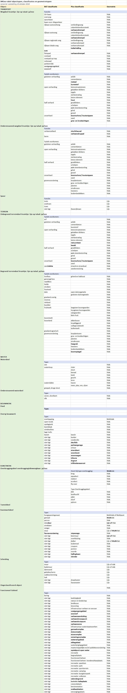
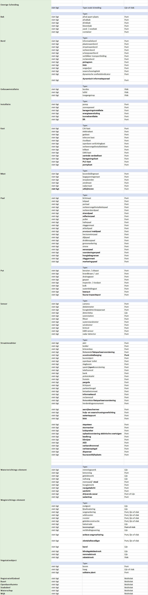

Managementsamenvatting
======================

Doel en resultaat
-----------------

IMGeo 2.2 is een nieuwe geoptimaliseerde versie van het informatiemodel Geografie (IMGeo) door 
-----------------------------------------------------------------------------------------------

1.  afbakeningsregels aan te scherpen zodat de BGT uniformer voor afnemers en
    makkelijker maakbaar voor bronhouders wordt.

2.  het model uit te breiden met ontbrekende subclassificaties (domeinwaarden)
    zodat sectoren (IMBOR, OOV) volledig kunnen aansluiten op IMGeo.

Het resultaat van IMGeo 2.2 is een goed bruikbare registratie met grootschalige
topografie voor Nederland en daarvoor moet de BGT\|IMGeo+ uniform zijn en passen
bij de behoeften van gebruikers. Met IMGeo 2.2 wordt/worden

1.  Landelijke gebruikers beter bediend met een uniforme(re) BGT door de
    spelregels van de BGT beter uit te leggen aan bronhouder waardoor zij
    eenvoudiger en beter BGT kunnen inwinnen en bijhouden. Deze verduidelijking
    en uniformering draagt bij aan onder meer de automatische generalisatie van
    BGT naar BRT.

2.  Nutsbedrijven en veiligsheidssector beter bediend door meer volledige en
    uniforme inhoud van de BGT, die aansluit bij de informatiebehoefte voor het
    uitvoeren van wettelijk geregelde dienstverlening.

3.  Het proces van beheer openbare ruimte bij waterschappen, provincies,
    gemeenten en andere organisaties beter ondersteund door IMGeo te laten
    aansluiten op de behoeften voor inhoud en afbakening vanuit die sectoren.

4.  Een volledige aansluiting van IMBOR op IMGeo gerealiseerd wat bijdraagt aan
    de standaardisatie van BOR, en het efficiënter bijhouden van de BGT
    (‘opbouwen vanuit beheer’).

5.  (Het proces rondom de bijhouding van bouwwerken vereenvoudigd wat bijdraagt
    aan het efficiënter bijhouden en de actualiteit van de BGT.)

Inhoud
------

In het wijzigingsvoorstel IMGeo 2.2 worden voorstellen gedaan die betrekking
hebben op:

1.  het opnemen van bestaande werkafspraken of verduidelijken van bestaande
    spelregels in het model;

2.  Het aanscherpen van afbakeningsregels met nieuwe criteria;

3.  Het uitbreiden van het model met een aantal nieuwe subclassificaties;

4.  Herindeling van subclassificaties en geometrietypen van objecten zijnde

    1.  het hernoemen (en samenvoegen) van subclassificaties

    2.  het verplaatsen van subclassificaties naar een ander object, attribuut
        of codelijst (bgt/plus)

    3.  het schrappen van subclassificaties

    4.  het aanpassen van geometrietypen binnen de huidige structuur.

Impact
------

De impact van IMGeo 2.2 voor de verschillende categorieën wijzigingen is als
volgt:

Categorie 1 heeft geen impact. Bronhouder dient al conform deze spelregels te
werken.

Categorie 2 heeft als impact een inwinlast voor bronhouders. Verwacht is dat
bronhouders opnieuw moeten inwinnen en/of de huidige populatie van objecten
moeten nalopen.

Categorie 3 en 4 hebben een technische IT-impact bestaande uit:

-   Aanpassen van de BGT-software om

1.  nieuwe subclassificaties te kunnen inlezen en aanmaken (categorie 3 en 4a).

2.  heringedeelde subclassificaties te kunnen inlezen en aanmaken (categorie 4a
    en 4b).,

3.  het ondersteunen van de nieuwe topologische regels bij
    herindeling/verschuiving van opdelende naar inrichtende laag en vice versa
    (categorie 4b).

4.  vervallen subclassificaties niet meer te ondersteunen (categorie 4c).

5.  de nieuwe geometrietypen voor bepaalde subclassificaties te kunnen inlezen
    en aanmaken (categorie 4d).

-   Repareren van data om:

1.  inrichtende objecten om te zetten naar opdelende objecten (categorie 4b).

2.  vervallen subclassificaties om te zetten naar nieuwe subclassificaties
    (categorie 4c).

3.  geometrie voor bepaalde subclassificaties om te zetten naar nieuwe
    geometrietype (categorie 4d).

Voorstellen
-----------

### Opnemen bestaande werkafspraken en verduidelijken bestaande spelregels

| Onderwerp                                                                                                                      | Samenvatting                                                                                                                                                                                                                                                                                                                                           | Github-issue(s)                                                                                                                                                               |
|--------------------------------------------------------------------------------------------------------------------------------|--------------------------------------------------------------------------------------------------------------------------------------------------------------------------------------------------------------------------------------------------------------------------------------------------------------------------------------------------------|-------------------------------------------------------------------------------------------------------------------------------------------------------------------------------|
| Opnemen definitie ‘maaiveld’                                                                                                   | In de ontwerpprincipes van de BGT catalogus wordt een definitie van maaiveld toegevoegd.                                                                                                                                                                                                                                                               | [\#156](https://github.com/Geonovum/IMGeo2018/issues/156)                                                                                                                     |
| De indeling van particuliere terreinen                                                                                         | Ten aanzien van de dekking van de BGT wordt toegelicht dat dat alle particulieren terreinen nader ingedeeld moeten worden, waar deze informatie noodzakelijk is voor wettelijk geregelde dienstverlening door bronhouders en gebruikers”                                                                                                               | [\#9](https://github.com/Geonovum/IMGeo2018/issues/9)                                                                                                                         |
| Opnemen van objecten buiten Nederland                                                                                          | Ten aanzien van de dekking van de BGT wordt toegelicht dat de BGT tenminste landsdekkend binnen de landsgrens beheerd moet worden, maar dat bronhouders objecten die deels buiten de landgrens in zijn geheel mogen opnemen in de BGT. Objecten, die geheel buiten Nederland liggen én in beheer zijn bij bronhouder, kunnen worden opgenomen in IMGeo | [\#9](https://github.com/Geonovum/IMGeo2018/issues/9)                                                                                                                         |
| Plaatsing en draaiing van nummeraanduidingen                                                                                   | Ten aanzien van teksten op de kaart wordt toegelicht dat elke nummeraanduidingreeks eenmaal op de kaart geplaatst wordt, en dat een nummeraanduiding haaks of evenwijdig aan de voorgevel wordt gevisualiseerd met de minimale rotatiehoek ten opzicht van de normale leesrichting (horizontaal).                                                      | [\#3](https://github.com/Geonovum/IMGeo2018/issues/3)                                                                                                                         |
| Rotatiehoek labels                                                                                                             | De eisen en regels van o.a. eenheid, decimale precisie, oriëntering voor rotatiehoek in de werkafspraak Nummeraanduidingreeksen worden opgenomen in de regels van attribuutsoort hoek                                                                                                                                                                  | [\#3](https://github.com/Geonovum/IMGeo2018/issues/3)                                                                                                                         |
| Patroon reeksen van nummeraanduidingen                                                                                         | Het patroon voor het samenstellen van reeksen van nummeraanduidingen in de werkafspraak Nummeraanduidingreeksen wordt opgenomen in de regels over teksten op de kaart                                                                                                                                                                                  | [\#3](https://github.com/Geonovum/IMGeo2018/issues/3)                                                                                                                         |
| Regels voor panden boven water                                                                                                 | In de afbakeningsregels voor panden wordt toegelicht hoe panden die (deels) boven water liggen worden afgebakend.                                                                                                                                                                                                                                      | [\#61](https://github.com/Geonovum/IMGeo2018/issues/61)                                                                                                                       |
| Afbakening van gemaal, sluis en stuw                                                                                           | De afbakeningsregels voor gemaal, sluis en stuw worden verduidelijkt met extra toelichting en regels.                                                                                                                                                                                                                                                  | [\#37](https://github.com/Geonovum/IMGeo2018/issues/37), [\#72](https://github.com/Geonovum/IMGeo2018/issues/72)                                                              |
| Onderscheid muur, keermuur, kademuur, strekdam en damwand                                                                      | Het onderscheid tussen muur, keermuur, kademuur, strekdam en damwand wordt verduidelijkt met een beslisboom.                                                                                                                                                                                                                                           | [\#14](https://github.com/Geonovum/IMGeo2018/issues/14), [\#30](https://github.com/Geonovum/IMGeo2018/issues/30), [\#69](https://github.com/Geonovum/IMGeo2018/issues/69)     |
| Relatieve hoogte van tunneldeel en duiker                                                                                      | In de regels voor relatieve hoogte voor tunneldeel en duiker wordt toegevoegd dat deze objecten altijd op een relatieve hoogte lager dan 0 hebben.                                                                                                                                                                                                     | [\#62](https://github.com/Geonovum/IMGeo2018/issues/62)                                                                                                                       |
| Definities rijbanen en fietspad                                                                                                | De definities van rijbanen en fietspad worden uitgebreid met de verkeerskundige aanduidingen (verkeersborden en symbolen) en fysieke kenmerken (scheiding en kleur asfalt). Fietssuggestiestroken worden uitgesloten.                                                                                                                                  | [\#11](https://github.com/Geonovum/IMGeo2018/issues/11)                                                                                                                       |
| Definitie bunker                                                                                                               | De definitie van ‘bunker’ wordt aangepast naar ‘van oorsprong’ militair verdedingswerk.                                                                                                                                                                                                                                                                | [\#183](https://github.com/Geonovum/IMGeo2018/issues/183)                                                                                                                     |
| Definitie Put                                                                                                                  | De definitie van subclassificaties van Put worden aangepast naar ‘deksel van een put’ in plaats van de gehele put betreffend.                                                                                                                                                                                                                          | [\#92](https://github.com/Geonovum/IMGeo2018/issues/92)                                                                                                                       |
| samenvallen coördinaten kruinlijn en objectbegrenzing                                                                          | Het samenvallen van coördinaten van kruinlijn en objectbegrenzing wordt nader toegelicht dat coördinaten identiek moeten zijn.                                                                                                                                                                                                                         | [\#36](https://github.com/Geonovum/IMGeo2018/issues/36), [\#175](https://github.com/Geonovum/IMGeo2018/issues/175)                                                            |
| samenvallen functionele gebieden en objectgrenzen                                                                              | In de afbakeningsregels wordt toegelicht dat de grens van een functioneel gebied niet persé samenvalt met de grens van de objecten die geclusterd worden.                                                                                                                                                                                              | [\#119](https://github.com/Geonovum/IMGeo2018/issues/119)                                                                                                                     |
| geen plaatsbepalingspunten bij planinformatie, OngeclassificeerdObject, functionele gebieden, labels en registratieve gebieden | Voor planinformatie, ongeclassificeerde objecten. functionele en registratieve gebieden en labels wordt toegelicht dat deze objecten geen (eigen) plaatsbepalingspunten.                                                                                                                                                                               | [\#79](https://github.com/Geonovum/IMGeo2018/issues/79), [\#120](https://github.com/Geonovum/IMGeo2018/issues/120), [\#134](https://github.com/Geonovum/IMGeo2018/issues/134) |
| Nederlandse tijdzone met zomer/wintertijd                                                                                      | De tekst over Nederlandse tijd en tijdzone wordt nader toegelicht met toepassing van de tijdzones voor zomer- en wintertijd.                                                                                                                                                                                                                           | [\#13](https://github.com/Geonovum/IMGeo2018/issues/13)                                                                                                                       |
| Interne vs. relatieve precisie                                                                                                 | In de BGT catalogus in paragraaf 4.2 wordt de term ‘interne precisie’ geschrapt.                                                                                                                                                                                                                                                                       | [\#142](https://github.com/Geonovum/IMGeo2018/issues/142)                                                                                                                     |

### Uitbreiden van het model met subclassificaties

Overzichtstabel IMGeo 2.2
-------------------------

Onderstaande tabel toont een overzicht van de objecttypen, attributen en
domeinwaarden van IMGeo 2.2, na overnemen voorstellen in dit wijzigingsvoorstel.

