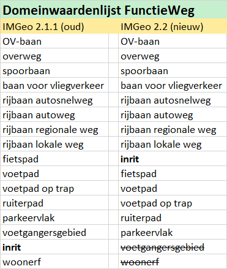
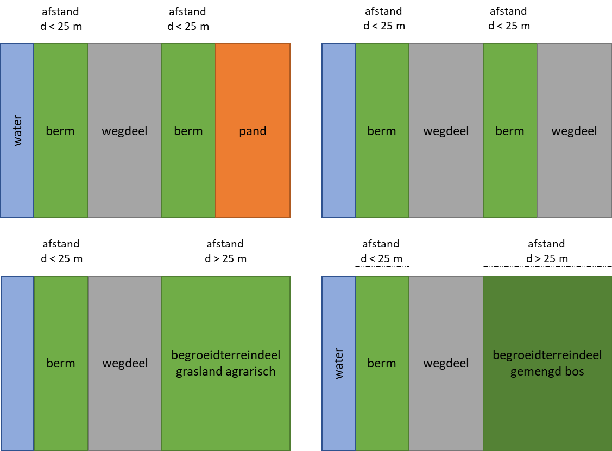

Overige voorstellen, met keuze-opties
=====================================

De volgende voorstellen worden apart toegelicht, waarbij het BGT werkveld werd
gevraagd om extra input te leveren of een keuze te maken voor een van de
geschetste opties. Deze reacties van het werkveld zijn verwerkt in één
voorgestelde oplossing.

Verschuiven inrichtende/vrijwillige vlakobjecten naar opdelende/verplichte vlakobjecten
---------------------------------------------------------------------------------------

**Wijziging t.o.v. vorige versie** schuur, typen OverigeScheiding zijn
verwijderd uit het voorstel om deze opdelend/verplicht. Overige optionele
inrichtende vlakobjecten worden voorgesteld om op te nemen in de opdelende en
verplichte BGT.

Nieuw voorstel is om boomspiegel te verplaatsen van ‘Weginrichtingselement’ naar
BegroeidTerreindeel:groenvoorziening (zie ook [Schrappen inwinregel voor
plantvakken kleiner dan
5m](https://geonovum.github.io/IMGeo2018/wijzigingsvoorstel/#schrappen-inwinregel-voor-plantvakken-kleiner-dan-5m2)2).
Hiermee wordt boomspiegel automatisch opdelend, maar niet verplicht.

**Gerelateerde
Github-issue(s)** [\#16](https://github.com/Geonovum/IMGeo2018/issues/16), [\#96](https://github.com/Geonovum/IMGeo2018/issues/96), [\#118](https://github.com/Geonovum/IMGeo2018/issues/118), [\#173](https://github.com/Geonovum/IMGeo2018/issues/173),
[\#174](https://github.com/Geonovum/IMGeo2018/issues/174)

**Huidige situatie** In paragraaf 3.3 van de IMGeo gegevenscatalogus staat het
volgende:

>   "De optionele objecttypen van IMGeo zijn topologisch gestructureerd indien
>   het een nadere detaillering betreft van de BGT objecten. Het optionele deel
>   van IMGeo is geen onderdeel van de topologische structuur indien het een
>   uitbreiding van de populatie is (‘inrichtend’). Dit geldt bijvoorbeeld voor
>   Overig bouwwerk: bunker en Kunstwerkdeel: keermuur. Deze objecten liggen
>   ongeacht of ze een punt-, lijn- of vlakgeometrie hebben altijd boven of
>   onder één of meer BGT objecten op maaiveldniveau. Een optioneel IMGeo object
>   dat een vlakgeometrie heeft, bijvoorbeeld een wildrooster, maakt geen gat in
>   het onderliggende BGT object, bijvoorbeeld een wegdeel of onbegroeid
>   terreindeel.”

In het informatiemodel van BGT\|IMGeo zijn de verplichte vlakobjecten (m.u.v.
Functioneel Gebied: kering) dus opdelend en de vrijwillige vlakobjecten
inrichtend. Het algemene principe wat hier achter zit is: opdelend is verplicht,
en inrichtend is vrijwillig.

**Nieuwe situatie** Het voorstel is om de volgende objecten om bepaalde
inrichtende/vrijwillige vlakobjecten van IMGeo te verschuiven naar
opdelende/*verplichte* BGT-inhoud.

Het betreft de volgende objecten:

>   OverigBouwwerk: **bunker**  
>   Kunstwerkdeel: **keermuur, faunavoorziening**

>   Gebouwinstallatie: **bordes**

>   Weginrichtingselement: **wildrooster, rooster**

Deze vlakobjecten worden dus opdelend, maar daarmee ook verplichte BGT-inhoud.

Dit betekent voor het model dat deze domeinwaarden zullen verplaatsen van een
plus-waardelijst (bijv. OverigBouwwerkPlus) naar een bgt-waardelijst (bijv.
OverigBouwwerk). De tekst in paragraaf 3.3 van de IMGeo gegevenscatalogus wordt
aangepast met voorbeelden uit de nieuwe situatie.

**Onderbouwing** Bronhouders ervaren het in bepaalde situaties als lastig om
onder een inrichtend vlak op relatieve hoogte 0 een opdelend vlak te moeten
leggen. Gebruikers (bijvoorbeeld groenbeheerders) en bronhouders hebben
aangegeven dat zij bepaalde grote vlakobjecten die nu inrichtend zijn, in de
opdelende laag willen hebben voor het beter kunnen opstellen van
onderhoudsbestekken en kostenramingen. Om die reden wordt voorgesteld om
bovenstaande objecten op te nemen in de opdelende laag, zodat deze een gat maken
in het onderliggende terrein. De lijst van bovenstaande objecten is samengesteld
op basis van de reacties uit de 1e ronde van de formele consultatie. Het opnemen
van schuur wordt uitgesteld naar IMGeo 3.0; met BAG 2.0 zullen op termijn in de
BGT de meeste schuren naar verwachting als Pand worden afgebakend (dus daarmee
opdelend).

De volgende vlakobjecten blijven optioneel en inrichtend:

>   Kunstwerkdeel: overkluizing, duiker, bodemval, coupure, ponton, voorde.

>   OverigeScheiding: muur, kademuur

>   Gebouwinstallatie: luifel, toegangstrap

>   Weginrichtingselement: wegmarkering, geleideconstructie

>   Vegetatieobject: haag

>   Functionele en registratieve gebieden

De nieuwe classificaties die voorgesteld worden voor IMGeo worden nu beschouwd
als vrijwillige en dus inrichtende inhoud (uitbreiding in plus-deel van het
informatiemodel).

**Impact** De impact van dit voorstel wordt ingeschat op relatief ‘gemiddeld tot
laag’:

-   *Verplicht/niet verplicht:* Het betreft een verschuiving van niet-verplichte
    IMGeo naar verplichte IMGeo.

-   *Software:* er is aanpassing van de software nodig als gevolg van nieuwe
    domeinwaardenlijsten.

-   *Dataconversie:* bestaande gegevens dienen te worden omgezet.

-   *Inwinning:* voor de vlakobjecten die verplicht worden moeten bronhouders de
    gegevens inwinnen en aanleveren aan de LV-BGT, dit is verplicht.

-   *Samenhang basisregistraties:* er is geen impact voor andere
    basisregistraties voorzien.

**Implementatie-advies** Het advies is als volgt:

1.  Implementeer de nieuwe domeinwaardenlijsten in de software van bronhouders
    en BGT keten.

2.  Onderzoek de mogelijkheden van het automatisch omzetten van bestaande
    objecten: zet de classificatie om van plus-kolom naar bgt-kolom, en maak een
    gat in het onderliggende opdelende object (bijv. terreindeel) met de
    geometrie van het betreffende nieuwe opdelende vlakobject (bijv. bunker).
    Mislukt het maken van een gat, leg het nieuwe opdelende vlakobject (bijv.
    bunker) op een andere relatieve hoogte dan 0 waarmee dit vlakobject alsnog
    inrichtend is.

3.  Met betreffende bronhouders dienen afspraken gemaakt te worden wanneer zij
    de uitvallijst van de automatisch omzetting hebben opgelost (d.w.z. zelf gat
    maken in onderliggende objecten), alsook wanneer de ontbrekende objecten die
    nu verplichte BGT-inhoud zijn ingewonnen en aangeleverd.

Verplaatsen ‘inrit’ boven ‘fietspad’ voor functies van Wegdeel
--------------------------------------------------------------

**Wijziging(en) t.o.v. vorige versie** De voorgelegde opties worden naar
aanleiding van de reacties geschrapt. Voorstel is aangepast om ‘inrit’ in de
domeinwaardenlijst FunctieWeg te plaatsen boven ‘fietspad’ en onder ‘rijbaan
lokale weg’.

**Gerelateerde issue(s)**
[\#126](https://github.com/Geonovum/IMGeo2018/issues/126)

**Huidige situatie** In de BGT komt de functie 'inrit' voor bij een Wegdeel met
de volgende definitie:

*"Toegangswegen, oprijlanen en dergelijke met verkeersfunctie die leiden naar
afgelegen erven en terreinen."*

Afgelegen is niet nader gespecificeerd in de afbakeningsregels. Als gevolg
daarvan zijn zowel de langere toegangswegen naar afgelegen percelen en gebouwen
als de korte inritten voor toegang van een openbare weg naar een perceel of
gebouw door bijna alle bronhouders opgenomen in de BGT. 

Op BGT-niveau is het aanvankelijk niet de bedoeling geweest om de korte inritten
als ‘inrit’ af te bakenen. Voor beheer openbare ruimte zijn de korte inritten
wel relevant.

**Nieuwe situatie** Het voorstel is om ‘inrit’ in de domeinwaardenlijst
FunctieWeg te plaatsen boven ‘fietspad’ en onder ‘rijbaan lokale weg’.

N.B. het schrappen van ‘voetgangersgebied’ en ‘woonerf’ bij FunctieWeg is een
voorstel, zie [Verplaatsen 'voetgangersgebied'en 'woonerf' van Wegdeel naar
FunctioneelGebied](https://geonovum.github.io/IMGeo2018/wijzigingsvoorstel/#verplaatsen-voetgangersgebied-en-woonerf-van-wegdeel-naar-functioneelgebied).

De definitie van ‘inrit’ wordt aangepast:

*"Toegangswegen, oprijlanen en dergelijke met verkeersfunctie die leiden naar
\<strike\>afgelegen\</strike\> erven en terreinen."*

Conform de hiërarchische toewijzingsregels van IMGeo in paragraaf 3.9 van de BGT
catalogus wordt dan een object eerst als inrit afgebakend (indien voldoet aan de
definitie) en pas daarna als fietspad of voetpad (indien voldoet aan de
definitie).

**Onderbouwing** Inritten worden nu niet uniform afgebakend in de BGT. Bij
aanvang van de BGT was het niet de bedoeling om kleine inritten als verplichte
BGT-inhoud op te nemen. Vanuit BOR en andere gebruikers blijkt een enorme
behoefte om deze informatie beschikbaar te hebben, wat -naast de
begripsverwarring t.a.v. inrit/toegangsweg - verklaart waarom veel bronhouders
toch kleine inritten als BGT hebben afgebakend.

Uit de 1e ronde van de formele consultatie bleek dat geen van alle opties echt
passend waren:

-   Optie 1: BGT moet uniform en conform spelregels zijn, dus niets doen is geen
    optie.

-   Optie 2: Inritten zijn geen onderdeel van een berm, want hebben een
    verkeersfunctie

-   Optie 3: Rijbaan regionale en lokale weg op BGT-niveau krijgen kleine
    uitstulpingen wat niet wenselijk is voor bepaling doorgaande weg/route of
    afleiden BRT uit BGT.

De werkgroep IMGeo heeft zich nogmaals gebogen over alle reacties:

-   Er een duidelijke behoefte is aan informatie over inritten, ongeacht de
    lengte en/of breedte.

-   Inritten geven aan waar toegang tot een perceel is, in het kader van
    bereikbaarheid moet het niet uitmaken of. Essentie van de informatie is:
    hier loopt een weg naar een perceel/erf en dus eventueel een bedrijf,
    woonhuis, fabriek e.d. Voor o.a. hulpdiensten is dit relevante informatie.

-   Een inrit dat een fietspad of voetpad is begaanbaar voor zowel gemotoriseerd
    verkeer, als voor fietsers en voetgangers begaanbaar. Als inritten over een
    fietspad/voetpad door de hierarchische toewijzigingsregels als zodanig niet
    herkenbaar zijn, is niet bekend dat op die plek met een motorvoertuig een
    perceel/erf bereikt kan worden.

Conclusie is dat inrit ongeacht lengte of breedte als inrit herkenbaar moet
zijn, en dat deze belangrijk is voor verschillende gebruikers voor o.a. beheer
en bereikbaarheid, en dus voor de afbakening van fietspad en voetpad moet komen.
Om die reden wordt inrit in de domeinwaardenlijst FunctieWegdeel geplaatst boven
fietspad en onder rijbaan lokale weg.

**Impact** De impact van dit voorstel wordt ingeschat op relatief ‘gemiddeld tot
laag’:

-   *Verplicht/niet verplicht:* Het betreft verplichte BGT.

-   *Software:* er is geen aanpassing van de software nodig.

-   *Dataconversie:* bestaande gegevens hoeven niet te worden omgezet.

-   *Inwinning:* bronhouders die de huidige spelregels van BGT hebben gevolgd
    dienen hun bestand na te lopen, en ontbrekende (kleine) inritten in te
    winnen en aan te leveren.

-   *Samenhang basisregistraties:* er is geen impact voor andere
    basisregistraties voorzien.

**Implementatie-advies** Het advies is om met betreffende bronhouders afspraken
te maken wanneer zij de inritten conform de nieuwe regels hebben ingewonnen en
aangeleverd.

Aanpassen afbakeningsregel voor berm naar maximaal 25 meter vanaf wegkant
-------------------------------------------------------------------------

**Wijziging(en) t.o.v. vorige versie** O.b.v. reacties uit ronde 1 van de
formele consultatie is optie 2 verder uitgewerkt.

**Gerelateerde
Github-issue(s)** [\#8](https://github.com/Geonovum/IMGeo2018/issues/8)

**Huidige situatie** In de BGT komt de functie 'berm' voor bij een
OndersteunendWegdeel met de volgende definitie:

>   "Een strook grond langs een weg of spoorweg."

Een OndersteunendWegdeel 'berm' heeft een eigen fysiek voorkomen. Deze keuze in
het model is gemaakt voor de afstemming/koppeling met de internationale
uitwisselstandaard CityGML. Voorts kent de BGT terreindelen (begroeid en
onbegroeid) zonder functie, maar wel met een fysiek voorkomen. In de praktijk
blijkt dat bermen soms door bronhouders afgebakend worden als
OndersteunendWegdeel en soms als Terreindeel. 

**Nieuwe situatie** Het voorstel is om voor de afbakening van bermen een
algemene stelregel te hanteren dat een berm tot maximaal 25 meter vanaf de
wegkant loopt.

In de BGT catalogus wordt in H10 de volgende afbakeningsregel aan
OndersteunendWegdeel toegevoegd:

>   ‘Een terreindeel langs een weg dat niet breder is dan 25 meter gemeten
>   t.o.v. de kant van de weg en met verharding of begroeiing conform de fysieke
>   voorkomens van OndersteunendWegdeel wordt in de BGT opgenomen als berm.’

Met bovenstaande stelregel mag een berm ook smaller zijn dan 25 meter. De
minimale breedte voor een berm wordt bepaald door de bronhouder (bijv. vanuit
groenbeheer of wegbeheer).

**Onderbouwing** Het is niet de bedoeling dat bermen (te) ver doorlopen vanaf de
wegkant, immers de ondersteunende verkeersfunctie loopt niet tot enkele
honderden meters vanaf de wegkant. Bermen zijn wel relevante BGT-inhoud voor
o.a. analyse over verkeersveiligheid, en ook voor BOR in verband met groenbeheer
/ maairegiems.

Uit de 1e ronde van de formele consultatie volgt:

-   Optie 3 Afbakenen conform de wegbeheersystematiek van CROW werd door
    bronhouders als te complex beoordeeld, en valt af.

-   Optie 1 niets doen komt de uniformiteit van de BGT niet ten goede en valt
    dus ook af.

-   Op Optie 2 werd overwegend positief gereageerd, zij het dat om voorbeelden
    werd gevraagd en opgemerkt werd dat niet altijd een berm langs de weg ligt
    (bijvoorbeeld bij een bos langs een weg).

Een terreindeel langs een wegdeel smaller dan 25 meter wordt dus in principe
opgenomen als berm, als de verharding of begroeiing matcht met de fysieke
voorkomens van OndersteunendWegdeel. Bredere terreindelen en terreindelen die
niet voldoen aan de fysieke voorkomens van OndersteunendWegdeel (bijv. bos,
bouwland of grasland agrarisch) worden als BegroeidTerreindeel of
OnbegroeidTerreindeel afgebakend.

Enkele voorbeelden van bermen en begroeide terreindelen langs een weg:

In het objectenhandboek zullen extra voorbeelden en foto’s worden toegevoegd.

**Impact** De impact van het toevoegen en uitbreiden van domeinwaarden wordt
ingeschat op relatief ‘gemiddeld’:

-   *Verplicht/niet verplicht:* Het betreft verplichte BGT.

-   *Software:* er is geen aanpassing van de software nodig.

-   *Dataconversie:* bestaande gegevens hoeven niet te worden omgezet.

-   *Inwinning:* bronhouders dienen hun bestand na te lopen of aan nieuwe
    afbakeningsregels voor bermen wordt voldaan.

-   *Samenhang basisregistraties:* er is geen impact voor andere
    basisregistraties voorzien.

**Implementatie-advies** Het advies is om met betreffende bronhouders afspraken
te maken wanneer zij de bermen conform de nieuwe regels hebben ingewonnen en
aangeleverd.
