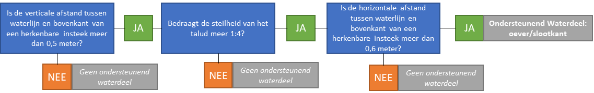

Aanscherpen afbakeningsregels met extra criteria
================================================

De volgende voorstellen betreffen het aanscherpen van afbakeningsregels met
extra criteria.

| Onderwerp                                                     | Samenvatting                                                                                                                                                                                                                             | Github-issue                                                                                                                                                               |
|---------------------------------------------------------------|------------------------------------------------------------------------------------------------------------------------------------------------------------------------------------------------------------------------------------------|----------------------------------------------------------------------------------------------------------------------------------------------------------------------------|
| Schrappen inwinregel voor uitsparingen stedelijk groen \< 5m2 | De inwinregels dat uitsparingen in wegdelen van stedelijk groen kleiner dan 5 m2 niet in de BGT opgenomen moeten worden, maar wel in IMGeo opgenomen mogen worden geschrapt.                                                             | [\#28](https://github.com/Geonovum/IMGeo2018/issues/28)                                                                                                                    |
| Maximale breedte voor berm van 25 meter                       | De breedte van een berm wordt beperkt tot maximaal 25 meter vanaf het Wegdeel. Bredere terreindelen langs een weg worden afgebakend als BegroeidTerreindeel, en niet als OndersteunendWegdeel:berm.                                      | [\#8](https://github.com/Geonovum/IMGeo2018/issues/8)                                                                                                                      |
| Percentages type boom voor naaldbos, loofbos en gemengd bos   | Het onderscheid tussen naaldbos, loofbos en gemengd bos wordt met minimum percentages aangescherpt: 90% of meer loofboom is loofbos, 90% of meer naaldboom is naaldbos en minder dan 90% naaldboom of loofboom is gemengd bos.           | [\#161](https://github.com/Geonovum/IMGeo2018/issues/161)                                                                                                                  |
| De indeling van particuliere terreinen                        | Ten aanzien van de dekking van de BGT wordt toegelicht dat dat alle particulieren terreinen nader ingedeeld moeten worden, waar deze informatie noodzakelijk is voor wettelijk geregelde dienstverlening door bronhouders en gebruikers” | [\#9](https://github.com/Geonovum/IMGeo2018/issues/9)                                                                                                                      |
| Kleinere minimale afmetingen voor oever/slootkant             | De minimale breedte van een oever wordt verlaagd naar 60 centimeter en de regels voor opname worden uitgebreid met criteria voor hoogte oever van minimaal 50 centimeter en een minimale steilheid van 1:4.                              | [\#50](https://github.com/Geonovum/IMGeo2018/issues/50), [\#74](https://github.com/Geonovum/IMGeo2018/issues/74), [\#76](https://github.com/Geonovum/IMGeo2018/issues/76)  |
| Uitbreiden opslagtank voor gassen en energie                  | De definitie van opslagtank wordt uitgebreid met faciliteiten voor opslag van gassen en energie.                                                                                                                                         | [\#190](https://github.com/Geonovum/IMGeo2018/issues/90)                                                                                                                   |
| Afbakening damwand inclusief deksloof                         | Indien een deksloof aanwezig op de damwand, wordt deze meegenomen in de afbakening van damwand, en niet afzonderlijk afgebakend.                                                                                                         | [\#14](https://github.com/Geonovum/IMGeo2018/issues/14), [\#30](https://github.com/Geonovum/IMGeo2018/issues/30), [\#69](https://github.com/Geonovum/IMGeo2018/issues/69)  |
| Schrappen minimale lengte voor hek en muur                    | Voor hek en muur wordt de minimale lengte voor opname van respectievelijk 10 meter en 1 meter geschrapt. De inwinregel voor minimale hoogte blijft onveranderd.                                                                          | [\#198](https://github.com/Geonovum/IMGeo2018/issues/198)                                                                                                                  |
| Minimale breedte voor luifel van 1 meter                      | De minimale breedte van een luifel wordt vergroot naar minimaal 1 meter vanaf de gevel.                                                                                                                                                  | [\#197](https://github.com/Geonovum/IMGeo2018/issues/197)                                                                                                                  |
| Geleidewerk en remmingswerk inwinnen aan zijde scheepvaart    | De inwinregel voor remmingswerks en geleidewerk wordt aangescherpt dat deze wordt ingewonnen langs de zijde waar de scheepvaart langs vaart.                                                                                             | [\#38](https://github.com/Geonovum/IMGeo2018/issues/38)                                                                                                                    |
| Schrappen ‘afgelegen’ in definitie inrit                      | In de definitie van inrit wordt de zinsnede ‘afgelegen’ geschrapt.                                                                                                                                                                       | [\#126](https://github.com/Geonovum/IMGeo2018/issues/126)                                                                                                                  |

Schrappen inwinregel voor uitsparingen stedelijk groen \< 5m2
-------------------------------------------------------------

In paragraaf 10.1 Wegdeel van de BGT catalogus wordt de volgende zinsnede
geschrapt:

>   Uitsparingen in wegdelen, meestal van het type voetpad, voor stedelijk groen
>   worden niet afzonderlijk geregistreerd indien \<5 m2 . Het wegdeel wordt
>   daarbij geacht door te lopen.

In paragraaf 9.2 Wegdeel en weginrichting van de IMGeo catalogus wordt de
volgende zinsnede geschrapt:

>   In de BGT worden uitsparingen in wegdelen voor stedelijk groen niet apart
>   ingewonnen indien \\\< 5 m2. In IMGeo kunnen deze worden opgenomen als
>   ‘begroeid terreindeel groenvoorziening’.

Uit analyse van BGT-gegevens blijkt dat bronhouders massaal kleine plantvakken
(=kleiner dan 5m2) als begroeidTerreindeel opnemen. Het vasthouden aan deze
inwinregel voor kleine plantvakken lijkt dus niet zinvol.

Maximale breedte voor berm van 25 meter
---------------------------------------

In paragraaf 10.2 OndersteunendWegdeel van de BGT catalogus wordt de volgende
tekst opgenomen:

>   ‘Een terreindeel langs een weg dat niet breder is dan 25 meter gemeten
>   t.o.v. de kant van de weg en met verharding of begroeiing conform de fysieke
>   voorkomens van OndersteunendWegdeel wordt in de BGT opgenomen als berm.’

Met de afbakeningsregel mag een berm ook smaller zijn dan 25 meter. De minimale
breedte voor een berm wordt bepaald door de bronhouder (bijv. vanuit groenbeheer
of wegbeheer). Een terreindeel langs een wegdeel smaller dan 25 meter wordt dus
in principe opgenomen als berm, als de verharding of begroeiing matcht met de
fysieke voorkomens van OndersteunendWegdeel. Als er geen berm aanwezig is naast
een weg of spoorweg, dan wordt geen berm opgenomen. Bredere terreindelen en
terreindelen die niet voldoen aan de fysieke voorkomens van OndersteunendWegdeel
(bijv. bos, bouwland of grasland agrarisch) worden als BegroeidTerreindeel of
OnbegroeidTerreindeel afgebakend.

Percentages type boom voor naaldbos, loofbos, gemengd bos
---------------------------------------------------------

In paragraaf 10.5 BegroeidTerreindeel van de BGT catalogus wordt bij de regels
voor opname het volgend toegevoegd:

>   Om een terreindeel als loofbos af te bakenen dient het minimum percentage
>   loofboom groter dan of gelijk aan 90% te zijn.

>   Om een terreindeel als naaldbos af te bakenen dient het minimum percentage
>   naaldboom groter dan of gelijk aan 90 % te zijn.

>   Om een terreindeel als gemengd bos af te bakenen dient het maximum
>   percentage naaldboom of het maximum percentage loofboom kleiner dan 90% te
>   zijn.

>   Bij deze percentages worden het eventueel aanwezige onderhout en smalle
>   stroken loof- en of naaldbos gelegen naast of als uitloper van het bos
>   buiten beschouwing gelaten.

De percentages zijn gebaseerd op de afbakeningscriteria voor bos in de
Basisregistratie Topografie (BRT). Met deze wijziging sluiten BGT en BRT beter
op elkaar aan wat bijdraagt aan de geautomatiseerde generalisatie van BRT uit
BGT.

Indeling van particuliere terreinen
-----------------------------------

Aan de tekst in paragraaf 2.4 Dekking van de BGT catalogus:

>   “De BGT wordt landsdekkend beheerd voor het grondgebied van Nederland binnen
>   de gemeentegrenzen. Daartoe behoren ook industriële complexen, zoals
>   Schiphol, de Hoogovens en Europoort.”

wordt als verduidelijking toegevoegd:

>   Dit geldt voor alle particuliere terreinen waar deze informatie noodzakelijk
>   is voor wettelijk geregelde dienstverlening door bronhouders en gebruikers”

Met deze toevoeging dienen ook particuliere en bedrijventerreinen nader
ingedeeld te worden voor zover dit nodig is voor de uitvoering van wettelijke
taken bijvoorbeeld voor de inzet van hulpdiensten en de dienstverlening door
netbeheerders.

Kleinere minimale afmetingen voor oever/slootkant
-------------------------------------------------

De tekst in paragraaf 10.6 OndersteunendWaterdeel in de BGT catalogus:

>   Als de **horizontale afstand** tussen waterlijn en de bovenkant van een
>   herkenbare **insteek 1m** of meer bedraagt dan ontstaat in de BGT een
>   ondersteunend waterdeel van het type oever/slootkant.

wordt vervangen door

>   Als tussen waterlijn en de bovenkant van een herkenbare insteek **de
>   verticale afstand** (ofwel: hoogte oever) **minimaal 50 centimeter** is,
>   **de steilheid (H/Br) 1:4 of meer** bedraagt, en de **horizontale afstand**
>   (ofwel: breedte oever) **60 centimeter of meer** bedraagt, dan ontstaat in
>   de BGT een ondersteunend waterdeel van het type oever/slootkant.

Met deze nieuwe afbakeningsregels sluit de BGT beter aan op de behoeften voor
beheer openbare ruimte van waterschappen. De aanvullende eisen worden nader
toegelicht in een technische afbeelding en een beslisboom.

Uitbreiden opslagtank voor gassen en energie
--------------------------------------------

In paragraaf 9.11 TypeOverigBouwwerk wordt de definitie van opslagtank verruimd
met de volgende zinsnede:

>   opslagtank: Opslagfaciliteit voor vloeistoffen *of gassen of energie*.
>   Alleen bovengrondse opslagtanks worden opgenomen.

Hiermee kan opslagtank ook worden toegepast voor opslagtanken voor gas of
energie, zoals bijvoorbeeld een buurtbatterij.

Afbakening damwand inclusief deksloof
-------------------------------------

In paragraaf 10.12 Scheiding van de BGT catalogus wordt de volgende zinsnede
toegevoegd:

>   Indien een deksloof aanwezig op de damwand, wordt deze meegenomen in de
>   afbakening van damwand, en niet afzonderlijk afgebakend.

Schrappen minimale lengte voor hek en muur
------------------------------------------

In paragraaf 10.12 Scheiding van de BGT catalogus wordt de tekst:

>   “Scheidingen worden als lijnobject vastgelegd als de breedte kleiner is dan
>   30cm. Bij scheidingen breder dan 30cm moet de buitenomtrek waar het object
>   de grond raakt worden ingewonnen en vastgelegd als vlakgeometrie. Een
>   scheiding wordt vastgelegd waar het object de ondergrond raakt. In de
>   scheidingen worden onderbrekingen van \< 1m genegeerd. Doorgangen worden
>   gezien als integraal onderdeel van de scheiding. Scheidingen van het **type
>   hek** die **een minimale lengte van 10m en een minimale hoogte van 1m**
>   hebben, worden vastgelegd. Scheidingen van de typen kademuur en
>   walbescherming worden opgenomen aan de bovenzijde aan de waterkant.
>   Kademuren breder dan 30cm worden ingewonnen als vlakobject; de omtrek van
>   het object aan de bovenzijde wordt dan vastgelegd. Scheidingen van het type
>   **muur, met een minimale lengte van 1m en met een minimale breedte van
>   30cm** worden opgenomen. Een muur smaller dan 30cm wordt als lijnobject
>   vastgelegd, een bredere muur als vlakobject. **Muren met een minimale hoogte
>   van 50cm worden vastgelegd.** In terreinen met een fysiek voorkomen ‘erf’
>   worden alleen die scheidingen opgenomen die direct aan de straatzijde zijn
>   gelegen.”

vervangen door:

>   Scheidingen worden als lijnobject vastgelegd als de breedte kleiner is dan
>   30cm*.* Bij scheidingen breder dan 30cm moet de buitenomtrek waar het object
>   de grond raakt worden ingewonnen en vastgelegd als vlakgeometrie.

>   Een scheiding wordt vastgelegd waar het object de ondergrond raakt. In de
>   scheidingen worden onderbrekingen van \<1m genegeerd. Doorgangen worden
>   gezien als integraal onderdeel van de scheiding.

>   Scheidingen van het **type hek die een minimale hoogte van 1m hebben**,
>   worden vastgelegd.

>   Scheidingen van de typen kademuur en walbescherming worden opgenomen aan de
>   bovenzijde aan de waterkant. Kademuren die als vlakobject worden ingewonnen
>   wordt de omtrek van het object aan de bovenzijde vastgelegd.

>   **Muren met een minimale hoogte van 50cm worden vastgelegd.**

>   In terreinen met een fysiek voorkomen ‘erf’ worden alleen die scheidingen
>   opgenomen die direct aan de straatzijde zijn gelegen.

In paragraaf 9.11 van de IMGeo catalogus wordt de tekst:

>   “In de BGT worden **scheidingen** alleen vastgelegd als ze bepaalde minimum
>   afmetingen hebben, die per type scheiding verschillen (zie deel I). In IMGeo
>   kunnen scheidingen, die kleiner dan het BGT minimum zijn, worden opgenomen
>   als objecttype ‘overige scheiding’. **Deze kent dezelfde typen scheiding**.”

>   “Scheidingen worden als lijnobject vastgelegd als de breedte kleiner is dan
>   30cm**.** Bij scheidingen breder dan 30cm moet de buitenomtrek waar het
>   object de grond raakt worden ingewonnen en vastgelegd als vlakgeometrie.

>   Een scheiding wordt vastgelegd waar het object de ondergrond raakt. In de
>   scheidingen worden onderbrekingen van \<1m genegeerd. Doorgangen worden
>   gezien als integraal onderdeel van de scheiding.

>   Scheidingen van het type **hek die een minimale hoogte van 1m hebben**,
>   worden vastgelegd.

>   Scheidingen van de typen kademuur en walbescherming worden opgenomen aan de
>   bovenzijde aan de waterkant. Kademuren die als vlakobject worden ingewonnen
>   wordt de omtrek van het object aan de bovenzijde vastgelegd.

>   **Muren met een minimale hoogte van 50cm worden vastgelegd.**

>   In terreinen met een fysiek voorkomen ‘erf’ worden alleen die scheidingen
>   opgenomen die direct aan de straatzijde zijn gelegen.

vervangen door:

>   In de BGT worden **scheidingen van het type hek en muur** alleen vastgelegd
>   als ze bepaalde minimum afmeting hebben, die per type scheiding verschillen
>   (zie deel I). In IMGeo kunnen scheidingen van het type hek en muur, die
>   kleiner dan het BGT minimum zijn, worden opgenomen als objecttype ‘overige
>   scheiding’. **De populatie van Overige Scheiding bestaat uit: · Scheidingen
>   van type hek en muur die niet voldoen aan de BGT minimummaat; · scheidingen
>   in terrein met fysiek voorkomen ‘erf’ die niet aan de straatzijde gelegen
>   zijn.**

Uit analyse van de BGT-gegevens lijkt dat bronhouders massaal de regels voor
opname in de BGT catalogus en IMGeo catalogus niet opvolgen t.a.v de minimale
afmetingen voor de lengte van type ‘hek’ en ‘muur’ voor Scheiding en
OverigeScheiding. De minimale afmetingen voor lengte van hek en muur worden
daarom geschrapt.

Onderscheid tussen twee objecten Scheiding en OverigScheiding blijft wel nodig
voor bijvoorbeeld het opnemen van draadraster en faunaraster en scheidingen
tussen percelen. Om die reden kan OverigeScheiding als objecttype niet geschrapt
worden.

Het voorstel voor aanscherpen afbakeningsregels komt dan neer op dat:

1.  Een hek hoger dan 1 meter is een BGT Scheiding; een hek lager dan 1 meter is
    een IMGeo OverigeScheiding.

2.  Een muur hoger dan 50cm is een BGT Scheiding; een muur lager dan 50cm is een
    IMGeo OverigeScheiding

3.  Elke kademuur, damwand, geluidscherm, walbescherming wordt voor de BGT
    ingewonnen als Scheiding onafhankelijk van lengte, hoogte of breedte. Deze
    objecten kunnen dus niet voorkomen als OverigeScheiding o.b.v. bovenstaande
    criteria.

4.  Alleen muur en hek kunnen voorkomen als typen van OverigeScheiding als niet
    aan de minimale hoogte voor Scheiding wordt voldaan.

5.  Elke (overige) scheiding met breedte meer dan 30 cm heeft vlakgeometrie;
    elke (overige) scheiding met een breedte kleiner dan 30 cm heeft
    lijngeometrie.

6.  Een hek of muur tussen perceel en openbare ruimte wordt als BGT Scheiding
    opgenomen indien aan de minimale afmetingen wordt voldaan voor de hoogte,
    dus minimaal 1 meter hoog voor hek en minimaal 50 cm hoog voor muur.

7.  Scheidingen tussen percelen worden altijd als IMGeo OverigeScheiding
    opgenomen.

Onderscheid tussen twee objecten Scheiding en OverigScheiding blijft wel nodig
voor bijvoorbeeld het opnemen van draadraster en faunaraster en scheidingen
tussen percelen. Om die reden kan OverigeScheiding als objecttype niet geschrapt
worden.

Minimale breedte voor luifel van 1 meter
----------------------------------------

In paragraaf 9.7 Pand en gebouwinstallatie van de IMGeo catalogus wordt de
tekst:

>   Uitstulpingen in gevels van panden zijn alleen BGT inhoud als ze groter zijn
>   dan 30 cm. Kleinere uitstulpingen, kunnen, indien ze aan de definitie van
>   het objecttype Gebouwinstallatie voldoen, in IMGeo worden opgenomen.
>   Gebouwinstallaties zijn aan het pand verbonden toegangstrappen, luifels en
>   bordessen. Overige uitstulpingen kleiner dan 30 cm worden niet in IMGeo
>   opgenomen.

vervangen door:

>   Gebouwinstallaties zijn aan het pand verbonden toegangstrappen, luifels en
>   bordessen. Luifels worden opgenomen indien ze breder zijn dan 1 m vanaf de
>   gevel.

Geleidewerk en remmingswerk inwinnen aan zijde scheepvaart
----------------------------------------------------------

In paragraaf 9.6 Waterdeel en waterinrichtingselement van de IMGeo catalogus
wordt tekst uitgebreid met de volgende zinsnede:

>   Van remmingswerk, geleidewerk en vuilvang wordt de lijngeometrie opgenomen
>   waarbij voor remmingswerk en geleidewerk geldt dat deze worden ingewonnen
>   aan die zijde waar de scheepvaart langs vaart.

Schrappen ‘afgelegen’ in definitie inrit
----------------------------------------

In paragraaf 9.2 FunctieWeg wordt de definitie van ‘inrit’:

>   Toegangswegen, oprijlanen en dergelijke met verkeersfunctie die leiden naar
>   erven en terreinen.
