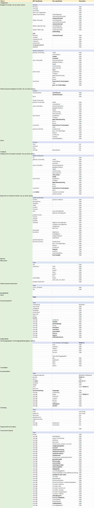
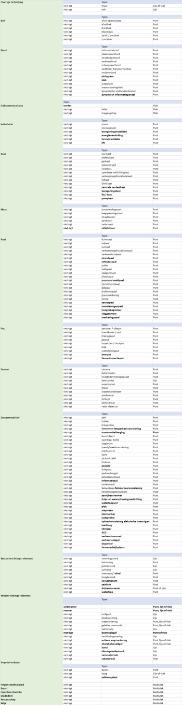

Samenvatting
============

Doel en resultaat
-----------------

IMGeo 2.2 is een nieuwe geoptimaliseerde versie van het informatiemodel
Geografie (IMGeo) door

-   afbakeningsregels aan te scherpen zodat de BGT uniformer voor afnemers en
    makkelijker maakbaar voor bronhouders wordt.

-   het model uit te breiden met ontbrekende subclassificaties (domeinwaarden)
    zodat sectoren (IMBOR, OOV) volledig kunnen aansluiten op IMGeo.

Het resultaat van IMGeo 2.2 is een goed bruikbare registratie met grootschalige
topografie voor Nederland en daarvoor moet de BGT\|IMGeo+ uniform zijn en passen
bij de behoeften van gebruikers. Met IMGeo 2.2 wordt/worden

-   Landelijke gebruikers beter bediend met een uniforme(re) BGT door de
    spelregels van de BGT beter uit te leggen aan bronhouder waardoor zij
    eenvoudiger en beter BGT kunnen inwinnen en bijhouden. Deze verduidelijking
    en uniformering draagt bij aan onder meer de automatische generalisatie van
    BGT naar BRT.

-   Nutsbedrijven en veiligsheidssector beter bediend door meer volledige en
    uniforme inhoud van de BGT, die aansluit bij de informatiebehoefte voor het
    uitvoeren van wettelijk geregelde dienstverlening.

-   Het proces van beheer openbare ruimte bij waterschappen, provincies,
    gemeenten en andere organisaties beter ondersteund door IMGeo te laten
    aansluiten op de behoeften voor inhoud en afbakening vanuit die sectoren.

-   Een volledige aansluiting van IMBOR op IMGeo gerealiseerd wat bijdraagt aan
    de standaardisatie van BOR, en het efficiënter bijhouden van de BGT
    (‘opbouwen vanuit beheer’).

Inhoud
------

In het wijzigingsvoorstel IMGeo 2.2 worden voorstellen gedaan die betrekking
hebben op:

-   het opnemen van bestaande werkafspraken of verduidelijken van bestaande
    spelregels in het model;

-   Het aanscherpen van afbakeningsregels met nieuwe criteria;

-   Het uitbreiden van het model met een aantal nieuwe subclassificaties;

-   Herindeling van subclassificaties en geometrietypen van objecten zijnde

    -   A. het hernoemen (en samenvoegen) van subclassificaties

    -   B. het verplaatsen van subclassificaties naar een ander object,
        attribuut of codelijst (bgt/plus)

    -   C. het schrappen van subclassificaties

    -   D. het aanpassen van geometrietypen binnen de huidige structuur.

Impact
------

De impact van IMGeo 2.2 voor de verschillende categorieën wijzigingen is als
volgt:

Categorie 1 heeft geen impact. Bronhouder dient al conform deze spelregels te
werken.

Categorie 2 heeft als impact een inwinlast voor bronhouders. Verwacht is dat
bronhouders opnieuw moeten inwinnen en/of de huidige populatie van objecten
moeten nalopen.

Categorie 3 en 4 hebben een beperkte technische IT-impact bestaande uit

Aanpassen van de BGT-software om

-   nieuwe subclassificaties te kunnen inlezen en aanmaken (categorie 3 en 4a).

-   heringedeelde subclassificaties te kunnen inlezen en aanmaken (categorie 4a
    en 4b).,

-   het ondersteunen van de nieuwe topologische regels bij
    herindeling/verschuiving van opdelende naar inrichtende laag en vice versa
    (categorie 4b).

-   vervallen subclassificaties niet meer te ondersteunen (categorie 4c).

-   de nieuwe geometrietypen voor bepaalde subclassificaties te kunnen inlezen
    en aanmaken (categorie 4d).

Repareren van data om:

-   inrichtende objecten om te zetten naar opdelende objecten (categorie 4b).

-   vervallen subclassificaties om te zetten naar nieuwe subclassificaties
    (categorie 4c).

-   geometrie voor bepaalde subclassificaties om te zetten naar nieuwe
    geometrietype (categorie 4d).

De voorstellen voor IMGeo 2.2 passen binnen de huidige structuur van IMGeo: er
is geen nieuw berichtschema nodig, de impact blijft naar inschatting beperkt tot
nieuwe domeinwaardenlijsten en aanpassing van enige topologische business rules.

Overzichtstabel IMGeo 2.2
-------------------------

De objectenstructuur in IMGeo 2.2 is als volgt:

Onderstaande tabel toont een overzicht van de objecttypen, attributen en
domeinwaarden van IMGeo 2.2, na overnemen voorstellen in dit wijzigingsvoorstel.

